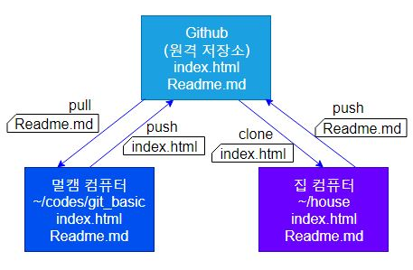

# Git의 발전과정

### 1. 코드 관리도구

### 2. 코드 저장소

### 3. 코드 협업도구

### 4. 개발자 이력서


## 1. 코드 관리도구

### Git을

#### SCM- Source Code Management

혹은

#### VCS - Version Control System

이라고도 한다.

우리 코드의 스냅샷같은 기능을 해준다.

```bash
$ git init
# 이제부터 내가 이 경로를 git으로 관리하겠다. git 숨김폴더 생성 - 이 폴더를 기초로 관리를 함
$ cd .git

$ cat config
[core]
        repositoryformatversion = 0
        filemode = false
        bare = false
        logallrefupdates = true
        symlinks = false
        ignorecase = true

$ git status
On branch master

No commits yet

Untracked files:
  (use "git add <file>..." to include in what will be committed)

        index.html

nothing added to commit but untracked files present (use "git add" to track)
# 수정된 것들을 알려준다.
# 파일이 생성되었는데 관리되지 않고있다고 알려줌
```


```bash
student@M50414 MINGW64 ~/codes/git_basic (master)
$ git add index.html

student@M50414 MINGW64 ~/codes/git_basic (master)
$ git status
On branch master

No commits yet

Changes to be committed:
  (use "git rm --cached <file>..." to unstage)

        new file:   index.html
        
# 이제는 새로운 파일을 관리한다고 알려준다.

student@M50414 MINGW64 ~/codes/git_basic (master)
$ git commit
hint: Waiting for your editor to close the file...
Aborting commit due to empty commit message.

student@M50414 MINGW64 ~/codes/git_basic (master)
$ git commit -m "first commit"
[master (root-commit) 6731b85] first commit
 1 file changed, 13 insertions(+)
 create mode 100644 index.html
# 커밋명령을 통해 커밋을 찍어봤다.

student@M50414 MINGW64 ~/codes/git_basic (master)
$ git log
commit 6731b85dac8858d6e61c259875019790bdbadec2 (HEAD -> master)
Author: Bang Hyechan <38344292+momo1108@users.noreply.github.com>
Date:   Tue Sep 3 10:32:36 2019 +0900

    first commit

student@M50414 MINGW64 ~/codes/git_basic (master)
$ git status
On branch master
nothing to commit, working tree clean

# 커밋의 로그를 확인간으하고 status에 working tree clean 메시지를 확인했다.

student@M50414 MINGW64 ~/codes/git_basic (master)
$ git status
On branch master
Changes not staged for commit:
  (use "git add <file>..." to update what will be committed)
  (use "git checkout -- <file>..." to discard changes in working directory)

        modified:   index.html

no changes added to commit (use "git add" and/or "git commit -a")
# 파일을 수정했더니 status에 수정이 되었다고 알려준다.
# 다시 커밋을 해보자.
student@M50414 MINGW64 ~/codes/git_basic (master)
$ git add index.html

student@M50414 MINGW64 ~/codes/git_basic (master)
$ git commit -m "git 기초 명령어 추가"
[master 84647ae] git 기초 명령어 추가
 1 file changed, 5 insertions(+)

student@M50414 MINGW64 ~/codes/git_basic (master)
$ git log
commit 84647ae222163c4f5ec5777f8bed83375d6c43bf (HEAD -> master)
Author: Bang Hyechan <38344292+momo1108@users.noreply.github.com>
Date:   Tue Sep 3 10:40:35 2019 +0900

    git 기초 명령어 추가

commit 6731b85dac8858d6e61c259875019790bdbadec2
Author: Bang Hyechan <38344292+momo1108@users.noreply.github.com>
Date:   Tue Sep 3 10:32:36 2019 +0900

    first commit

student@M50414 MINGW64 ~/codes/git_basic (master)
$ git status
On branch master
nothing to commit, working tree clean

student@M50414 MINGW64 ~/codes/git_basic (master)
$ git log --oneline
84647ae (HEAD -> master) git 기초 명령어 추가
6731b85 first commit
# git log가 너무 길어지면 --oneline옵션을 사용해보자.
```

---

#### Hash를 쓰는 이유

- 데이터를 암호화하기 위해
- 무결성 검증 - 데이터가 커지면 커질수록 직접 비교하기에는 코스트가 너무 크다. 데이터의 길이와 상관없이 일정한 길이의 Hash로 비교를 하면 코스트가 엄청나게 줄어든다.


#### Git이 데이터 관리에서 Hash를 엄청나게 사용한다.

```bash
commit 84647ae222163c4f5ec5777f8bed83375d6c43bf (HEAD -> master)
Author: Bang Hyechan <38344292+momo1108@users.noreply.github.com>
Date:   Tue Sep 3 10:40:35 2019 +0900

    git 기초 명령어 추가

commit 6731b85dac8858d6e61c259875019790bdbadec2
Author: Bang Hyechan <38344292+momo1108@users.noreply.github.com>
Date:   Tue Sep 3 10:32:36 2019 +0900

    first commit

```

##### commit마다 해쉬(SHA1)값을 ID로 사용한다.

---

### 이제 이전 커밋으로 돌아가보자.

```bash
student@M50414 MINGW64 ~/codes/git_basic (master)
$ git log --oneline
84647ae (HEAD -> master) git 기초 명령어 추가
6731b85 first commit
# Hash값의 일부만 써줘도 된다. (도커 컨테이너와 비슷한듯)
student@M50414 MINGW64 ~/codes/git_basic (master)
$ git checkout 6731
Note: checking out '6731'.

You are in 'detached HEAD' state. You can look around, make experimental
changes and commit them, and you can discard any commits you make in this
state without impacting any branches by performing another checkout.

If you want to create a new branch to retain commits you create, you may
do so (now or later) by using -b with the checkout command again. Example:

  git checkout -b <new-branch-name>

HEAD is now at 6731b85 first commit
# 파일을 확인해보니 예전으로 돌아가있다.
# 확인을 했으니 다시 원래대로 돌려보자.
student@M50414 MINGW64 ~/codes/git_basic ((6731b85...))
$ git checkout master
Previous HEAD position was 6731b85 first commit
Switched to branch 'master'
# 원래대로 돌아갔다.
```


### 수정중 맘에들지 않아서 완전 처음부터 하거나 돌아갈 때는 어떻게 할까

```bash
student@M50414 MINGW64 ~/codes/git_basic (master)
$ git status
On branch master
Changes not staged for commit:
  (use "git add <file>..." to update what will be committed)
  (use "git checkout -- <file>..." to discard changes in working directory)

        modified:   index.html

Untracked files:
  (use "git add <file>..." to include in what will be committed)

        style.css

no changes added to commit (use "git add" and/or "git commit -a")
# 수정을 했지만 맘에 안든다.

student@M50414 MINGW64 ~/codes/git_basic (master)
$ git reset --hard HEAD
HEAD is now at 84647ae git 기초 명령어 추가
# 이제 아예 git log에서 index.html 수정사항이 사라져버린것을 확인할 수 있다.
# 이제 되돌릴 수 없다. 하지만 추가해놓은 css파일은 남아있다. 커밋에 관련된 일이 없었기 때문인듯.
```


## 2. 코드 저장소

```bash
student@M50414 MINGW64 ~/codes/git_basic (master)
$ git remote add origin https://github.com/momo1108/git_basic.git
# origin 부분은 저장소의 이름으로 쓸 것으로 관례적으로 origin이라 쓴다.
# 우리는 root로 실습을 진행해보자.
student@M50414 MINGW64 ~/codes/git_basic (master)
$ git remote
root

student@M50414 MINGW64 ~/codes/git_basic (master)
$ git remote -v
root    https://github.com/momo1108/git_basic.git (fetch)
root    https://github.com/momo1108/git_basic.git (push)
# 저장소 주소까지 확인하고 싶으면 -v 옵션을 확인하자

student@M50414 MINGW64 ~/codes/git_basic (master)
$ git push -u root master
Enumerating objects: 9, done.
Counting objects: 100% (9/9), done.
Delta compression using up to 8 threads
Compressing objects: 100% (6/6), done.
Writing objects: 100% (9/9), 1.27 KiB | 650.00 KiB/s, done.
Total 9 (delta 3), reused 0 (delta 0)
remote: Resolving deltas: 100% (3/3), done.
To https://github.com/momo1108/git_basic.git
 * [new branch]      master -> master
Branch 'master' set up to track remote branch 'master' from 'root'.
# 원격 저장소에 저장이 완료됐다.
```

#### 이제 다른곳에서 원격 저장소에 저장한 내 코드를 수정해보고 싶다.



```bash
student@M50414 MINGW64 ~/house
$ git clone https://github.com/momo1108/git_basic.git
Cloning into 'git_basic'...
remote: Enumerating objects: 9, done.
remote: Counting objects: 100% (9/9), done.
remote: Compressing objects: 100% (3/3), done.
remote: Total 9 (delta 3), reused 9 (delta 3), pack-reused 0
Unpacking objects: 100% (9/9), done.

student@M50414 MINGW64 ~/house
$ ls
git_basic/
# 원격 저장소가 로컬로 복제된것을 볼 수 있다.
student@M50414 MINGW64 ~/house/git_basic (master)
$ git status
On branch master
Your branch is up to date with 'origin/master'.

Untracked files:
  (use "git add <file>..." to include in what will be committed)

        Readme.md

nothing added to commit but untracked files present (use "git add" to track)
# 원격으로 Readme.md 파일을 만들어주고 원격 저장소에 저장해보자.
student@M50414 MINGW64 ~/house/git_basic (master)
$ git add Readme.md

student@M50414 MINGW64 ~/house/git_basic (master)
$ git status
On branch master
Your branch is up to date with 'origin/master'.

Changes to be committed:
  (use "git reset HEAD <file>..." to unstage)

        new file:   Readme.md


student@M50414 MINGW64 ~/house/git_basic (master)
$ git commit -m "집에서 작업 시작"
[master 54211b3] 집에서 작업 시작
 1 file changed, 3 insertions(+)
 create mode 100644 Readme.md

student@M50414 MINGW64 ~/house/git_basic (master)
$ git push origin master
Enumerating objects: 4, done.
Counting objects: 100% (4/4), done.
Delta compression using up to 8 threads
Compressing objects: 100% (2/2), done.
Writing objects: 100% (3/3), 368 bytes | 368.00 KiB/s, done.
Total 3 (delta 0), reused 0 (delta 0)
To https://github.com/momo1108/git_basic.git
   cbc3d00..54211b3  master -> master
# push 명령어의 마지막에 master 브랜치를 입력해준다.

# 이제 원래 작업을 하던 멀티캠퍼스쪽에서 수정사항을 맏아와보자.
student@M50414 MINGW64 ~/codes/git_basic (master)
$ git pull root master
remote: Enumerating objects: 4, done.
remote: Counting objects: 100% (4/4), done.
remote: Compressing objects: 100% (2/2), done.
remote: Total 3 (delta 0), reused 3 (delta 0), pack-reused 0
Unpacking objects: 100% (3/3), done.
From https://github.com/momo1108/git_basic
 * branch            master     -> FETCH_HEAD
   cbc3d00..54211b3  master     -> root/master
Updating cbc3d00..54211b3
Fast-forward
 Readme.md | 3 +++
 1 file changed, 3 insertions(+)
 create mode 100644 Readme.md
# 마스터 브랜치의 수정사항을 root저장소로 pull해온다.

student@M50414 MINGW64 ~/codes/git_basic (master)
$ git pull root master
From https://github.com/momo1108/git_basic
 * branch            master     -> FETCH_HEAD
Already up to date.
# 이미 풀을 한 경우엔 했다고 알려준다.

# 혹시 저장소 이름을 바꾸고 싶은 경우
student@M50414 MINGW64 ~/codes/git_basic (master)
$ git remote help
error: Unknown subcommand: help
usage: git remote [-v | --verbose]
   or: git remote add [-t <branch>] [-m <master>] [-f] [--tags | --no-tags] [--mirror=<fetch|push>] <name> <url>
   or: git remote rename <old> <new>
   or: git remote remove <name>
   or: git remote set-head <name> (-a | --auto | -d | --delete | <branch>)
   or: git remote [-v | --verbose] show [-n] <name>
   or: git remote prune [-n | --dry-run] <name>
   or: git remote [-v | --verbose] update [-p | --prune] [(<group> | <remote>)...]
   or: git remote set-branches [--add] <name> <branch>...
   or: git remote get-url [--push] [--all] <name>
   or: git remote set-url [--push] <name> <newurl> [<oldurl>]
   or: git remote set-url --add <name> <newurl>
   or: git remote set-url --delete <name> <url>

    -v, --verbose         be verbose; must be placed before a subcommand
# 명령어가 궁금할 땐 help로 확인을 해보자.

student@M50414 MINGW64 ~/codes/git_basic (master)
$ git remote rename root origin

student@M50414 MINGW64 ~/codes/git_basic (master)
$ git remote
origin

student@M50414 MINGW64 ~/codes/git_basic (master)
$ git remote -v
origin  https://github.com/momo1108/git_basic.git (fetch)
origin  https://github.com/momo1108/git_basic.git (push)

```

