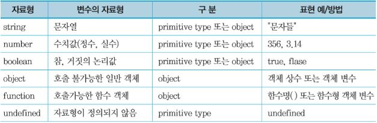
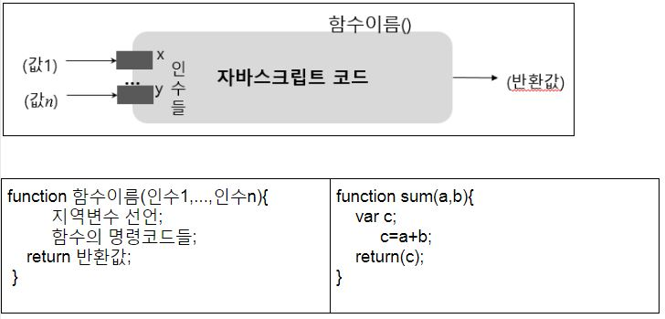
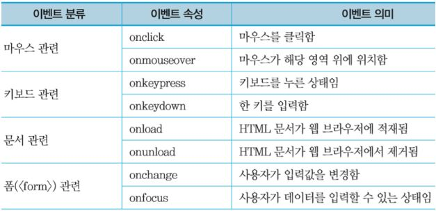
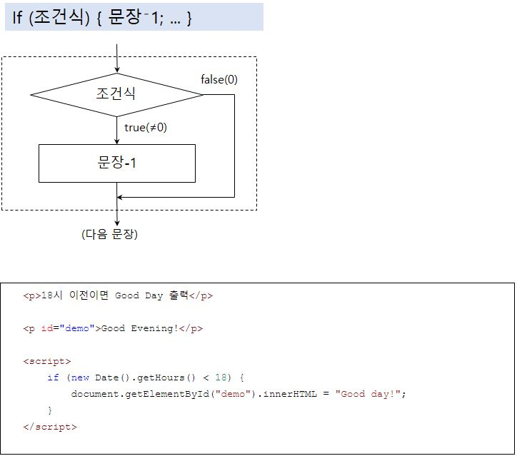
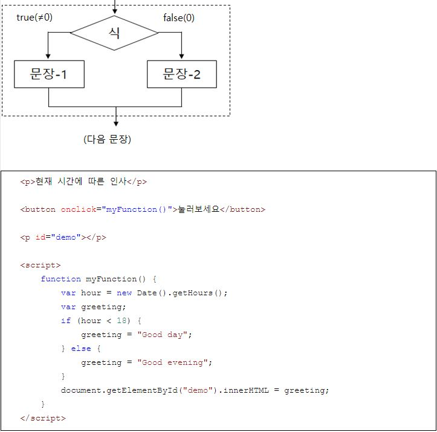
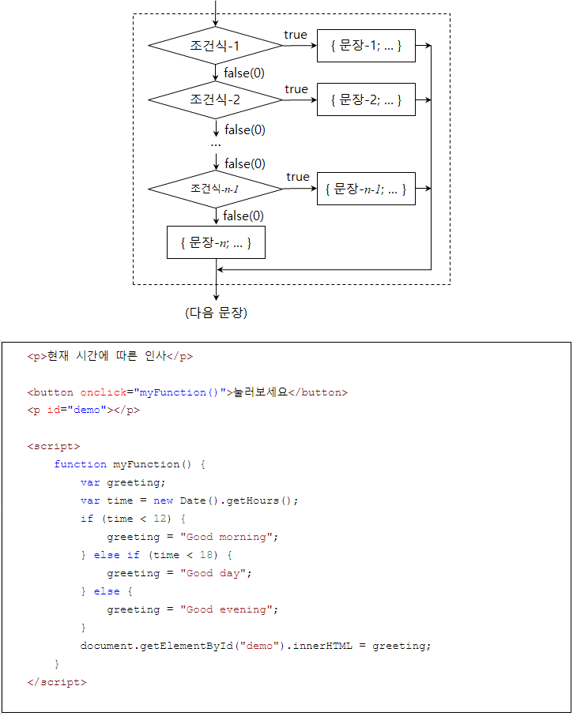
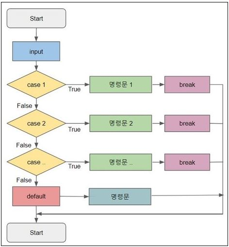
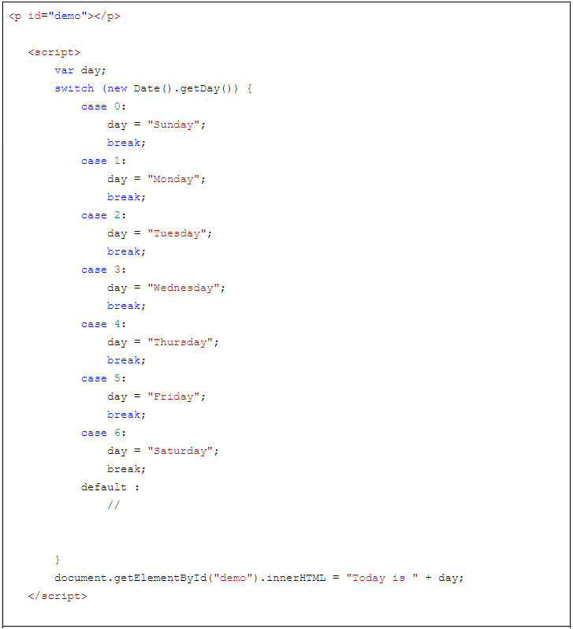

# 자바스크립트

https://www.codecademy.com/

### 변수 선언

- 다른 언어들은 변수를 선언해줄 때 변수의 자료형으로 선언해준다.

  ex) int a;	float b;

- 자바스크립트는 var나 let 등으로 먼저 선언을 해주고 값이 들어갈 때 자료형이 정해진다.

  

  - string형

  - number형

    - 정수 또는 실수 등의 수치값들

      정수 :  소수점을 포함하지 않는 수치값
      10진수 또는 16진수(예 : 0xFF(=255) 등) 표현 사용 
      최대 15자리까지의 정확도(precision) 표시, 그 이상을 넘으면 오버플로우됨

      실수 :  소수점을 포함하는 수치값 
      10진수 (예: 3.14, 45.0 등) 또는 지수표현(예: 123e⁻3 등) 사용 

      정수와 실수는 내부적으로는 모두 64비트 실수형(floating point)으로 저장됨

      number 형 예약어
      **NaN(Not a Number)  : 자료값이 수치형이 아님**
      Infinity(또는 ⁻Infinity) : 시스템에서 표 현가능한 최대값(또는 최소값)을 벗어난 값임
      수치를 0으로 나누면 그 결과는 Infinity가 됨 

  - boolean형

    - 0, –0,  공백문자열(""),  undefind 변수, null 객체 :  false
      그 외 :  true

  - undefined형

    - 변수명 선언후 아직 값을 저장하지 않았거나 변수값으로 undefined를 저장한 변수들
      undefined : 기본 자료형 변수가 비어있음을 나타냄(자료형: undefined)
      null : 객체형 변수가 비어있음을 나타냄(자료형:  object)

- typeof 연산자

  - ```javascript
    document.write(typeof "John" + '<br>'); // 문자열
    document.write(typeof 3.14 + '<br>'); // 실수
    document.write(typeof NaN + '<br>'); // NaN
    document.write(typeof false + '<br>'); // 논리형
    document.write(typeof [1, 2, 3, 4] + '<br>'); // 배열
    document.write(typeof function () {} + '<br>'); // 함수
    document.write(typeof myCar + '<br>'); // 정의되지 않은 변수
    document.write(typeof null); // null
    ```

### 형변환

- 자동 형변환
- 강제 형변환
  - Number(str1)
  - parseInt(str1)
  - parseFloat(str2)
  - num3.toString()
  - Boolean(num2)
  - Number(true)
  - Number(false)

### 함수

- 인수들을 통해 외부로 부터 자료값을 전달 받고

- 실행 결과 값을 반환할 수 있음

- 보통 사용 전에 미리 정의해야 함

  


### 이벤트

- 웹 문서를 로드한 웹 브라우저에서 발생되는 어떤 동작이나 상태변화를 나타내는 것

- 웹 브라우저에 로드된 HTML 문서 와 사용자 사이의 상호작용에 의해 발생함

- 사용자의 마우스 클릭, 입력, 타이머 등

- 이벤트가 발생 했을 때, 호출되는 JavaScript 실행문을 이벤트 핸들러라고 함

  

### 조건문

- 단일 조건문

  

- 양자 택일문

  

- 다중 조건문

  


### 선택문

- 조건에 맞는 케이스에 해당하는 문장을 실행

  

  

  

### 반복문

- for (초기값; 조건문; 증감값) {

  ​	반복할 문장

  }

- while(조건식) {

  ​	반복할 문장

  }

- do {

  반복할 문장

  } (조건문)

- break, continue


### 배열

- 연속된 여러개의 메모리공간을 확보하여 하나의 저장소로 관리
- 0번부터 인덱스를 사용해서 접근 가능
- 자바스크립트 배열은 미리 정의하지 않고 사용할 수 있고,
- 배열 크기도 동적으로 변경 가능
- 자바스크립트는 유연성이 좋아서 배열 원소들의 자료형이 같지 않아도 됨.
- 배열 원소에 다른 객체 저장 가능.