# jQuery

### 존 레식이 개발한 자바스크립트 라이브러리

#### Write less, Do more

document.getElementby....

document.querySelector..... 등의 복잡한 API를 간단하게 표현해 사용할 수 있다.

### jQuery 로 할 수 있는 일

- HTML 요소들의 내용이나 속성 변경
- HTML 요소들의 CSS3 스타일 속성변경
- HTML DOM 트리의 변경 (요소노드 추가, 삭제)
- HTML 요소들의 다양한 애니메이션 효과 지정
- 서버와의 비동기 통신(Ajax) 지원
- **웹브라우저 호환성 문제 해결**

#### 순수 Java Script 와 jQuery 비교 (jQuery가 좀더 웹 브라우저의 영향을 덜받는다)

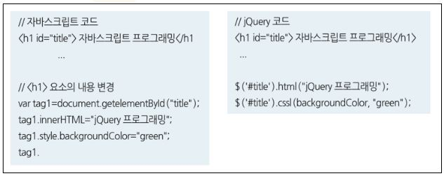

#### jQuery 명령어 형식

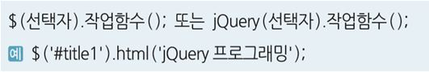

#### jQuery 선택자 (CSS의 선택자를 다 쓸수 있다.)

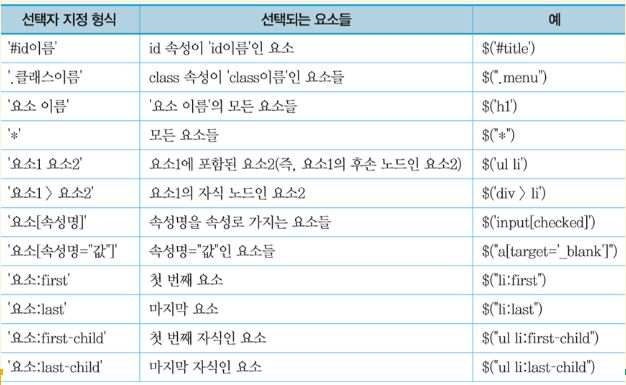

#### jQuery 주요 함수 (적지만 아주 유용하다.)

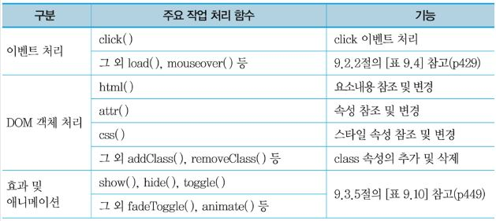

#### jQuery 이벤트

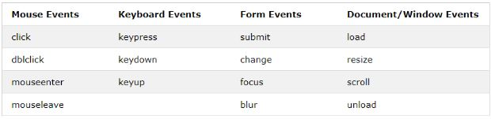

#### jQuery 이벤트 처리 ( on함수)

- on(), off() 함수 이용

  - on() : 선택자로 지정된 요소에 이벤트와 이벤트 핸들러를 연결해서 이벤트 처리 등록
  - off() : 등록된 이벤트 처리 제거

  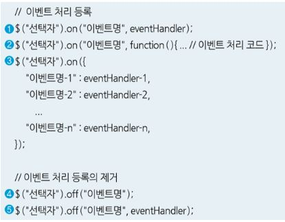

#### jQuery 이벤트 처리 ( 이벤트별 작업 함수 - 자주 사용되는 이벤트에 대해 함수로 노출)

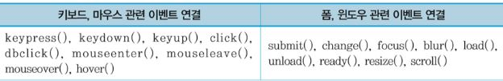

#### jQuery 시각 효과

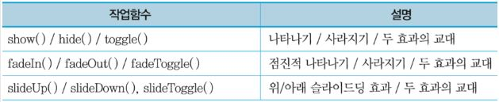

#### 애니메이션 처리 효과

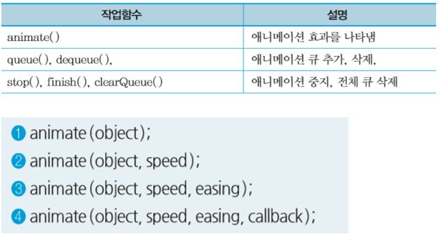

###  jQuery 이용 동적 문서 작성 (객체 조작)

#### 객체 조작 관련 주요 함수

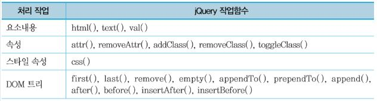

#### HTML 요소의 내용 변경

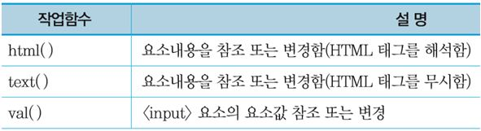

#### HTML 요소의 속성 변경

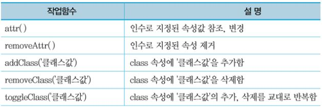

#### HTML 요소의 추가, 삭제

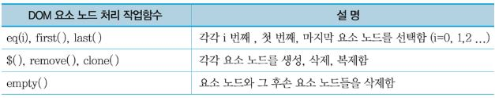

#### HTML 요소 생성

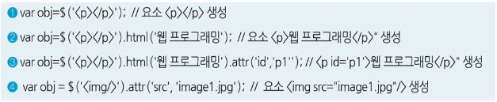

#### HTML 요소 객체 추가

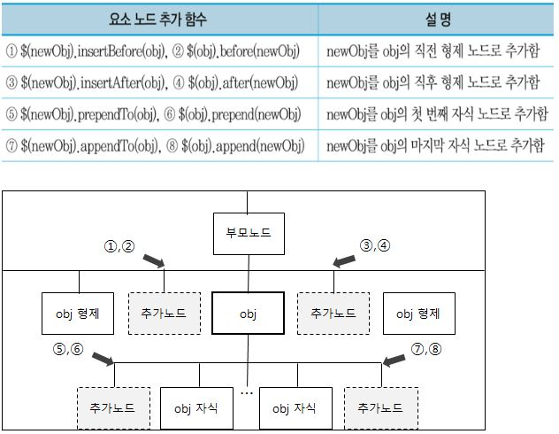