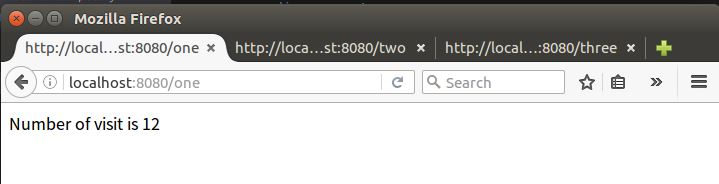
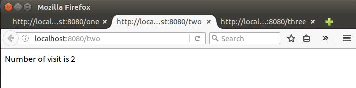
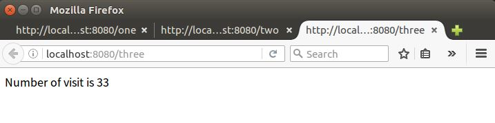
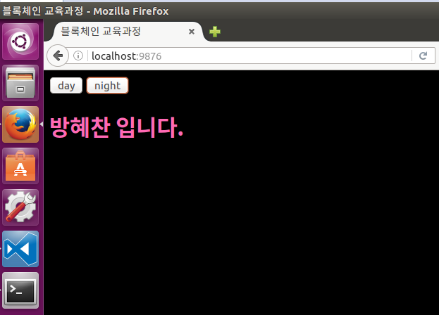

문제

1. runc.sh 스크립트를 작성

2. 파라미터로 컨테이너 이름을 받습니다. 

3. 동일한 이름의 컨테이너가 존재하면 해당 컨테이너를 삭제 후 컨테이너를 생성(실행)한다. 

4. 생성 스크립트는 다음과 같다.

   **docker container run --name 컨테이너이름 -itd -p 8888:8080 echo **

5. runc.sh hello 명령을 입력하면 hello라는 이름의 컨테이너가 실행된다.

\# 명령어 형식을 체크 (파라미터 존재 여부를 확인)

\# 동일 이름의 컨테이너를 조회

\# 동일 이름의 컨테이너가 존재하는 경우 해당 컨테이너를 삭제하고 메시지를 출력

\# 컨테이너를 실행

\# 쉘 종료

**hint. test.sh**
#!/bin/bash

echo $# ⇐ 파라미터의 개수를 반환

echo $* ⇐ 파라미터를 반환

- 내 답안

```bash
#!/bin/bash
echo "컨테이너 이름을 입력하세요."
read name
set $(docker container ls | grep $name)
if [ "$1" != "" ]
then
docker container rm -f $1
docker container run --name $name -itd -p :8080 echo
else
docker container run --name $name -itd -p :8080 echo
fi
exit 0
```


- 간단한 버젼

```bash
#!/bin/bash

docker container rm -f $(docker container ls --filter="name=$1" -q)

docker container run -itd -p 8888:8080 --name $1 echo

exit 0
```


- 정답

```bash
#!/bin/bash

function msg () {
	printf "%s" $1
	for i in {1..5}
	do
		printf "%s" "."
		sleep 1
	done
	printf "\n"
}

# 명령어 형식을 체크 (파라미터 존재 여부를 확인)
if [ $# == 0 ]
then
	echo 명령어 사용법이 잘못되었습니다.
	echo [사용법] ./run2.sh container_name
	exit 1
fi

# 컨테이너 실행 전 컨테이너 리스트 출력
msg "실행 전 컨테이너를 출력합니다"
echo "-------------------------------------"
echo "----실행 전 컨테이너 리스트 출력-----"
echo "-------------------------------------"
docker container ps -a

# 동일 이름의 컨테이너를 조회 ($1 양 옆에 ^와 $를 붙여주면 정규표현식에서 단어의 시작과 끝을 나타내는 것이다.)
# 정규표현식에서 파라미터의 $를 단어의 끝으로 착각하지 않게 이스케이프(/) 시켜준다.
cid=$(docker container ps --filter="name=^/$1$" -q)
echo $cid

# 동일 이름의 컨테이너가 존재하는 경우 해당 컨테이너를 삭제하고 메시지를 출력
if [ "$cid" != "" ]
then
	docker container rm -f $cid
	echo $1 이름의 컨테이너\($cid\)를 삭제했습니다.
fi

# 컨테이너를 실행
docker container run --name $1 -itd -p :8080 echo

# 컨테이너 실행 후 컨테이너 리스트 출력
msg "실행 후 컨테이너를 출력합니다"
echo "-------------------------------------"
echo "----실행 후 컨테이너 리스트 출력-----"
echo "-------------------------------------"
docker container ps -a

# 쉘 종료
exit 0
```


Message : ./db_migrate.sh: line 3: [: =: unary operator expected

검색해보니 정확히 같은 사례가 나와서 바로 해결

<https://stackoverflow.com/questions/13617843/unary-operator-expected>

리눅스 환경에 배포하다보면 shell script 사용을 할 일이 상당히 많은데…

쉘스크립트 공부해서 쓰는것도 아니고 그때그때 찾아가며 쓰다보니 자주 맞딱뜨리는 문제

**이렇게 비교를 했는데**

```
if [ $db_name = "api" ]; then
```

**바시Bash는 이렇게 알아듣는다고**

```
if [ = "api" ]; then
```

## 해결 – 아래의 표기법을 쓴다

따블 대괄호Braket

```
if [[ $db_name = "api" ]]; then
```

변수쌍따옴표

```
if [ "$db_name" = "api" ]; then
```

 


# 실습 미리 해보기

> ## 1. docker-compose
>
> redis-one 컨테이너
>
> redis-two 컨테이너
>
> redis-three 컨테이너
>
> node-server 컨테이너
>
> - localhost:8080/one (<= redis-one server의 )
> - localhost:8080/two (<= redis-one server의 )
> - localhost:8080/three (<= redis-one server의 )
>
> ```bash
> # 컨테이너들을 생성새켜줄 docker-compose.yml 파일을 만든다.
> version: '2'
> services:
>   redis-server1:
>     image: 'redis'
>   redis-server2:
>     image: 'redis'
>   redis-server3:
>     image: 'redis'
>   node-app:
>     build: .
>     ports:
>       - "8080:8081"
> 
> 
> # node-app 컨테이너의 이미지를 빌드하기 위해서 dockerfile 을 만든다.
> # Specify a base image
> FROM node:10-alpine
> 
> WORKDIR /usr/app
> 
> # Install some dependencies
> COPY ./package.json .
> 
> RUN npm install
> 
> COPY . .
> # Default command
> CMD ["npm", "start"]
> 
> 
> # node-app 서버의 정보들을 package.json 파일에 설정한다.
> {
>   "name": "node_redis",
>   "version": "1.0.0",
>   "description": "",
>   "main": "index.js",
>   "scripts": {
>     "test": "echo \"Error: no test specified\" && exit 1",
>     "start": "node app.js"
>   },
>   "author": "",
>   "license": "ISC",
>   "dependencies": {
>     "express": "^4.17.1",
>     "redis": "^2.8.0"
>   }
> }
> 
> # package.json 파일에서 선언한 app.js 파일을 만든다.
> const express = require('express');
> const redis = require('redis');
> 
> const app = express();
> 
> const client1 = redis.createClient({
>     host:'redis-server1',
>     port:6379
> });
> const client2 = redis.createClient({
>     host:'redis-server2',
>     port:6379
> });
> const client3 = redis.createClient({
>     host:'redis-server3',
>     port:6379
> });
> 
> client1.set('visits', 0);
> client2.set('visits', 0);
> client3.set('visits', 0);
> 
> app.get('/one', (req, res) => {
>     client1.get('visits', (err, visits) => {
>         res.send('Number of visit is ' + visits);
>         client1.set('visits', parseInt(visits) + 1);
>     });
> });
> app.get('/two', (req, res) => {
>     client2.get('visits', (err, visits) => {
>         res.send('Number of visit is ' + visits);
>         client2.set('visits', parseInt(visits) + 1);
>     });
> });
> app.get('/three', (req, res) => {
>     client3.get('visits', (err, visits) => {
>         res.send('Number of visit is ' + visits);
>         client3.set('visits', parseInt(visits) + 1);
>     });
> });
> 
> app.listen(8081, () =>{
>     console.log('Listening 8080 port');
> });
> 
> 
> 
> 
> 
> 
> # 이제 docker-compose를 사용해보자.
> ubuntu@server:~/docker/prac$ sudo docker-compose up --build
> Creating network "prac_default" with the default driver
> Building node-app
> Step 1/6 : FROM node:10-alpine
>  ---> 9dfa73010b19
> Step 2/6 : WORKDIR /usr/app
>  ---> Using cache
>  ---> 7f9ac3cab5d8
> Step 3/6 : COPY ./package.json .
>  ---> Using cache
>  ---> c3508d47f274
> Step 4/6 : RUN npm install
>  ---> Using cache
>  ---> fec495c01167
> Step 5/6 : COPY . .
>  ---> Using cache
>  ---> 954fb1c5e736
> Step 6/6 : CMD npm start
>  ---> Using cache
>  ---> 63206a62ff29
> Successfully built 63206a62ff29
> Successfully tagged prac_node-app:latest
> Creating prac_node-app_1      ... done
> Creating prac_redis-server3_1 ... done
> Creating prac_redis-server2_1 ... done
> Creating prac_redis-server1_1 ... done
> Attaching to prac_redis-server3_1, prac_redis-server1_1, prac_node-app_1, prac_redis-server2_1
> redis-server3_1  | 1:C 17 Jun 2019 07:28:03.931 # oO0OoO0OoO0Oo Redis is starting oO0OoO0OoO0Oo
> redis-server3_1  | 1:C 17 Jun 2019 07:28:03.931 # Redis version=5.0.5, bits=64, commit=00000000, modified=0, pid=1, just started
> redis-server3_1  | 1:C 17 Jun 2019 07:28:03.931 # Warning: no config file specified, using the default config. In order to specify a config file use redis-server /path/to/redis.conf
> redis-server3_1  | 1:M 17 Jun 2019 07:28:03.939 * Running mode=standalone, port=6379.
> redis-server3_1  | 1:M 17 Jun 2019 07:28:03.939 # WARNING: The TCP backlog setting of 511 cannot be enforced because /proc/sys/net/core/somaxconn is set to the lower value of 128.
> redis-server3_1  | 1:M 17 Jun 2019 07:28:03.940 # Server initialized
> redis-server3_1  | 1:M 17 Jun 2019 07:28:03.940 # WARNING overcommit_memory is set to 0! Background save may fail under low memory condition. To fix this issue add 'vm.overcommit_memory = 1' to /etc/sysctl.conf and then reboot or run the command 'sysctl vm.overcommit_memory=1' for this to take effect.
> redis-server3_1  | 1:M 17 Jun 2019 07:28:03.940 # WARNING you have Transparent Huge Pages (THP) support enabled in your kernel. This will create latency and memory usage issues with Redis. To fix this issue run the command 'echo never > /sys/kernel/mm/transparent_hugepage/enabled' as root, and add it to your /etc/rc.local in order to retain the setting after a reboot. Redis must be restarted after THP is disabled.
> redis-server3_1  | 1:M 17 Jun 2019 07:28:03.940 * Ready to accept connections
> redis-server1_1  | 1:C 17 Jun 2019 07:28:03.931 # oO0OoO0OoO0Oo Redis is starting oO0OoO0OoO0Oo
> redis-server1_1  | 1:C 17 Jun 2019 07:28:03.931 # Redis version=5.0.5, bits=64, commit=00000000, modified=0, pid=1, just started
> redis-server1_1  | 1:C 17 Jun 2019 07:28:03.931 # Warning: no config file specified, using the default config. In order to specify a config file use redis-server /path/to/redis.conf
> redis-server1_1  | 1:M 17 Jun 2019 07:28:03.939 * Running mode=standalone, port=6379.
> redis-server1_1  | 1:M 17 Jun 2019 07:28:03.939 # WARNING: The TCP backlog setting of 511 cannot be enforced because /proc/sys/net/core/somaxconn is set to the lower value of 128.
> redis-server1_1  | 1:M 17 Jun 2019 07:28:03.939 # Server initialized
> redis-server1_1  | 1:M 17 Jun 2019 07:28:03.939 # WARNING overcommit_memory is set to 0! Background save may fail under low memory condition. To fix this issue add 'vm.overcommit_memory = 1' to /etc/sysctl.conf and then reboot or run the command 'sysctl vm.overcommit_memory=1' for this to take effect.
> redis-server1_1  | 1:M 17 Jun 2019 07:28:03.940 # WARNING you have Transparent Huge Pages (THP) support enabled in your kernel. This will create latency and memory usage issues with Redis. To fix this issue run the command 'echo never > /sys/kernel/mm/transparent_hugepage/enabled' as root, and add it to your /etc/rc.local in order to retain the setting after a reboot. Redis must be restarted after THP is disabled.
> redis-server1_1  | 1:M 17 Jun 2019 07:28:03.940 * Ready to accept connections
> redis-server2_1  | 1:C 17 Jun 2019 07:28:04.827 # oO0OoO0OoO0Oo Redis is starting oO0OoO0OoO0Oo
> redis-server2_1  | 1:C 17 Jun 2019 07:28:04.827 # Redis version=5.0.5, bits=64, commit=00000000, modified=0, pid=1, just started
> redis-server2_1  | 1:C 17 Jun 2019 07:28:04.827 # Warning: no config file specified, using the default config. In order to specify a config file use redis-server /path/to/redis.conf
> redis-server2_1  | 1:M 17 Jun 2019 07:28:04.829 * Running mode=standalone, port=6379.
> redis-server2_1  | 1:M 17 Jun 2019 07:28:04.829 # WARNING: The TCP backlog setting of 511 cannot be enforced because /proc/sys/net/core/somaxconn is set to the lower value of 128.
> redis-server2_1  | 1:M 17 Jun 2019 07:28:04.829 # Server initialized
> redis-server2_1  | 1:M 17 Jun 2019 07:28:04.829 # WARNING overcommit_memory is set to 0! Background save may fail under low memory condition. To fix this issue add 'vm.overcommit_memory = 1' to /etc/sysctl.conf and then reboot or run the command 'sysctl vm.overcommit_memory=1' for this to take effect.
> redis-server2_1  | 1:M 17 Jun 2019 07:28:04.829 # WARNING you have Transparent Huge Pages (THP) support enabled in your kernel. This will create latency and memory usage issues with Redis. To fix this issue run the command 'echo never > /sys/kernel/mm/transparent_hugepage/enabled' as root, and add it to your /etc/rc.local in order to retain the setting after a reboot. Redis must be restarted after THP is disabled.
> redis-server2_1  | 1:M 17 Jun 2019 07:28:04.829 * Ready to accept connections
> node-app_1       | 
> node-app_1       | > node_redis@1.0.0 start /usr/app
> node-app_1       | > node app.js
> node-app_1       | 
> node-app_1       | Listening 8080 port
> 
> 
> # 제대로 컨테이너들이 실행되었다. 이제 웹 브라우져로 가서 카운팅이 되는지 확인해보자.
> ```
>
> 
>
> 
>
> ## 2. apache 서버
>
> apache 컨테이너
>
> - index.html(<= 본인 이름 출력)
> - localhost:80/
>
> ```bash
> # 컨테이너 이미지를 만들기 위한 도커파일을 만든다.
> FROM httpd:2.4
> COPY ./public-html /usr/local/apache2/htdocs/
> 
> # 컨테이너 안으로 html파일을 카피하기 위해 public-html 디렉터리를 생성해주고 index.html 파일을 만들어주자.
> ubuntu@server:~/docker/prac3$ mkdir public-html
> ubuntu@server:~/docker/prac3$ cd public-html/
> ubuntu@server:~/docker/prac3/public-html$ nano index.html
> 
> <!doctype html>
> <html>
> <head>
>   <title>블록체인 교육과정</title>
>   <meta charset="utf-8">
> </head>
> <body>
>   <input type="button" value="day" onclick="
>     document.querySelector('body').style.backgroundColor='white';
>     document.querySelector(                 'body').style.color='green';
>   "> <!-- "" 안에는 ''로만 인식이 된다. ""를 안에 넣을 경우 ""로 두부분으로 나눠진 상태로 인식하기때문이다. -->
>   <input type="button" value="night" onclick="
>     document.querySelector('body').style.backgroundColor='black';
>     document.querySelector('body').style.color='hotpink';
>   ">      
>   <h1>방혜찬 입니다.</h1>
> </body>
> </html>
> 
> 
> 
> # 이제 컨테이너를 생성하고 웹 브라우져를 통해 동작을 확인해보자.
> ubuntu@server:~/docker/prac3$ sudo docker run -dit --name bangpache -p 9876:80 momo1108/apache_server:3.0
> b38d42c0b25a8b2a20e27108db842e0551987eff71df5e346b8c43b185ceea06
> ```
>
> 


## ## 수행 평가

1. 다음 조건에 맞는 docker-compose 파일을 작성하고id/exam:0.1 이름으로 이미지를 만들어 docker hub에 올린 후 Dockerfile, docker-compose.yml 파일과 docker-hub 이미지명을 제출하시오 

- 두 개의 노드 서버 구동 (node-server1, node-server2)
- 두 개의 redis 서버 구동 (redis-server1, redis-server2)
- 노드 서버의 이미지는 node:10-alpine을 사용
- 각각의 노드 서버는 8081, 8082 , 8083 포트에 매핑
-  app.js 파일은 다음을 참고

```bash
const express = require('express');
const redis = require('redis');

const app = express();

const client = redis.createClient();
client.set('visits', 0);

app.get('/', (req, res) => {
    client.get('visits', (err, visits) => {
        res.send('<이름>-<서버이름>- 방문수 :  ' + visits);
        client.set('visits', parseInt(visits) + 1);
    });
});

app.listen(8081, () =>{
    console.log('Listening 8081 port');
});

```


1. 수행할 프로젝트 개요 및 UseCase Diagram 을 그려서 제출하시오

(

http://bitly.kr/zrT38X

) 의 프로젝트 설계 / 요구사항 분석.xls 파일 참조


```bash
# prac4 디렉터리를 만들어서 그 안에 두개의 노드서버 디렉터리를 만든다.
ubuntu@server:~/docker/prac4$ mkdir node1
ubuntu@server:~/docker/prac4$ mkdir node2

# 도커컴포즈 파일을 만든다.
version: '2'
services:
  redis-server1:
    image: 'redis'
  redis-server2:
    image: 'redis'
  node-app1:
    build: ./node1
    ports:
      - "8081:8081"
  node-app2:
    build: ./node2
    ports:
      - "8082:8081"
      
# 각각의 디렉터리에 package.json 파일과 app.js 파일을 알맞게 생성해준다.
# /node1/package.json
{
  "name": "node_redis",
  "version": "1.0.0",
  "description": "",
  "main": "index.js",
  "scripts": {
    "test": "echo \"Error: no test specified\" && exit 1",
    "start": "node app.js"
  },
  "author": "",
  "license": "ISC",
  "dependencies": {
    "express": "^4.17.1",
    "redis": "^2.8.0"
  }
}

# /node1/app.js
const express = require('express');
const redis = require('redis');

const app = express();

const client = redis.createClient({
    host:'redis-server1',
    port:6379
});
client.set('visits', 0);

app.get('/', (req, res) => {
    client.get('visits', (err, visits) => {
        res.send('방혜찬-node-server1 - 방문수 :  ' + visits);
        client.set('visits', parseInt(visits) + 1);
    });
});

app.listen(8081, () =>{
    console.log('Listening 8081 port');
});
# /node2/package.js
{
  "name": "node_redis",
  "version": "1.0.0",
  "description": "",
  "main": "index.js",
  "scripts": {
    "test": "echo \"Error: no test specified\" && exit 1",
    "start": "node app.js"
  },
  "author": "",
  "license": "ISC",
  "dependencies": {
    "express": "^4.17.1",
    "redis": "^2.8.0"
  }
}
# /node2/app.js
const express = require('express');
const redis = require('redis');

const app = express();

const client = redis.createClient({
    host:'redis-server2',
    port:6379
});
client.set('visits', 0);

app.get('/', (req, res) => {
    client.get('visits', (err, visits) => {
        res.send('방혜찬-node-server2 - 방문수 :  ' + visits);
        client.set('visits', parseInt(visits) + 1);
    });
});

app.listen(8081, () =>{
    console.log('Listening 8081 port');
});

# 각각의 디렉터리에 dockerfile을 생성해준다.
# /node1/dockerfile
FROM node:10-alpine

WORKDIR /usr/app

# Install some dependencies
COPY ./package.json .

RUN npm install

COPY . .
# Default command
CMD ["npm", "start"]

# /node2/dockerfile
FROM node:10-alpine

WORKDIR /usr/app

# Install some dependencies
COPY ./package.json .

RUN npm install

COPY . .
# Default command
CMD ["npm", "start"]

# 이제 컴포즈를 실행하고 웹브라우저로 확인해보자.
ubuntu@server:~/docker/prac4$ sudo docker-compose up --build
Building node-app1
Step 1/6 : FROM node:10-alpine
 ---> 9dfa73010b19
Step 2/6 : WORKDIR /usr/app
 ---> Using cache
 ---> 7f9ac3cab5d8
Step 3/6 : COPY ./package.json .
 ---> Using cache
 ---> c3508d47f274
Step 4/6 : RUN npm install
 ---> Using cache
 ---> fec495c01167
Step 5/6 : COPY . .
 ---> 62a96c615a0a
Removing intermediate container 0a6891ebaaae
Step 6/6 : CMD npm start
 ---> Running in cf0210c102fa
 ---> cdeae2ea603d
Removing intermediate container cf0210c102fa
Successfully built cdeae2ea603d
Successfully tagged prac4_node-app1:latest
Building node-app2
Step 1/6 : FROM node:10-alpine
 ---> 9dfa73010b19
Step 2/6 : WORKDIR /usr/app
 ---> Using cache
 ---> 7f9ac3cab5d8
Step 3/6 : COPY ./package.json .
 ---> Using cache
 ---> c3508d47f274
Step 4/6 : RUN npm install
 ---> Using cache
 ---> fec495c01167
Step 5/6 : COPY . .
 ---> 9348f0847981
Removing intermediate container a7d104218409
Step 6/6 : CMD npm start
 ---> Running in 89e2aec75537
 ---> f1fc9e9b50af
Removing intermediate container 89e2aec75537
Successfully built f1fc9e9b50af
Successfully tagged prac4_node-app2:latest
Creating prac4_redis-server2_1 ... done
Creating prac4_node-app2_1     ... done
Creating prac4_node-app1_1     ... done
Creating prac4_redis-server1_1 ... done
Attaching to prac4_node-app2_1, prac4_redis-server2_1, prac4_redis-server1_1, prac4_node-app1_1
redis-server2_1  | 1:C 17 Jun 2019 08:43:17.049 # oO0OoO0OoO0Oo Redis is starting oO0OoO0OoO0Oo
redis-server2_1  | 1:C 17 Jun 2019 08:43:17.049 # Redis version=5.0.5, bits=64, commit=00000000, modified=0, pid=1, just started
redis-server2_1  | 1:C 17 Jun 2019 08:43:17.049 # Warning: no config file specified, using the default config. In order to specify a config file use redis-server /path/to/redis.conf
redis-server2_1  | 1:M 17 Jun 2019 08:43:17.063 * Running mode=standalone, port=6379.
redis-server1_1  | 1:C 17 Jun 2019 08:43:17.049 # oO0OoO0OoO0Oo Redis is starting oO0OoO0OoO0Oo
redis-server1_1  | 1:C 17 Jun 2019 08:43:17.049 # Redis version=5.0.5, bits=64, commit=00000000, modified=0, pid=1, just started
redis-server1_1  | 1:C 17 Jun 2019 08:43:17.049 # Warning: no config file specified, using the default config. In order to specify a config file use redis-server /path/to/redis.conf
redis-server2_1  | 1:M 17 Jun 2019 08:43:17.063 # WARNING: The TCP backlog setting of 511 cannot be enforced because /proc/sys/net/core/somaxconn is set to the lower value of 128.
redis-server2_1  | 1:M 17 Jun 2019 08:43:17.063 # Server initialized
redis-server2_1  | 1:M 17 Jun 2019 08:43:17.063 # WARNING overcommit_memory is set to 0! Background save may fail under low memory condition. To fix this issue add 'vm.overcommit_memory = 1' to /etc/sysctl.conf and then reboot or run the command 'sysctl vm.overcommit_memory=1' for this to take effect.
redis-server2_1  | 1:M 17 Jun 2019 08:43:17.063 # WARNING you have Transparent Huge Pages (THP) support enabled in your kernel. This will create latency and memory usage issues with Redis. To fix this issue run the command 'echo never > /sys/kernel/mm/transparent_hugepage/enabled' as root, and add it to your /etc/rc.local in order to retain the setting after a reboot. Redis must be restarted after THP is disabled.
redis-server2_1  | 1:M 17 Jun 2019 08:43:17.063 * Ready to accept connections
redis-server1_1  | 1:M 17 Jun 2019 08:43:17.078 * Running mode=standalone, port=6379.
redis-server1_1  | 1:M 17 Jun 2019 08:43:17.078 # WARNING: The TCP backlog setting of 511 cannot be enforced because /proc/sys/net/core/somaxconn is set to the lower value of 128.
redis-server1_1  | 1:M 17 Jun 2019 08:43:17.078 # Server initialized
redis-server1_1  | 1:M 17 Jun 2019 08:43:17.078 # WARNING overcommit_memory is set to 0! Background save may fail under low memory condition. To fix this issue add 'vm.overcommit_memory = 1' to /etc/sysctl.conf and then reboot or run the command 'sysctl vm.overcommit_memory=1' for this to take effect.
redis-server1_1  | 1:M 17 Jun 2019 08:43:17.078 # WARNING you have Transparent Huge Pages (THP) support enabled in your kernel. This will create latency and memory usage issues with Redis. To fix this issue run the command 'echo never > /sys/kernel/mm/transparent_hugepage/enabled' as root, and add it to your /etc/rc.local in order to retain the setting after a reboot. Redis must be restarted after THP is disabled.
redis-server1_1  | 1:M 17 Jun 2019 08:43:17.078 * Ready to accept connections
node-app2_1      | 
node-app2_1      | > node_redis@1.0.0 start /usr/app
node-app2_1      | > node app.js
node-app2_1      | 
node-app1_1      | 
node-app1_1      | > node_redis@1.0.0 start /usr/app
node-app1_1      | > node app.js
node-app1_1      | 
node-app2_1      | Listening 8081 port
node-app1_1      | Listening 8081 port
```

