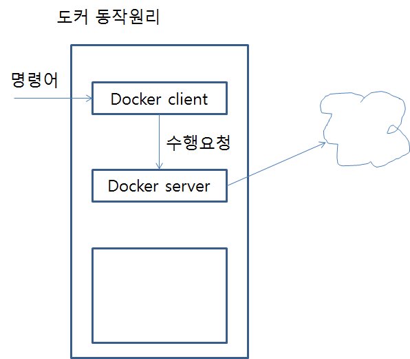

컨테이너를 이용하기 위해선 틀이 있어야한다. → Image





**도커이미지 동작원리**


## 도커 레파지토리를 추가

\# gedit /etc/apt/sources.list

deb https://apt.dockerproject.org/repo ubuntu-xenial main

## HTTPS 통신에 사용되는 패키지와 공개키를 설치

**\# apt-get install -y apt-transport-https ca-certificates curl gnupg-agent software-properties-common**

패키지 목록을 읽는 중입니다... 완료

의존성 트리를 만드는 중입니다       

상태 정보를 읽는 중입니다... 완료

apt-transport-https is already the newest version (1.2.10ubuntu1).

apt-transport-https 패키지는 수동설치로 지정합니다.

ca-certificates is already the newest version (20160104ubuntu1).

ca-certificates 패키지는 수동설치로 지정합니다.

curl is already the newest version (7.47.0-1ubuntu2).

curl 패키지는 수동설치로 지정합니다.

gnupg-agent is already the newest version (2.1.11-6ubuntu2).

gnupg-agent 패키지는 수동설치로 지정합니다.

software-properties-common is already the newest version (0.96.20).

software-properties-common 패키지는 수동설치로 지정합니다.

0개 업그레이드, 0개 새로 설치, 0개 제거 및 0개 업그레이드 안 함.

**\# apt-key adv --keyserver hkp://p80.pool.sks-keyservers.net:80 --recv-keys 58118E89F3A912897C070ADBF76221572C52609D**

Executing: /tmp/tmp.XkzJ6mLu4r/gpg.1.sh --keyserver

hkp://p80.pool.sks-keyservers.net:80

--recv-keys

58118E89F3A912897C070ADBF76221572C52609D

gpg: requesting key 2C52609D from hkp server p80.pool.sks-keyservers.net

gpg: key 2C52609D: public key "Docker Release Tool (releasedocker) <docker@docker.com>" imported

gpg: Total number processed: 1

gpg:               imported: 1  (RSA: 1)

**\# apt-get update**

linux-image-extra와 docker-engine 패키지를 설치

**\# apt-get install linux-image-extra-$(uname -r)**

**\# apt-get install docker-engine**

**root@server:/etc/apt# docker version**

Client:

 Version:      17.05.0-ce

 API version:  1.29

 Go version:   go1.7.5

 Git commit:   89658be

 Built:        Thu May  4 22:10:54 2017

 OS/Arch:      linux/amd64

Server:

 Version:      17.05.0-ce

 API version:  1.29 (minimum version 1.12)

 Go version:   go1.7.5

 Git commit:   89658be

 Built:        Thu May  4 22:10:54 2017

 OS/Arch:      linux/amd64

 Experimental: false

**root@server:~# cd**
**root@server:~# mkdir docker**
**root@server:~# cd docker/**

**root@server:~/docker# gedit main.go**

package main

import (
        "fmt"
        "log"
        "net/http"
)

func main() {
        http.HandleFunc("/", func (w http.ResponseWriter, r *http.Request) {
                log.Println("received request")
                fmt.Fprintf(w, "I have to see a Docker !!!")
        })
        log.Println("start server")

        server := &http.Server{Addr: ":8080"}
        if err := server.ListenAndServe(); err != nil {
                log.Println(err)
        }
}

**root@server:~/docker# gedit dockerfile**

FROM golang:1.9


RUN mkdir /echo


COPY main.go /echo


CMD [ "go", "run", "/echo/main.go" ]

**root@server:~/docker# docker image build -t example/echo:latest . **

Sending build context to Docker daemon  3.072kB

Step 1/4 : FROM golang:1.9

1.9: Pulling from library/golang

0d4eafcc732a: Pull complete 

186b06a99029: Pull complete 

Digest: sha256:8b5968585131604a92af02f5690713efadf029cc8dad53f79280b87a80eb1354

Status: Downloaded newer image for golang:1.9

 ---> ef89ef5c42a9

Step 2/4 : RUN mkdir /echo

 ---> Running in 28fc48e76b1a

 ---> 024d93e00764

Removing intermediate container 28fc48e76b1a

Step 3/4 : COPY main.go /echo

 ---> 9536233ba248

Removing intermediate container d660cc064687

Step 4/4 : CMD go run /echo/main.go

 ---> Running in e58fc269864c

 ---> 6775e8903765

Removing intermediate container e58fc269864c

Successfully built 6775e8903765

Successfully tagged example/echo:latest

**root@server:~/docker# docker image ls**

REPOSITORY          TAG                 IMAGE ID            CREATED             SIZE

example/echo        latest              6775e8903765        4 minutes ago       750MB

golang              1.9                 ef89ef5c42a9        10 months ago       750MB

**root@server:~/docker# docker image build -t example/echo:latest . **

Sending build context to Docker daemon  3.072kB

Step 1/4 : FROM golang:1.9

 ---> ef89ef5c42a9

Step 2/4 : RUN mkdir /echo

 ---> Using cache

 ---> 024d93e00764

Step 3/4 : COPY main.go /echo

 ---> 76b9aa0125fe

Removing intermediate container 1a437913aa6f

Step 4/4 : CMD go run /echo/main.go

 ---> Running in 891755cd6071

 ---> 8da1dcd16f94

Removing intermediate container 891755cd6071

Successfully built 8da1dcd16f94

Successfully tagged example/echo:latest

root@server:~/docker# docker image ls

REPOSITORY          TAG                 IMAGE ID            CREATED             SIZE

example/echo        latest              8da1dcd16f94        52 seconds ago      750MB

<none>              <none>              6775e8903765        9 minutes ago       750MB

golang              1.9                 ef89ef5c42a9        10 months ago       750MB

root@server:~/docker# 

**root@server:~/docker# docker container run -d -p 9000:8080 example/echo:latest**

**root@server:~/docker# docker container rm -f b**

**root@server:~/docker# docker container run -it -p 9000:8080 -d example/echo:latest /bin/bash**

**root@server:~/docker# doker attach 09**

**root@0915e6220036:/go# exit**

**root@server:~/docker# docker container ps -a**

**root@server:~/docker# docker container restart 09**

**root@server:~/docker# docker container run -p 9002:80 --name web1 nginx**

**root@server:~/docker# docker container ps -a --filter "ancestor=example/echo"**

**root@server:~/docker# docker container rm -f $(docker container ps -q -a --filter "ancestor=example/echo")**
33433cf771cb
2908b5fb06d8
6e64a7a35424

**root@server:~/docker# docker login**

**root@server:~/docker# docker system prune**
WARNING! This will remove:

all stopped containers

all volumes not used by at least one container

all networks not used by at least one container

all dangling images
Are you sure you want to continue? [y/N] y
Total reclaimed space: 0B
**root@server:~/docker# docker container run -d -p 9000:80 nginx**
Unable to find image 'nginx:latest' locally
latest: Pulling from library/nginx
688a776db95f: Pull complete 
Digest: sha256:23b4dcdf0d34d4a129755fc6f52e1c6e23bb34ea011b315d87e193033bcd1b68
Status: Downloaded newer image for nginx:latest
14fee3e1be65231e649a402344061a3ccc09724805b5df6b2af54b8872935c32
root@server:~/docker# docker container ls
CONTAINER ID        IMAGE               COMMAND                  CREATED             STATUS              PORTS                  NAMES
14fee3e1be65        nginx               "nginx -g 'daemon ..."   13 seconds ago      Up 12 seconds       0.0.0.0:9000->80/tcp   quizzical_brattain
**root@server:~/docker# docker container exec 1 ls /usr/share/nginx/html/**
50x.html
index.html
**root@server:~/docker# docker container cp 1:/usr/share/nginx/html/index.html /root/docker**
**root@server:~/docker# ls**
dockerfile  index.html  main.go
**root@server:~/docker# nano index.html**
**root@server:~/docker# docker container cp ./index.html 1:/usr/share/nginx/html/index.html**

특정 이름의 컨테이너를 조회

**\# docker container ls -a --filter="name=ooo"**

특정 이름의 컨테이너를 삭제

**\# docker container rm -f $(docker container ls -aq --filter="name=ooo")**

특정 이름의 컨테이너를 삭제하고 해당 이름의 컨테이너를 실행

**\# docker container rm -f $(docker container ls -aq --filter="name=ooo") ; docker container run --name ooo IMAGE_NAME**

실행 또는 중지 상태의 컨테이너를 모두 강제로 삭제

**root@server:~/docker# docker container rm -f $(docker container ls -aq)**

모든 이미지를 삭제

**root@server:~/docker# docker image rm $(docker image ls -aq)**

**root@server:~/docker# cat Dockerfile **

FROM golang:1.9

RUN mkdir /echo

COPY main.go /echo

CMD [ "go", "run", "/echo/main.go" ]

echo라는 이름의 도커 이미지 생성

**root@server:~/docker# docker build -t echo .**

호스트의 9090 포트를 컨테이너의 8080 포트로 맵핑해서 컨테이너를 실행

**root@server:~/docker# docker container run -p 9090:8080 -d echo**

4daae1153e8f1959a6db7b6b94b4ba65f60d002c55d2514852060348b1949155

컨테이너 상태를 확인 (실행 여부)

**root@server:~/docker# docker container ps **

CONTAINER ID        IMAGE               COMMAND                  CREATED             STATUS              PORTS                    NAMES

4daae1153e8f        echo                "go run /echo/main.go"   13 seconds ago      Up 12 seconds       0.0.0.0:9090->8080/tcp   amazing_snyder

컨테이너에 서비스를 요청

**root@server:~/docker# curl http://localhost:9090**

Hello Docker ^^ !!!

컨테이너에 파일을 가져와서 수정 후 재실행

컨테이너의 /echo/main.go 파일을 호스트의 ./main2.go 파일로 복사

**root@server:~/docker# docker container cp 4da:/echo/main.go ./main2.go**

**root@server:~/docker# ls main2.go**

main2.go

호스트에서 ./main2.go 파일의 내용을 수정

**root@server:~/docker# gedit main2.go**

호스트의 ./main2.go 파일을 컨테이너의 /echo/main.go 파일로 복사

**root@server:~/docker# docker container cp ./main2.go 4da:/echo/main.go**

컨테이너가 재실행되지 않았으므로 변경된 내용이 반영되지 않았음

**root@server:~/docker# curl http://localhost:9090**

Hello Docker ^^ !!!

root@server:~/docker# 

컨테이너의 실행을 중지하고 재실행

**root@server:~/docker# docker container stop 4da**

4da

**root@server:~/docker# docker container start 4da**

4da

수정한 내용이 반영된 것을 확인

**root@server:~/docker# curl http://localhost:9090**

안녕 도커 !!!

root@server:~/docker#

## 공유폴더 사용

- 공유폴더를 사용하는 이유
  1. container 안의 파일의 수정 등 작업의 편리성을 위해
  2. container에 사용되는 것들의 버젼이 업데이트 되어도 필요한 파일을 보존하기 위해 사용(컨테이너는 편리하게 없애고 생성할 수 있으나 그만큼 데이터가 쉽게 사라질 수 있음) → 이 용도로 사용할 컨테이너를 만들어 쓰기도 함(볼륨 컨테이너)

root@server:~/docker# mkdir echo (공유할 폴더를 만든다.)

root@server:~/docker#  cp main.go ./echo (공유는 호스트의 폴더가 마운트 되는 형식이므로 dockerfile에서 설정한 대로 컨테이너의 /echo폴더에는 main.go가 있어야 하므로 공유될 호스트의 폴더에 main.go를 넣어준다.)

root@server:~/docker# docker container run -v /root/docker/echo:/echo -d -p 9090:8080 imagename

이제 호스트 공유 폴더에 파일을 생성하면 컨테이너 공유폴더에도 생성되는걸 확인할 수 있다.

### 이미 작동중인 컨테이너에 새 마운트를 하고싶을 경우


## commit

#### 컨테이너의 현재 상태를 이미지로 남기고 싶을 때 사용

**root@server:~/docker/echo# docker commit ef85 myanjini/k_echo**

sha256:e8d7627b322aa01258dd3f76ca91764a457da52872248902dbf103f0e1c50d55

#### 생성된 이미지를 확인

**root@server:~/docker/echo# docker image ls**

REPOSITORY          TAG                 IMAGE ID            CREATED             SIZE

myanjini/k_echo     latest              e8d7627b322a        15 seconds ago      758MB

echo                latest              bbdd71d4e499        About an hour ago   750MB

golang              1.9                 ef89ef5c42a9        10 months ago       750MB

#### 이미지를 도커 허브에 올리고싶을 때

**root@server:~/docker/echo# docker login**

Login with your Docker ID to push and pull images from Docker Hub. If you don't have a Docker ID, head over to https://hub.docker.com to create one.

Username (myanjini): 

Password: 

Login Succeeded

**root@server:~/docker/echo# docker push myanjini/k_echo**

The push refers to a repository [docker.io/myanjini/k_echo]

6ebb376134e0: Pushed 

3b10514a95be: Mounted from myanjini/echo 

latest: digest: sha256:3141d0ad68401de0dffd336089f6d0ff738e26548079871b1f5f0777d60913e4 size: 2628

#### 도커 파일로 빌드한 이미지 vs 커밋으로 만든 이미지

도커파일로 빌드한 것은 어떻게 작동하는 컨테이너인지 확인할 수 있기 때문에 일반 사용자들은 도커 파일이 공개되있는 컨테이너를 선호하는 편이다.

#### -p 옵션에서 특정포트를 지정해주지 않으면 랜덤으로 적용된다.

**root@server:~/docker/echo# docker container run -d -p :8080 temp**
1d10c7e063e8c55bef6654a2349dfa2a499dd95eb100da468b2886ef97dea659
**root@server:~/docker/echo# docker container run -d -p :8080 temp**
c983d004c4993b1c849209690ae77fd4c65bbc97a55152aabd9262231c537a7c
**root@server:~/docker/echo# docker container run -d -p :8080 temp**
97f0b443e4342f01b3d8992fa3479c0c5f9fffc7c740710d9d5402c40a7d7056
**root@server:~/docker/echo# docker container run -d -p :8080 temp**
51ae9bf4cf614717ce2e6468e12728010cb8ad3d570a761ba81f5e4beb294638
**root@server:~/docker/echo# docker container ls**
CONTAINER ID        IMAGE               COMMAND                  CREATED              STATUS              PORTS                     NAMES
51ae9bf4cf61        temp                "go run /echo/main.go"   3 seconds ago        Up 2 seconds        0.0.0.0:**32772**->8080/tcp   musing_meitner
97f0b443e434        temp                "go run /echo/main.go"   4 seconds ago        Up 3 seconds        0.0.0.0:**32771**->8080/tcp   upbeat_newton
c983d004c499        temp                "go run /echo/main.go"   5 seconds ago        Up 4 seconds        0.0.0.0:**32770**->8080/tcp   zen_varahamihira
1d10c7e063e8        temp                "go run /echo/main.go"   6 seconds ago        Up 5 seconds        0.0.0.0:**32769**->8080/tcp   infallible_allen
eb272c523de5        temp                "go run /echo/main.go"   About a minute ago   Up About a minute   0.0.0.0:**32768**->8080/tcp   zen_sammet


```bash
#우분투 16.04가 깔린 가상머신을 실행한 것과 동일한 결과
ubuntu@server:~/docker$ sudo docker run -it --name commit_test ubuntu:16.04
root@89f7ew98fw98f7:/# ls
bin dev home
root@89f7ew98fw98f7:/# mkdir test1234
root@89f7ew98fw98f7:/# ls
bin dev home test1234
root@89f7ew98fw98f7:/# exit
exit
ubuntu@server:~/docker$ sudo docker ps -a
ubuntu@server:~/docker$ sudo docker commit 89f7 commit_test:1.0
ubuntu@server:~/docker$ sudo docker run -it commit_test:1.0
root@234joi23kfjie3:/# ls
bin dev home test1234
root@234joi23kfjie3:/# 
```


#### Redis - 인 메모리 데이터베이스

```bash
root@server:~/docker# docker container run -it redis
Unable to find image 'redis:latest' locally
latest: Pulling from library/redis
743f2d6c1f65: Pull complete 
171658c5966d: Pull complete 
fbef10bd7a65: Pull complete 
0b0b11956c72: Pull complete 
09dbd716637e: Pull complete 
d09046fd4481: Pull complete 
Digest: sha256:e549a30b3c31e6305b973e0d9113a3d38d60566708137af9ed7cbdce5650c5cc
Status: Downloaded newer image for redis:latest
1:C 11 Jun 2019 09:48:06.479 # oO0OoO0OoO0Oo Redis is starting oO0OoO0OoO0Oo
1:C 11 Jun 2019 09:48:06.479 # Redis version=5.0.5, bits=64, commit=00000000, modified=0, pid=1, just started
1:C 11 Jun 2019 09:48:06.479 # Warning: no config file specified, using the default config. In order to specify a config file use redis-server /path/to/redis.conf
                _._                                                  
           _.-``__ ''-._                                             
      _.-``    `.  `_.  ''-._           Redis 5.0.5 (00000000/0) 64 bit
  .-`` .-```.  ```\/    _.,_ ''-._                                   
 (    '      ,       .-`  | `,    )     Running in standalone mode
 |`-._`-...-` __...-.``-._|'` _.-'|     Port: 6379
 |    `-._   `._    /     _.-'    |     PID: 1
  `-._    `-._  `-./  _.-'    _.-'                                   
 |`-._`-._    `-.__.-'    _.-'_.-'|                                  
 |    `-._`-._        _.-'_.-'    |           http://redis.io        
  `-._    `-._`-.__.-'_.-'    _.-'                                   
 |`-._`-._    `-.__.-'    _.-'_.-'|                                  
 |    `-._`-._        _.-'_.-'    |                                  
  `-._    `-._`-.__.-'_.-'    _.-'                                   
      `-._    `-.__.-'    _.-'                                       
          `-._        _.-'                                           
              `-.__.-'                                               

1:M 11 Jun 2019 09:48:06.480 # WARNING: The TCP backlog setting of 511 cannot be enforced because /proc/sys/net/core/somaxconn is set to the lower value of 128.
1:M 11 Jun 2019 09:48:06.480 # Server initialized
1:M 11 Jun 2019 09:48:06.480 # WARNING overcommit_memory is set to 0! Background save may fail under low memory condition. To fix this issue add 'vm.overcommit_memory = 1' to /etc/sysctl.conf and then reboot or run the command 'sysctl vm.overcommit_memory=1' for this to take effect.
1:M 11 Jun 2019 09:48:06.481 # WARNING you have Transparent Huge Pages (THP) support enabled in your kernel. This will create latency and memory usage issues with Redis. To fix this issue run the command 'echo never > /sys/kernel/mm/transparent_hugepage/enabled' as root, and add it to your /etc/rc.local in order to retain the setting after a reboot. Redis must be restarted after THP is disabled.
1:M 11 Jun 2019 09:48:06.481 * Ready to accept connections

```

```bash
#또다른 터미널을 열어서 redis를 사용해야한다.
root@server:~# docker ps
CONTAINER ID        IMAGE               COMMAND                  CREATED              STATUS              PORTS               NAMES
dfb674fe7b21        redis               "docker-entrypoint..."   About a minute ago   Up About a minute   6379/tcp            goofy_swirles
root@server:~# docker exec -it df redis-cli
127.0.0.1:6379> 
127.0.0.1:6379> 
127.0.0.1:6379> 
127.0.0.1:6379> 
127.0.0.1:6379> set test1 1234
OK
127.0.0.1:6379> get test1
"1234"
127.0.0.1:6379> 

```

```bash
# docker file을 생성해서 알파인 기반으로 직접 이미지를 빌드해보자
#알파인은 최소한의 리눅스 기능을 가졌기때문에 많이 사용된다.(ubuntu나 centos보다 훨씬 가볍다. 패키지 설치 명령어가 다르다.)
dockerfile 생성
FROM alpine 

RUN apk add --update redis

CMD ["redis-server"]

ubuntu@server:~/docker/redis-server$ sudo docker build -t momo1108/redis-server:1.0 .
ubuntu@server:~/docker/redis-server$ sudo docker images
ubuntu@server:~/docker/redis-server$ sudo docker run momo1108/redis-server:1.0

#다른 터미널에서 cli실행
ubuntu@server:~/docker/redis-server$ sudo docker exec -it 94 redis-cli
127.0.0.1:6379>
127.0.0.1:6379>
127.0.0.1:6379>set test1 1234
OK
127.0.0.1:6379>get test1
"1234"
127.0.0.1:6379>exit
ubuntu@server:~/docker/redis-server$

```

```bash
# 이제 직접 우분투 기반으로 도커파일을 작성해서 이미지를 빌드해보자. 도커파일은 root의 권한으로 실행되기 때문에 sudo를 써줄 필요가 없다.
dockerfile 생성
FROM ubuntu:16.04
#우분투 기반 이미지를 받아온다.
RUN apt-get update
#apt-get update 명령을 실행하고 다시 그 결과를 이미지로 생성한다.
RUN apt-get install -y redis-server
#apt-get install -y redis-server 명령을 실행하고 다시 그 결과를 이미지로 생성한다.
CMD ["redis-server"]
#CMD 명령은 이미지가 빌드되고 컨테이너가 실행됬을 때 사용될 디폴트 커맨드를 올려놓는다.
#빌드를 할 때 이미지 뒤에 따로 실행될 커맨드를 올려놓으면 그 커맨드가 우선적으로 실행된다.
--------------------------------------------------------------------------------------
ubuntu@server:~/docker/redis-server2$ sudo docker build -t momo1108/ubuntu_redis:1.0 .
ubuntu@server:~/docker/redis-server2$ sudo docker ps -a
ubuntu@server:~/docker/redis-server2$ sudo docker exec -it 79ef redis-cli
127.0.0.1:6379>
127.0.0.1:6379>
127.0.0.1:6379>set test1 123
OK
127.0.0.1:6379>get test1
"123"
127.0.0.1:6379>exit
ubuntu@server:~/docker/redis-server2$ 
```


```bash
# 이제 직접 기반을 선택해서 dockerfile을 작성하여 apache2 서버 이미지를 생성하고 컨테이너를 생성해서 서버를 실행해보자. 사실 우리가 직접 dockerfile을 생성하는 건 어렵다. 오피셜로 제공되는 이미지를 받아서 설치에 대해 신경쓸 필요없이 쓸 수 있다는 것이 docker의 장점이다. 그냥 인터넷으로 찾아서 쓰도록 하자. 도커허브에 친절하게 나와있을 것이다.
dockerfile 생성
FROM ubuntu:latest

RUN apt-get update

RUN apt-get check

RUN apt-get dist-upgrade -y

RUN apt-get install -y apache2

# See http://www.kstaken.com/blog/2013/07/06/how-to-run-apache-under-docker/
ENV APACHE_RUN_USER www-data

ENV APACHE_RUN_GROUP www-data

ENV APACHE_LOG_DIR /var/log/apache2

ADD apache2.conf /etc/apache2/apache2.conf

EXPOSE 80

ENTRYPOINT ["/usr/sbin/apache2"]

CMD ["-D", "FOREGROUND"]

실패!!!!
```


### node 맛만보자

```bash
ubuntu@server:~/docker$ curl -o- https://raw.githubusercontent.com/nvm-sh/nvm/v0.34.0/install.sh | bash
ubuntu@server:~/docker$ nvm install 10.14.2
ubuntu@server:~/docker$ mkdir simpleweb
ubuntu@server:~/docker$ cd simpleweb/
ubuntu@server:~/docker/simpleweb$ npm init
ubuntu@server:~/docker/simpleweb$ npm install --save express

# app.js 파일을 생성해주고 package.json 파일을 수정해준다.
#package.json 에 test 튀에 , 와 start 행을 추가해준다.
{
  "name": "simpleweb",
  "version": "1.0.0",
  "description": "",
  "main": "index.js",
  "scripts": {
    "test": "echo \"Error: no test specified\" && exit 1",
    "start": "node app.js"
  },
  "author": "",
  "license": "ISC",
  "dependencies": {
    "express": "^4.17.1"
  }
}

#app.js 파일을 생성해준다.
const express = require('express');

const app = express();

app.get('/', (req, res) => {
res.send('Hi there');
});

app.listen(8080, () => {
console.log('Listening at 8080');
})

# node 서버의 동작을 확인해보자.
ubuntu@server:~/docker/simpleweb$ node app.js
Listening at 8080
^C
ubuntu@server:~/docker/simpleweb$ npm start

> simpleweb@1.0.0 start /home/ubuntu/docker/simpleweb
>node app.js

Listening at 8080

```

**브라우저에서 확인**

http://localhost:8080


```bash
Dockerfile 생성

# Specify a base image
FROM alpine 
# Install some dependencies
RUN npm install 
# Default command
CMD ["npm", "start"] 

# docker build

ubuntu@server:~/docker/simpleweb$ sudo docker build -t momo1108/node_server:1.0 .
[sudo] password for ubuntu: 
Sending build context to Docker daemon  1.999MB
Step 1/3 : FROM alpine
 ---> 055936d39205
Step 2/3 : RUN npm Install
 ---> Running in b94e1f21bff8
/bin/sh: npm: not found
The command '/bin/sh -c npm Install' returned a non-zero code: 127
# npm이 무엇인지 모른다. 2가지 방법 - npm이 포함된 알파인을 사용하던가 npm을 사용할 수 있도록 설치를 해준다.


----------------------------------------------------------------------------------------


ubuntu@server:~/docker/simpleweb$ sudo docker build -t momo1108/node_server:1.0 .
Sending build context to Docker daemon  1.999MB
Step 1/3 : FROM node:10-alpine
 ---> 9dfa73010b19
Step 2/3 : RUN npm Install
 ---> Running in b295a11f637c

Usage: npm <command>

where <command> is one of:
    access, adduser, audit, bin, bugs, c, cache, ci, cit,
    clean-install, clean-install-test, completion, config,
    create, ddp, dedupe, deprecate, dist-tag, docs, doctor,
    edit, explore, get, help, help-search, hook, i, init,
    install, install-ci-test, install-test, it, link, list, ln,
    login, logout, ls, org, outdated, owner, pack, ping, prefix,
    profile, prune, publish, rb, rebuild, repo, restart, root,
    run, run-script, s, se, search, set, shrinkwrap, star,
    stars, start, stop, t, team, test, token, tst, un,
    uninstall, unpublish, unstar, up, update, v, version, view,
    whoami

npm <command> -h  quick help on <command>
npm -l            display full usage info
npm help <term>   search for help on <term>
npm help npm      involved overview

Specify configs in the ini-formatted file:
    /root/.npmrc
or on the command line via: npm <command> --key value
Config info can be viewed via: npm help config

npm@6.9.0 /usr/local/lib/node_modules/npm

Did you mean one of these?
    install
    uninstall
    unstar
The command '/bin/sh -c npm Install' returned a non-zero code: 1

#package.json 파일이 없어서 install 을 하지 못한다. npm init으로 파일을 받아와서 다시 실행해보면 설치가 된다. 따라서 Dockerfile에서 COPY 명령어로 package.json 파일을 복사해준다.


----------------------------------------------------------------------------------------


# dockerfile

FROM alpine 
# COPY 명령어로 simpleweb 디렉터리의 파일들을 컨테이너의 루트 디렉터리로 복사해준다.
COPY . .
RUN npm install 

CMD ["npm", "start"] 

# 다시 이미지를 빌드해보자.
ubuntu@server:~/docker/simpleweb$ sudo docker build -t momo1108/node_server:1.0 .
Sending build context to Docker daemon  1.999MB
Step 1/4 : FROM node:10-alpine
 ---> 9dfa73010b19
Step 2/4 : COPY . .
 ---> b5dffd5f842b
Removing intermediate container 0f19a9acc460
Step 3/4 : RUN npm install
 ---> Running in 9a90da450c13
npm WARN simpleweb@1.0.0 No description
npm WARN simpleweb@1.0.0 No repository field.

audited 126 packages in 0.851s
found 0 vulnerabilities

 ---> 79808b4ee2ea
Removing intermediate container 9a90da450c13
Step 4/4 : CMD npm start
 ---> Running in 9e9b50ffce30
 ---> 28bb2fde2cb5
Removing intermediate container 9e9b50ffce30
Successfully built 28bb2fde2cb5
Successfully tagged momo1108/node_server:1.0

ubuntu@server:~/docker/simpleweb$ sudo docker run momo1108/node_server:1.0

> simpleweb@1.0.0 start /
> node app.js

Listening at 8080

# 그러나 컨테이너를 런할 때 우분투 호스트의 포트를 컨테이너의 8080포트에 지정해주지 않았기 때문에 접속이 안된다.

ubuntu@server:~/docker/simpleweb$ sudo docker run -p 8080:8080 28bb

> simpleweb@1.0.0 start /
> node app.js

Listening at 8080

# 이제 웹 브라우저에서 8080포트로 접속을 하면 컨테이너의 8080포트에 접속이 되는 걸 확인할 수 있다.
```


```bash
# 컨테이너가 잘 작동되는지 확인해보자.

ubuntu@server:~$ sudo docker ps -a
CONTAINER ID        IMAGE               COMMAND                  CREATED             STATUS              PORTS                    NAMES
6f9beea3d346        28bb                "docker-entrypoint..."   9 minutes ago       Up 9 minutes        0.0.0.0:8080->8080/tcp   sleepy_sammet

ubuntu@server:~$ sudo docker exec -it sleepy_sammet sh
/ # 
/ # 
/ # 
/ # ls
app.js             lib                package.json       sys
bin                media              proc               tmp
dev                mnt                root               usr
dockerfile         node_modules       run                var
etc                opt                sbin
home               package-lock.json  srv
/ # exit


-----------------------------------------------------------------------------------------


# 이 경우 컨테이너의 루트폴더에 파일들이 복사가 되므로 지저분해진다. 루트 디렉터리를 설정해줘서 깔끔해서 복사해보자.

# Specify a base image
FROM node:10-alpine

WORKDIR /usr/app

# Install some dependencies
COPY . .
RUN npm install

# Default command
CMD ["npm", "start"]
ubuntu@server:~/docker/simpleweb$ sudo docker build -t momo1108/node_server:2.0 .
Sending build context to Docker daemon  1.999MB
Step 1/5 : FROM node:10-alpine
 ---> 9dfa73010b19
Step 2/5 : WORKDIR /usr/app
 ---> 149a97231ac3
Removing intermediate container 8333bd569543
Step 3/5 : COPY . .
 ---> 640e17adcb16
Removing intermediate container 4346afdeabf9
Step 4/5 : RUN npm install
 ---> Running in efa71d8f085f
npm WARN simpleweb@1.0.0 No description
npm WARN simpleweb@1.0.0 No repository field.

audited 126 packages in 0.714s
found 0 vulnerabilities

 ---> cff2855f4214
Removing intermediate container efa71d8f085f
Step 5/5 : CMD npm start
 ---> Running in c327940a2017
 ---> b16456233271
Removing intermediate container c327940a2017
Successfully built b16456233271
Successfully tagged momo1108/node_server:2.0
# 이미지가 잘 빌드되었다.

ubuntu@server:~/docker/simpleweb$ sudo docker run -p 8080:8080 momo1108/node_server:2.0

> simpleweb@1.0.0 start /usr/app
> node app.js

Listening at 8080
# 생성된 이미지를 컨테이너로 생성해보자.


# 이제 새로운 터미널을 열어서 컨테이너로 접속해보자.
ubuntu@server:~/docker/simpleweb$ sudo docker exec -it 29 sh
/usr/app # ls
app.js             dockerfile         node_modules       package-lock.json  package.json
/usr/app # cd 
~ # ls
~ # cd /
/ # ls
bin    dev    etc    home   lib    media  mnt    opt    proc   root   run    sbin   srv    sys    tmp    usr    var
/ # 

# 컨테이너로 접속햇을 때 작업 디렉터리인 /usr/app 으로 접속이되었고 작업 디렉터리에 CP 명령이 실행된 것을 확인할 수 있다.

```


### Optimiseweb

```bash
# app.js, package-lock.json, package.json 파일을 optimiseweb 디렉터리로 복사해준다.
# 도커파일을 생성해주자
FROM node:10-alpine

WORKDIR /usr/app

# Install some dependencies
COPY . .
RUN npm install

# Default command
CMD ["npm", "start"]

ubuntu@server:~/docker/optimiseweb$ npm install
npm WARN simpleweb@1.0.0 No description
npm WARN simpleweb@1.0.0 No repository field.

added 50 packages from 37 contributors and audited 126 packages in 1.196s
found 0 vulnerabilities

ubuntu@server:~/docker/optimiseweb$ sudo docker build -t momo1108/optimizeweb:1.0 .
[sudo] password for ubuntu: 
Sending build context to Docker daemon  1.996MB
Step 1/5 : FROM node:10-alpine
10-alpine: Pulling from library/node
e7c96db7181b: Already exists 
bbec46749066: Pull complete 
89e5cf82282d: Pull complete 
5de6895db72f: Pull complete 
Digest: sha256:0b9999cc406d842543be109c0d9dcf6198a96cc3dacdf2a4fb015a6dcc8c17b8
Status: Downloaded newer image for node:10-alpine
 ---> 9dfa73010b19
Step 2/5 : WORKDIR /usr/app
 ---> 31c999406f21
Removing intermediate container b94e1f21bff8
Step 3/5 : COPY . .
 ---> 0c00dd19fa50
Removing intermediate container d0a97f002de6
Step 4/5 : RUN npm install
 ---> Running in b6fe351aac4c
npm WARN simpleweb@1.0.0 No description
npm WARN simpleweb@1.0.0 No repository field.

audited 126 packages in 0.777s
found 0 vulnerabilities

 ---> 379ebc62329c
Removing intermediate container b6fe351aac4c
Step 5/5 : CMD npm start
 ---> Running in b295a11f637c
 ---> faf03733b0b0
Removing intermediate container b295a11f637c
Successfully built faf03733b0b0
Successfully tagged momo1108/optimizeweb:1.0


# 이제 제대로 됐는지 확인해보자.
ubuntu@server:~/docker/optimiseweb$ node app.js
Listening at 8080
ubuntu@server:~/docker/optimiseweb$ 

-----------------------------------------------------------------------------------------

# 이미지를 빌드할 때 변한 것 없이 똑같이 빌드하면 이미 생성돼있는 캐시를 이용한다.
ubuntu@server:~/docker/optimiseweb$ sudo docker build -t momo1108/optimizeweb:1.0 .
Sending build context to Docker daemon  1.996MB
Step 1/5 : FROM node:10-alpine
 ---> 9dfa73010b19
Step 2/5 : WORKDIR /usr/app
 ---> Using cache
 ---> 31c999406f21
Step 3/5 : COPY . .
 ---> Using cache
 ---> 0c00dd19fa50
Step 4/5 : RUN npm install
 ---> Using cache
 ---> 379ebc62329c
Step 5/5 : CMD npm start
 ---> Using cache
 ---> faf03733b0b0
Successfully built faf03733b0b0
Successfully tagged momo1108/optimizeweb:1.0

# 이제 app.js 의 'Hi there' 을 변경하고 다시 빌드를 해보자.
ubuntu@server:~/docker/optimiseweb$ sudo docker build -t momo1108/optimizeweb:1.0 .
Sending build context to Docker daemon  1.996MB
Step 1/5 : FROM node:10-alpine
 ---> 9dfa73010b19
Step 2/5 : WORKDIR /usr/app
 ---> Using cache
 ---> 31c999406f21
# 이제 여기부터 변경사항이 생기기 때문에 위의 과정과 달라진다.
Step 3/5 : COPY . .
 ---> c91333bdfffb
Removing intermediate container cefeb3d13d8e
Step 4/5 : RUN npm install
 ---> Running in 6d3d252f208a
npm WARN simpleweb@1.0.0 No description
npm WARN simpleweb@1.0.0 No repository field.

audited 126 packages in 1.171s
found 0 vulnerabilities

 ---> 56312660433d
Removing intermediate container 6d3d252f208a
Step 5/5 : CMD npm start
 ---> Running in 017024e10b9d
 ---> a4c4a31497b7
Removing intermediate container 017024e10b9d
Successfully built a4c4a31497b7
Successfully tagged momo1108/optimizeweb:1.0

-----------------------------------------------------------------------------------------

# 이런 불편함을 막기위해 미리 설치에 필요한 package.json 파일을 먼저 복사하도록 도커파일을 수정한다.
FROM node:10-alpine

WORKDIR /usr/app

COPY ./package.json .

RUN npm install

COPY . .

CMD ["npm", "start"]

# 위의 도커파일로 한번 빌드하고나서부터는 소스파일(app.js)을 아무리 바꿔도 npm install까지는 영향을 받지 않아 캐시를 사용해 빠르게 빌드할 수 있다.
ubuntu@server:~/docker/optimiseweb$ sudo docker build -t momo1108/optimizeweb:1.0 .
Sending build context to Docker daemon  1.996MB
Step 1/6 : FROM node:10-alpine
 ---> 9dfa73010b19
Step 2/6 : WORKDIR /usr/app
 ---> Using cache
 ---> 31c999406f21
Step 3/6 : COPY ./package.json .
 ---> Using cache
 ---> 96fea4188b69
Step 4/6 : RUN npm install
 ---> Using cache
 ---> 91af78ee18e8
Step 5/6 : COPY . .
 ---> 16aac868e666
Removing intermediate container 291adcd4e619
Step 6/6 : CMD npm start
 ---> Running in 309fd281d230
 ---> 564b7a7c4fd5
Removing intermediate container 309fd281d230
Successfully built 564b7a7c4fd5
Successfully tagged momo1108/optimizeweb:1.0


rm -rf node_modules
npm install
# .dockerignore 파일을 생성해준다.
# Dockerfile과 같은 디렉터리에 들어있는 모든 파일을 컨텍스트(context)라고 한다. 특히 이미지를 생성할 때 컨텍스트를 모두 Docker 데몬에 전송하므로 필요 없는 파일이 포함되지 않도록 주의하자. 컨텍스트에서 파일이나 디렉터리를 제외하고 싶을 때는 .dockerignore 파일을 사용하면 된다. Docker는 Go 언어로 작성되어 있기 때문에 파일 매칭도 Go 언어의 규칙을 따른다.
**/node_modules

```


### nodejs 와 redis-server 연동


```bash
# node-redis 디렉터리를 생성하고 도커파일을 만들자


# Specify a base image
FROM node:10-alpine

WORKDIR /usr/app

# Install some dependencies
COPY ./package.json .

RUN npm install

COPY . .
# Default command
CMD ["npm", "start"]


# package.json을 생성해주고 편집해주자
ubuntu@server:~/docker/node-redis$ npm init                                           
This utility will walk you through creating a package.json file.                      
It only covers the most common items, and tries to guess sensible defaults.           
                                                                                      
See `npm help json` for definitive documentation on these fields                      
and exactly what they do.   

Use `npm install <pkg>` afterwards to install a package and                           
save it as a dependency in the package.json file.                                     
                                                                                      
Press ^C at any time to quit.                                                         
package name: (redis)                                                                 
version: (1.0.0)                                                                      
description:                                                                          
entry point: (index.js)                                                               
test command:                                                                         
git repository:                                                                       
keywords:                                                                             
author:             
license: (ISC)                                                                        
About to write to /home/ubuntu/docker/node-redis/package.json:                        
                                                                                      
{                                                                                     
  "name": "redis",                                                                    
  "version": "1.0.0",                                                                 
  "description": "",                                                                  
  "main": "index.js",                                                                 
  "scripts": {                                                                        
    "test": "echo \"Error: no test specified\" && exit 1"                             
  },                                                                                  
  "author": "",                                                                       
  "license": "ISC"                                                                    
}                                                                                     
                                                                                      
                                                                                      
Is this OK? (yes)      


-----------------------------------------------------------------------------------------


# 이제 package.json 파일의 name 을 redis에서 node_redis로 변경해주고 test 행 뒤에 , 를 붙이고 "start": "node app.js"를 추가해주고 app.js파일을 생성해주고 진행한다.
# app.js
const express = require('express');
const redis = require('redis');

const app = express();

const client = redis.createClient();
client.set('visits', 0);

app.get('/', (req, res) => {
    client.get('visits', (err, visits) => {
        res.send('Number of visit is ' + visits);
        client.set('visits', parseInt(visits) + 1);
    });
});

app.listen(8081, () =>{
    console.log('Listening 8081 port');
});

# --save 옵션은 설치할 모듈을 직접 지정해준 것이고 옵션을 붙이지 않을 시 필요한 모든 모듈을 받아온다.
ubuntu@server:~/docker/node-redis$ npm install --save express
npm notice created a lockfile as package-lock.json. You should commit this file.
npm WARN node_redis@1.0.0 No description
npm WARN node_redis@1.0.0 No repository field.

+ express@4.17.1
added 50 packages from 37 contributors and audited 126 packages in 1.689s
found 0 vulnerabilities

ubuntu@server:~/docker/node-redis$ npm install --save redis
npm WARN node_redis@1.0.0 No description
npm WARN node_redis@1.0.0 No repository field.

+ redis@2.8.0
added 4 packages from 4 contributors and audited 130 packages in 1.05s
found 0 vulnerabilities

-----------------------------------------------------------------------------------------


# 이제 local에서 동작이 잘 되는지 확인해보자. redis가 없어서 에러가 발생할 것이다.
ubuntu@server:~/docker/node-redis$ npm start

> node_redis@1.0.0 start /home/ubuntu/docker/node-redis
> node app.js

Listening 8081 port
events.js:167
      throw er; // Unhandled 'error' event
      ^

Error: Redis connection to 127.0.0.1:6379 failed - connect ECONNREFUSED 127.0.0.1:6379
    at TCPConnectWrap.afterConnect [as oncomplete] (net.js:1117:14)
Emitted 'error' event at:
    at RedisClient.on_error (/home/ubuntu/docker/node-redis/node_modules/redis/index.js:406:14)
    at Socket.<anonymous> (/home/ubuntu/docker/node-redis/node_modules/redis/index.js:279:14)
    at Socket.emit (events.js:182:13)
    at emitErrorNT (internal/streams/destroy.js:82:8)
    at emitErrorAndCloseNT (internal/streams/destroy.js:50:3)
    at process._tickCallback (internal/process/next_tick.js:63:19)
npm ERR! code ELIFECYCLE
npm ERR! errno 1
npm ERR! node_redis@1.0.0 start: `node app.js`
npm ERR! Exit status 1
npm ERR! 
npm ERR! Failed at the node_redis@1.0.0 start script.
npm ERR! This is probably not a problem with npm. There is likely additional logging output above.

npm ERR! A complete log of this run can be found in:
npm ERR!     /home/ubuntu/.npm/_logs/2019-06-12T10_31_58_712Z-debug.log

-----------------------------------------------------------------------------------------


# redis를 설치해주고 실행, 동작확인을 해보자.
ubuntu@server:~/docker/node-redis$ sudo apt-get install redis-server
ubuntu@server:~/docker/node-redis$ redis-server
6493:C 12 Jun 19:34:57.996 # Warning: no config file specified, using the default config. In order to specify a config file use redis-server /path/to/redis.conf
6493:M 12 Jun 19:34:57.997 * Increased maximum number of open files to 10032 (it was originally set to 1024).
                _._                                                  
           _.-``__ ''-._                                             
      _.-``    `.  `_.  ''-._           Redis 3.0.6 (00000000/0) 64 bit
  .-`` .-```.  ```\/    _.,_ ''-._                                   
 (    '      ,       .-`  | `,    )     Running in standalone mode
 |`-._`-...-` __...-.``-._|'` _.-'|     Port: 6379
 |    `-._   `._    /     _.-'    |     PID: 6493
  `-._    `-._  `-./  _.-'    _.-'                                   
 |`-._`-._    `-.__.-'    _.-'_.-'|                                  
 |    `-._`-._        _.-'_.-'    |           http://redis.io        
  `-._    `-._`-.__.-'_.-'    _.-'                                   
 |`-._`-._    `-.__.-'    _.-'_.-'|                                  
 |    `-._`-._        _.-'_.-'    |                                  
  `-._    `-._`-.__.-'_.-'    _.-'                                   
      `-._    `-.__.-'    _.-'                                       
          `-._        _.-'                                           
              `-.__.-'                                               

6493:M 12 Jun 19:34:57.997 # WARNING: The TCP backlog setting of 511 cannot be enforced because /proc/sys/net/core/somaxconn is set to the lower value of 128.
6493:M 12 Jun 19:34:57.997 # Server started, Redis version 3.0.6
6493:M 12 Jun 19:34:57.997 # WARNING overcommit_memory is set to 0! Background save may fail under low memory condition. To fix this issue add 'vm.overcommit_memory = 1' to /etc/sysctl.conf and then reboot or run the command 'sysctl vm.overcommit_memory=1' for this to take effect.
6493:M 12 Jun 19:34:57.997 # WARNING you have Transparent Huge Pages (THP) support enabled in your kernel. This will create latency and memory usage issues with Redis. To fix this issue run the command 'echo never > /sys/kernel/mm/transparent_hugepage/enabled' as root, and add it to your /etc/rc.local in order to retain the setting after a reboot. Redis must be restarted after THP is disabled.
6493:M 12 Jun 19:34:57.997 * The server is now ready to accept connections on port 6379

# 새 터미널에서
ubuntu@server:~/docker/node-redis$ redis-cli
127.0.0.1:6379> 
127.0.0.1:6379> 
127.0.0.1:6379> set test1 1234
OK
127.0.0.1:6379> get test1
"1234"
127.0.0.1:6379> exit
ubuntu@server:~/docker/node-redis$ 

# 잘 동작한다. 소스파일 app.js를 확인해보자.
client.set('visits', 0);

app.get('/', (req, res) => {
    client.get('visits', (err, visits) => {
        res.send('Number of visit is ' + visits);
        client.set('visits', parseInt(visits) + 1);
    });
});
# 이 부분은 visits 초기값을 0으로 설정해주고 조건이 만족되면 1씩 더해줘서 다시 저장하는 코드다.

# 동작을 확인해보자
ubuntu@server:~/docker/node-redis$ node app.js
Listening 8081 port

# 웹 브라우저에서 접속을 하고 새로고침을 할때마다 visit가 1씩 늘어나는 것을 알 수 있다.
```


#### Docker Container 올리기

```bash
# .dockerignore 파일을 생성해주고 이미지를 빌드해주자.
**/node_modules

ubuntu@server:~/docker/node-redis$ sudo docker build -t momo1108/node_redis:1.0 .
[sudo] password for ubuntu: 
Sending build context to Docker daemon  20.99kB
Step 1/6 : FROM node:10-alpine
 ---> 9dfa73010b19
Step 2/6 : WORKDIR /usr/app
 ---> Using cache
 ---> 7f9ac3cab5d8
Step 3/6 : COPY ./package.json .
 ---> c511bb42ac9a
Removing intermediate container 6303e4fa5518
Step 4/6 : RUN npm install
 ---> Running in 5cca01ca3a22
npm notice created a lockfile as package-lock.json. You should commit this file.
npm WARN node_redis@1.0.0 No description
npm WARN node_redis@1.0.0 No repository field.

added 54 packages from 41 contributors and audited 130 packages in 2.363s
found 0 vulnerabilities

 ---> 4ec24f455b87
Removing intermediate container 5cca01ca3a22
Step 5/6 : COPY . .
 ---> b73a2bad4549
Removing intermediate container 4b0948861f5b
Step 6/6 : CMD npm start
 ---> Running in e17b8b4c6339
 ---> 8e76ae119be4
Removing intermediate container e17b8b4c6339
Successfully built 8e76ae119be4
Successfully tagged momo1108/node_redis:1.0

# 빌드된 이미지를 사용해 컨테이너를 실행해보자.
ubuntu@server:~/docker/node-redis$ sudo docker run momo1108/node_redis:1.0

> node_redis@1.0.0 start /usr/app
> node app.js

Listening 8081 port
events.js:174
      throw er; // Unhandled 'error' event
      ^

Error: Redis connection to 127.0.0.1:6379 failed - connect ECONNREFUSED 127.0.0.1:6379
    at TCPConnectWrap.afterConnect [as oncomplete] (net.js:1106:14)
Emitted 'error' event at:
    at RedisClient.on_error (/usr/app/node_modules/redis/index.js:406:14)
    at Socket.<anonymous> (/usr/app/node_modules/redis/index.js:279:14)
    at Socket.emit (events.js:198:13)
    at emitErrorNT (internal/streams/destroy.js:91:8)
    at emitErrorAndCloseNT (internal/streams/destroy.js:59:3)
    at process._tickCallback (internal/process/next_tick.js:63:19)
npm ERR! code ELIFECYCLE
npm ERR! errno 1
npm ERR! node_redis@1.0.0 start: `node app.js`
npm ERR! Exit status 1
npm ERR! 
npm ERR! Failed at the node_redis@1.0.0 start script.
npm ERR! This is probably not a problem with npm. There is likely additional logging output above.

npm ERR! A complete log of this run can be found in:
npm ERR!     /root/.npm/_logs/2019-06-12T10_47_20_955Z-debug.log
# 
```

```bash
# 도커의 ip대역
ubuntu@server:~$ ifconfig
docker0   Link encap:Ethernet  HWaddr 02:42:13:f0:90:5c  
          inet addr:172.17.0.1  Bcast:0.0.0.0  Mask:255.255.0.0
          inet6 addr: fe80::42:13ff:fef0:905c/64 Scope:Link
          UP BROADCAST RUNNING MULTICAST  MTU:1500  Metric:1
          RX packets:1333 errors:0 dropped:0 overruns:0 frame:0
          TX packets:1320 errors:0 dropped:0 overruns:0 carrier:0
          collisions:0 txqueuelen:0 
          RX bytes:204853 (204.8 KB)  TX bytes:2945699 (2.9 MB)
          
# 이제 도커 컴포즈를 이용해서 컨테이너를 실행해보자. docker-compose.yml 파일을 생성하자.
version: '2'
services:
  redis-server:
    image: 'redis'
  node-app:
    build: .
    ports:
      - "8081:8081"

ubuntu@server:~/docker/node-redis$ sudo docker-compose up --build
Building node-app
Step 1/6 : FROM node:10-alpine
 ---> 9dfa73010b19
Step 2/6 : WORKDIR /usr/app
 ---> Using cache
 ---> 7f9ac3cab5d8
Step 3/6 : COPY ./package.json .
 ---> Using cache
 ---> aa75bcea7200
Step 4/6 : RUN npm install
 ---> Using cache
 ---> 7676cd3c0bb2
Step 5/6 : COPY . .
 ---> e6b8ef80a766
Removing intermediate container 9c4ea7188ad6
Step 6/6 : CMD npm start
 ---> Running in 4decc2ed610d
 ---> e497636578db
Removing intermediate container 4decc2ed610d
Successfully built e497636578db
Successfully tagged node-redis_node-app:latest
Starting node-redis_redis-server_1 ... done
Recreating node-redis_node-app_1   ... done
Attaching to node-redis_redis-server_1, node-redis_node-app_1
redis-server_1  | 1:C 12 Jun 2019 11:23:58.038 # oO0OoO0OoO0Oo Redis is starting oO0OoO0OoO0Oo
redis-server_1  | 1:C 12 Jun 2019 11:23:58.038 # Redis version=5.0.5, bits=64, commit=00000000, modified=0, pid=1, just started
redis-server_1  | 1:C 12 Jun 2019 11:23:58.038 # Warning: no config file specified, using the default config. In order to specify a config file use redis-server /path/to/redis.conf
redis-server_1  | 1:M 12 Jun 2019 11:23:58.039 * Running mode=standalone, port=6379.
redis-server_1  | 1:M 12 Jun 2019 11:23:58.039 # WARNING: The TCP backlog setting of 511 cannot be enforced because /proc/sys/net/core/somaxconn is set to the lower value of 128.
redis-server_1  | 1:M 12 Jun 2019 11:23:58.039 # Server initialized
redis-server_1  | 1:M 12 Jun 2019 11:23:58.039 # WARNING overcommit_memory is set to 0! Background save may fail under low memory condition. To fix this issue add 'vm.overcommit_memory = 1' to /etc/sysctl.conf and then reboot or run the command 'sysctl vm.overcommit_memory=1' for this to take effect.
redis-server_1  | 1:M 12 Jun 2019 11:23:58.040 # WARNING you have Transparent Huge Pages (THP) support enabled in your kernel. This will create latency and memory usage issues with Redis. To fix this issue run the command 'echo never > /sys/kernel/mm/transparent_hugepage/enabled' as root, and add it to your /etc/rc.local in order to retain the setting after a reboot. Redis must be restarted after THP is disabled.
redis-server_1  | 1:M 12 Jun 2019 11:23:58.040 * DB loaded from disk: 0.000 seconds
redis-server_1  | 1:M 12 Jun 2019 11:23:58.040 * Ready to accept connections
node-app_1      | 
node-app_1      | > node_redis@1.0.0 start /usr/app
node-app_1      | > node app.js
node-app_1      | 
node-app_1      | Listening 8081 port
node-app_1      | events.js:174
node-app_1      |       throw er; // Unhandled 'error' event
node-app_1      |       ^
node-app_1      | 
node-app_1      | Error: Redis connection to 127.0.0.1:6379 failed - connect ECONNREFUSED 127.0.0.1:6379
-----------------------------------------------------------------------------------------
# 리스닝까진 잘 동작했지만 로컬의 6379로 접속하려다가 실패했다. app.js 소스파일에 포트를 알려줘야한다.
-----------------------------------------------------------------------------------------
node-app_1      |     at TCPConnectWrap.afterConnect [as oncomplete] (net.js:1106:14)
node-app_1      | Emitted 'error' event at:
node-app_1      |     at RedisClient.on_error (/usr/app/node_modules/redis/index.js:406:14)
node-app_1      |     at Socket.<anonymous> (/usr/app/node_modules/redis/index.js:279:14)
node-app_1      |     at Socket.emit (events.js:198:13)
node-app_1      |     at emitErrorNT (internal/streams/destroy.js:91:8)
node-app_1      |     at emitErrorAndCloseNT (internal/streams/destroy.js:59:3)
node-app_1      |     at process._tickCallback (internal/process/next_tick.js:63:19)
node-app_1      | npm ERR! code ELIFECYCLE
node-app_1      | npm ERR! errno 1
node-app_1      | npm ERR! node_redis@1.0.0 start: `node app.js`
node-app_1      | npm ERR! Exit status 1
node-app_1      | npm ERR! 
node-app_1      | npm ERR! Failed at the node_redis@1.0.0 start script.
node-app_1      | npm ERR! This is probably not a problem with npm. There is likely additional logging output above.
node-app_1      | 
node-app_1      | npm ERR! A complete log of this run can be found in:
node-app_1      | npm ERR!     /root/.npm/_logs/2019-06-12T11_23_59_783Z-debug.log
node-redis_node-app_1 exited with code 1
^CGracefully stopping... (press Ctrl+C again to force)
Stopping node-redis_redis-server_1 ... done

# app.js의 client 부분의 포트부분을 생성해주자. docker-compose.yml 파일에서 선언한 서비스의 이름을 알려주고 포트를 지정해준다. redis 서버와 내부적으로 통신을 하기 위해 client에 redis 서버를 등록해주는 것이다. ip를 지정해주지 않는 이유는 도커가 올라올 때 마다 할당되는 ip가 바뀌기 때문이다.
const client = redis.createClient({
    host:'redis-server',
    port:6379
});

ubuntu@server:~/docker/node-redis$ sudo docker-compose up
Creating network "node-redis_default" with the default driver
Building node-app
Step 1/6 : FROM node:10-alpine
 ---> 9dfa73010b19
Step 2/6 : WORKDIR /usr/app
 ---> Using cache
 ---> 7f9ac3cab5d8
Step 3/6 : COPY ./package.json .
 ---> Using cache
 ---> aa75bcea7200
Step 4/6 : RUN npm install
 ---> Using cache
 ---> 7676cd3c0bb2
Step 5/6 : COPY . .
 ---> 3522de28d4b0
Removing intermediate container bcc9ad803104
Step 6/6 : CMD npm start
 ---> Running in a606b82bbca2
 ---> 407089d7a8ca
Removing intermediate container a606b82bbca2
Successfully built 407089d7a8ca
Successfully tagged node-redis_node-app:latest
WARNING: Image for service node-app was built because it did not already exist. To rebuild this image you must use `docker-compose build` or `docker-compose up --build`.
Creating node-redis_redis-server_1 ... done
Creating node-redis_node-app_1     ... done
Attaching to node-redis_redis-server_1, node-redis_node-app_1
redis-server_1  | 1:C 12 Jun 2019 11:37:13.402 # oO0OoO0OoO0Oo Redis is starting oO0OoO0OoO0Oo
redis-server_1  | 1:C 12 Jun 2019 11:37:13.402 # Redis version=5.0.5, bits=64, commit=00000000, modified=0, pid=1, just started
redis-server_1  | 1:C 12 Jun 2019 11:37:13.402 # Warning: no config file specified, using the default config. In order to specify a config file use redis-server /path/to/redis.conf
redis-server_1  | 1:M 12 Jun 2019 11:37:13.403 * Running mode=standalone, port=6379.
redis-server_1  | 1:M 12 Jun 2019 11:37:13.403 # WARNING: The TCP backlog setting of 511 cannot be enforced because /proc/sys/net/core/somaxconn is set to the lower value of 128.
redis-server_1  | 1:M 12 Jun 2019 11:37:13.403 # Server initialized
redis-server_1  | 1:M 12 Jun 2019 11:37:13.403 # WARNING overcommit_memory is set to 0! Background save may fail under low memory condition. To fix this issue add 'vm.overcommit_memory = 1' to /etc/sysctl.conf and then reboot or run the command 'sysctl vm.overcommit_memory=1' for this to take effect.
redis-server_1  | 1:M 12 Jun 2019 11:37:13.403 # WARNING you have Transparent Huge Pages (THP) support enabled in your kernel. This will create latency and memory usage issues with Redis. To fix this issue run the command 'echo never > /sys/kernel/mm/transparent_hugepage/enabled' as root, and add it to your /etc/rc.local in order to retain the setting after a reboot. Redis must be restarted after THP is disabled.
redis-server_1  | 1:M 12 Jun 2019 11:37:13.403 * Ready to accept connections
node-app_1      | 
node-app_1      | > node_redis@1.0.0 start /usr/app
node-app_1      | > node app.js
node-app_1      | 
node-app_1      | Listening 8081 port

# 동작이 제대로 된 걸 확인할 수 있다.
```


