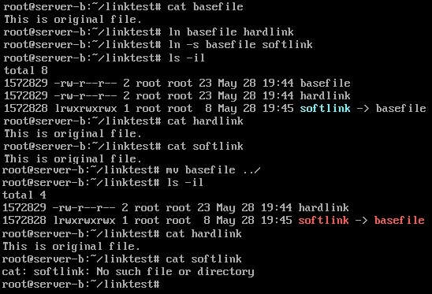

# 리눅스

Shell 은 os와 사용자간의 메세지를 전달

암호화된 패스워드가 /etc/passwd가 아닌 /etc/shadow에 저장되는 이유

다른 사용자가 passwd는 볼 수있지만 shadow는 볼 수 없다.

shadow파일의 내용 중 줄의 마지막 항목 쉘의 경우 /bin/bash는 원격 접속이 가능하지만 /bin/false는 원겹 접근을 막는 역할을 한다.

# 리눅스 실습

- 가상 콘솔
  - 우분투는 7개의 가상 콘솔 사용
  - Ctrl + Alt + F1~F7
  - Ctrl + Alt + F7 → X-Window Mode
- mount ⇐ VMware Tools CD의 마운팅 경로를 확인
-  cd /media/root/VMware\ Tools


- 리눅스에서는 띄워쓰기가 명령어와 서브명령어를 구분하는 역할을 한다.

- 따라서 cd명령어를 사용할 때 폴더 명에 띄워쓰기가 있으면 공백을 명령어가 아닌 폴더명의 일부로 인식하기 위해 \를 사용해서 escape를 해준다.


- cp *.gz /tmp ⇐ 설치 파일을 작업 디렉터리로 복사

- cd /tmp ⇐ 작업 디렉터리로 이동

- tar -xvf VMware[TABKEY]

- cd vmare[TABKEY]

- ./vmware-install.pl

- 첫번째 질문에 yes를 입력하고 나머지는 엔터(디폴트로 설치)

- 끝나고 나면 reboot


# vi 편집기

vi → 명령어 모드


- 명령어 모드에서 i(현재커서부터 입력), a(커서다음부터 입력)를 입력하면 편집모드로 들어간다
- 편집모드에서 명령어 모드로 들어오려면 esc키를 누른다.
- 명령어 모드에서 라인명령모드로 들어가려면 : 을 입력한다. 역시 돌아오려면 esc를 누른다.
  - :q (종료) :w (저장) :wq (저장 후 종료) : q!(강제로 종료)
  - /ba ☞ ba로 시작하는 문자열을 찾는다. 다음 문자열 찾기 - n
  - vi편집기를 사용하여 편집하는 도중에 터미널이 종료되면 그 파일의 임시저장(swp)파일이 저장된다.
  - 임시저장 파일은 숨김파일이다. ls -a로 볼 수 있다. linux의 숨김파일은 이름 앞에 . 이 붙는다.


# 명령어 프롬프트

사용자@호스트 : 경로 $#

ex) root@Server-b:~#

명령어들(p.140)

종료하는 방법

- poweroff, shutdown -P now, halt -p, <u>init 0</u>

시스템 재부팅

- shutdown -r now, reboot, <u>init 6</u>

로그아웃

- logout, exit

자동 완성

- tab

도스 키

- 방향키 위아래를 누르면 이전에 입력한 명령어로 다시 나타낼 수 있다.

history

- 여태까지 사용한 명령어들의 이력

공유폴더를 설정하고 찾아보자

- VM-세팅-Option-Shared Folders 를 enable해준다.
- root@server:/# mount | grep hgfs
- vmhgfs-fuse on /mnt/hgfs type fuse.vmhgfs-fuse (rw,nosuid,nodev,relatime,user_id=0,group_id=0,allow_other)
- 경로내에 지정해준 공유 폴더가 있다.

도움말(사용법) 명령어 man

- --help 옵션을 쓸 수도 있지만 man 명령어를 통해 확인할 수도 있다.
- ex) man vi
- 모든 명령어가 man을 지원하는것은 아니다.

## 마운트와 CD/DVD 및 USB의 활용★

- 마운트 - 물리적인 장치를 특정한 위치(대개는 디렉터리)에 연결시켜 주는 과정

- mount 명령어로 현재 마운트된 장치들을 확인할 수 있다.

- umount 명령어를 입력해서 마운트를 해제할 수 있다.

- umount /dev/cdrom 으로 cdrom이 언마운트된다.

- cdrom 세팅을 다시 설정해주고 connect해주면 다시 마운트된다.

- 현재의 작업중인 디렉터리 위치가 cdrom 내부이면 umount명령어가 먹히지 않는다. 

- USB를 연결하고 VMware 아래 작업표시줄에서 USB를 connect 해준다.

- mount 명령어를 실행해서 USB의 경로를 확인해본다.

- 언마운트 명령어를 실행해서 USB를 언마운트 하면 탐색기창에 USB가 없어진다.    umount /dev/sdg1

- DVD/USB 마운트를 완전히 해제하려면 다시 VMware 아래 작업표시줄에서 disconnect 해준다.

- 혹시라도 USB가 마운트 되지 않는다면 USB가 꽃힌 PC의 포트 버전과

  VMware의 USB 버전이 일치하는지 확인해준다.

- 텍스트모드의 서버에서도 진행을 해보자(p.169~)

- 일단 우분투서버에서는 마운트할 경로를 생성해주어야 한다.

  1. cdrom을 만들어보자

     - 처음엔 mount를 해보아도 cdrom이 확인되지 않는다.

     - mkdir /media/cdrom 으로 경로를 생성해준다.

     - VMware 설정에서 cdrom 에 이미지 파일을 넣어주고 connect 해준다.

     - cdrom의 기본 경로인 /dev/cdrom을 생성한 경로 /media/cdrom으로 마운트해준다.

       mount /dev/cdrom /media/cdrom

     - /media/cdrom에 우분투 이미지파일이 마운트된 것을 볼 수 있다.

     - 언마운트를 하면 경로안에 마운트된 내용이 다 없어진다.

       umount /media/cdrom

       umount /dev/cdrom

  2. usb를 만들어보자

     - 처음엔 mount를 해도 usb가 확인되지 않는다.

     - mkdir /media/usb 로 경로를 생성

     - VMware 설정에서 usb를 connect해준다.

     - usb의 기본 경로인 /dev/usb를 생성한 경로 /media/usb로 마운트해준다.

       mount /dev/sdb1 /media/usb

     - /media/usb에 usb안의 파일들이 마운트된 것을 볼 수 있다.

     - 언마운트를 하면 경로안에 마운트된 내용이 다 없어진다.

       umount /media/usb

       umount /dev/sdb1

  3. iso 파일을 직접 생성하고 마운트해보자

     - 먼저 genisoimage라는 프로그램을 설치해주어야 한다.

     - 설치되어있는지 확인해보자.

       dpkg --get-selections genisoimage

     - 설치가 되어있지 않은 경우 직접 설치해준다.

       apt-get install -y genisoimage

     - 이제 genisoimage 프로그램을 이용하여 iso파일을 만들고 마운트할 경로를 만들어보자.

       genisoimage -r -J -o boot.iso(생성할 ISO파일 이름) /boot(포함될 파일 또는 디렉터리)

       mkdir /media/iso

     - ls -l 로 생성된 iso파일을 확인해본다.

     - 생성된 iso 파일을 마운트해주고 파일 내용을 비교해본다.

       mount -o loop boot.iso /media/iso

       ll /media/iso

       ll /boot

     - 언마운트를 하면 경로안에 있던 내용들이 다 없어지는 것이다.

       umount /media/iso

       or     umount /root/boot.iso

     - 터미널에서는 x-윈도우처럼 자동으로 마운트되는 플러그 앤 플레이 기능을 지원하지 않기 때문에 전원이 꺼지면 마운트되었던 파일들이 언마운트된 상태로 유지가 된다. 그러므로 재부팅을 해도 마운트가 되지 않고 언마운트 된 채로 유지가 된다. 

- 기본 명령어

  - ls
    - Windows의 dir같은 역할, 해당 디렉터리의 파일목록 나열
  
      ex)   # ls /etc/systemd
  
  - cd
    
  - 디렉터리를 이동
    
    ex)   # cd ../etc/systemd
    
  - 절대경로와 상대경로를 이해하자
    
    현재 경로가 /etc 일 경우
    
    cd /data 의 결과는 root@server:/data/#
    
    cd ./data 의 결과는 root@server:/etc/data#
    
  - pwd
    
  - 현재 디렉터리의 전체 경로를 출력
    
  - rm
    
  - 파일이나 디렉터리를 삭제
    
    ex)   # rm -rf abc
    
  - cp
    - 파일이나 디렉터리를 복사
  
        해당 파일의 읽기권한이 필요
  
        ex)   # cp abc.txt cba.txt
  
  - touch
    - 크기가 0인 새 파일을 생성, 이미 존재하는 경우 수정 시간을 변경
  
      ex)   # touch abc.txt
  
  - mv
    - 파일과 디렉터리의 이름을 변경, 위치 이동시 사용
  
      ex)   # mv abc.txt www.txt
  
      \# mv aaa bbb ccc ddd		aaa,bbb,ccc 파일을 /ddd 디렉터리로 이동
  
  - mkdir
    - 새로운 디렉터리를 생성
  
      ex)   # mkdir abc   \# mkdir -p abc/xxx/yyy/zzz (부모 디렉터리가 없을경우 자동 생성) 	abc/xxx/yyy가 없을 경우 자동으로 생성해준다.
  
  - rmdir
    - 디렉터리를 삭제
  
      삭제 권한이 있어야 하며, 디렉터리는 비어 있어야 함.
  
      들어있는 경우 rm -r 을 사용
  
  - cat
    - 여러개 파일을 나열하면 파일을 연결해서 보여준다.
  
      ex)   # cat a.txt b.txt
  
  - head, tail
    - 텍스트 형식으로 작성된 파일의 앞 10행 또는 마지막 10해만 화면에 출력
  
      ex)   # head /etc/systemd/bootchart.conf
  
      \# head -3 /etc/systemd/bootchart.conf → 앞 3행만 화면에 출력
  
      \# tail -5 /etc/systemd/bootchart.conf → 마지막 5행만 화면에 출력
  
  - more
    - 텍스트 형식으로 작성된 파일을 페이지 단위로 화면에 출력
  
    - 다음 페이지 Space bar      앞 페이지 B      종료 Q
  
      ex)   # more +10 /etc/systemd/system.conf → 10행부터 출력
  
  - less
    - more과 비슷하지만 더 확장됨. more에서 사용하는 키도 사용가능, 
  
      Page Up, Page Down 사용 가능
  
      ex)   # less +10 /etc/systemd/system.conf → 10행부터 출력
  
  - file
    - 해당 파일이 어떤 종류의 파일인지 표시
  
      ex)   # file /etc/systemd/system.conf → 텍스트 파일이므로 ASCII로 표시됨
  
  - clear
  
    - 현재 사용 중 터미널 화면을 깨끗하게 지워줌
  
  - \>
    - redirect 명령어로 앞쪽에 있는 파일의 내용이나 명령어의 결과를 오른쪽에 생성한 파일에 집어넣는다.
  
      ex)   # cat aaa bbb > all

# 런 레벨 ★

p.144

시스템을 종료하는 init 0, 재부팅하는 init 6. init 명령어 뒤에 붙는 숫자를 런 레벨이라고 부른다. 리눅스는 시스템이 가동되는 방법을 7가지 런레벨로 나눌 수 있으며, 런 레벨은 다음과 같다.

| 런레벨 | 영문 모드  | 설명                           | 비고             |
| ------ | ---------- | ------------------------------ | ---------------- |
| 0      | Power Off  | 종료 모드                      |                  |
| 1      | Rescue     | 시스템 복구 모드               | 단일 사용자 모드 |
| 2      | Multi-User |                                | 사용하지 않음    |
| 3      | Multi-User | 텍스트 모드의 다중 사용자 모드 |                  |
| 4      | Multi-User |                                | 사용하지 않음    |
| 5      | Graphical  | 그래픽 모드의 다중 사용자 모드 |                  |
| 6      | Reboot     |                                |                  |

init 0 명령은 지금 즉시 런 레벨 0번으로 시스템을 전환하라는 의미이며, 런 레벨 0번은 '종료 모드'이므로 결국 지금 즉시 시스템을 종료하라는 의미다.

- ls -l /lib/systemd/system/default.target → default.target에 연결된 파일을 확인(시스템에 기본으로 설정된 런 레벨이 지정되어 있음).

ln 명령어

- 링크를 거는 명령어

- ln -sf /lib/systemd/system/multi-user.target /lib/systemd/system/default.target

  → default.target이 가리키는 파일을 텍스트 모드로 부팅되는 런 레벨 3번인 multi-user.target으로 변경

- run level에서 사용해서 default.target을 여러 run level로 바꿔본다.


# 사용자와 그룹(p.179)

## 사용자 그룹

- 리눅스는 다중 사용자 시스템(Multi-User System)
- root : 기본제공계정으로 모든 작업 권한을 가진 수퍼유저
- 모든 사용자는 하나 이상의 그룹에 소속
- 계정 정보는 /etc/passwd 파일에 정의
  - 사용자 이름 : 암호 : 사용자 ID : 사용자가 소속된 주 그룹 ID : 추가 정보 : 홈 디렉터리 : 기본 쉘
- /etc/passwd 파일에 패스워드가 x로 표시된 경우 /etc/shadow 파일에 암호화되어 저장되어 있는것
- 그룹 정보는 /etc/group 파일에 정의
  - 그룹 이름 : 비밀번호 : 그룹 id : 보조 그룹 사용자

- 관련 명령어
  - adduser
    - 사용자 추가
    - 사용자 생성시 별도의 그룹을 지정하지 않으면, 자동으로 사용자 이름과 동일한 그룹이 생성되고 자동으로 포함된다.
  - passwd
    - 사용자 비밀번호 지정, 변경
  - usermod
    - 사용자 속성 변경
  - userdel
    - 사용자 삭제
    - -r : recursive -f : force
  - chage
    - 암호를 주기적으로 변경하도록 설정
  - groups
    - 사용자나 명령어의 대상이 소속된 그룹을 보여줌
  - groupadd
    - 새로운 그룹을 생성
  - groupmod
    - 그룹의 속성을 변경
  - groupdel
    - 그룹을 삭제
  - gpasswd
    - 그룹의 암호를 설정, 그룹 관리를 수행
- /etc/skel 디렉터리에 파일을 넣어놓으면 새로운 사용자가 생성될 때 홈 디렉터리에 복사하는 작업이 발생한다.

## 파일과 디렉터리의 소유와 허가권

- 리눅스는 각각의 파일과 디렉터림다 소유권과 허가권이라는 속성이 있다.

| 파일 유형 | 파일 허가권 | 링크 수 | 파일 소유자 이름 | 파일 소유그룹 이름 | 파일 크기(Byte) | 마지막 변경 날짜/시간 | 파일 이름  |
| --------- | ----------- | ------- | ---------------- | ------------------ | --------------- | --------------------- | ---------- |
| -         | rw-r--r--   | 1       | root             | root               | 0               | 7월 15 16:11          | sample.txt |

- 파일 유형

  - 디렉터리 : d
  - 일반 파일 : -
  - 블록 디바이스 : b     문자 디바이스 : c     링크 : l

- chmod 명령

  - 파일 허가권 변경 명령어
  - chmod (u(소유자)/g(그룹)/o(다른사람들)/a(모두=ugo))(+/-/=)(r/w/x) 파일/폴더명 = 권한 변경
  - chmod (2진수 세자리 3개) 파일/폴더명 = 권한 변경

- 파일 소유권(Ownership)

  - 파일을 소유한 사용자와 그룹

- chown/chgrp 명령

  - 파일의 소유권을 바꾸는 명령어

  - ex) # chown ubuntu.ubuntu sample.txt

    \# chown ubuntu sample.txt

    \# chgrp ubuntu sample.txt

  - chown (사용자):(그룹) 파일/폴더명 = 소유 변경

  - : 과 . 둘다 사용 가능

  - 사용자만 지정해주면 그 사용자와 맞는 그룹으로 자동 지정해준다.

- 링크

  

  - 하드 링크(hard link)
    - 하드 링크 파일만 하나 생성되며 같은 inode1 사용
    - 명령 : # ln 링크대상파일이름 링크파일이름
  - 심볼릭 링크(symbolic link, soft link)
    - 새로운 inode2를 만들고, 데이터는 원본 파일을 연결하는 효과
    - 명령 : # ln -s 링크대상파일이름 링크파일이름
  - inode : 한 파일이나 디렉토리의 모든 정보를 갖고 있는 64byte로 구성된 표



## 리눅스 관리자를 위한 명령어(p.198)

dpkg(Debian Package)

- Windows의 setup.exe.와 비슷한 설치 파일
- 확장명은 *.deb, 이를 패키지라 부름

- deb 파일 형식 (패키지 파일 형식)

  - 패키지이름\_버전-개정번호_아키텍처.deb

- 명령어 옵션

  - 설치

    dpkg -i 패키지파일이름.deb

  - 삭제

    dpkg -r 패키지이름

    dpkg -P 패키지이름 - 설정파일까지 삭제

  - 패키지 조회

    **dpkg -l 패키지이름 - 설치된 패키지에 대한 정보를 조회**

    dpkg -L 패키지이름 - 패키지가 설치한 파일 목록을 보여줌

  - 아직 설치되지 않은 deb 파일 조회

    dpkg --info 패키지파일이름.deb

- 단점

  - 의존성 문제
  - 의존성 문제 해결을 위해 apt-get이 등장
  - 요즘은 이렇게 직접 받지 않고 모듈형식으로 레퍼지토리에서 다 받아와서 설치한다.

apt-get(p.205)

- dpkg의 의존성 문제를 완전 해결

- 인터넷을 통해 필요한 파일을 저장소(Repository)에서 자동으로 모두 다운로드해서 설치하는 방식

- 기본 사용법

  - 기본 설치 : apt-get install 패키지이름

    주로 -y옵션 사용 = 모두 yes

  - 패키지 목록의 업데이트 : apt-get update

  - 삭제 : apt-get remove 패키지이름

    apt-get purge 패키지이름

    apt-get autoremove

  - 내려받은 파일 제거

    apt-get clean

    apt-get autoclean

- 작동 방식과 설정파일

파일 압축과 묶기

- 파일 압축

  관련 명령

  - xz
  - bzip2
  - gzip
  - zip/unzip

- 파일 묶기

  - 리눅스(유닉스)에서는 '파일 압축'과 '파일 묶기'는 원칙적으로 별개의 프로그램으로 수행
  - 파일 묶기의 명령어는 'tar', 묶인 파일의 확장명도 'tar'

  파일 묶기 명령(tar)

  - tar : 확장명 tar로 묶음 파일을 만들어 주거나 묶음을 풀어준다.
    - 동작 : c(묶기), x(풀기), t(경로확인)
    - 옵션 : f(파일), v(과정보이기), J(tar+xz), z(tar+gzip), j(tar+bzip2)
  - 사용 예
    - \# tar cvf my.tar /etc/systemd/ → 묶기
    - \# tar cvfJ my.tar.xz /etc/systemd/ → 묶기 + xz 압축
    - \# tar cvfz my.tar.gz /etc/systemd/ → 묶기 + gzip 압축
    - \# tar cvfj my.tar.bz2 /etc/systemd/ → 묶기 + bzip2 압축
    - \# tar xvf my.tar → tar 풀기

파일 위치 검색

- find [경로] [옵션] [조건] [action] : 기본 파일 찾기
  - [옵션] -name, -user(소유자), -newer(전,후), -perm(허가권), -size(크기)
  - [action] -print(디폴트), -exec(외부명령 실행)
    - \# find /etc -name "*.conf"
    - \# find /bin -size +10k -size -100k
    - \# find /home -name "*.swp" -exec rm {} \;

시스템 설정

- 다양한 환경 설정 (unity-control-center)
- 네트워크 설정 (nmtui)
- 방화벽 설정 (ufw, gufw)
- 서비스 설정(rcconf)

## CRON과 AT(p.224) ★

- **cron ★**

  - 주기적으로 반복되는 일을 자동적으로 실행될 수 있도록 설정

  - 관련된 데몬(서비스)은 "crond", 관련 파일은 "/etc/crontab"

  - /etc/crontab 형식 (끝이 tab인 파일은 대부분 테이블)

    

    - | 분   | 시   | 일   | 월   | 요일(0~7; 0,7=일요일) | 사용자 | 실행명령            |
      | ---- | ---- | ---- | ---- | --------------------- | ------ | ------------------- |
      | 00   | 05   | 1    | *    | *                     | root   | cp -r /home /backup |

      ex) 매달 1일 5시에 홈 디렉터리의 모든 내용을 백업 디렉터리에 저장하라

  - 실습

  - **#!/bin/sh** → 아래 내용을 쉘에서 실행하라

    **set $(date)** → date는 현재 시간을 가져오는 것 $와 괄호로 묶으면 명령어를 실행하라는 뜻 이렇게 쓰지

    않으면 명령어가 아닌 그냥 하나의 문자열로 인식한다. 

    set은 뒤의 내용을 파라미터화 하라 공백들로 변수들을 구분.

    궁금하면 $(date)를 실행해보고 $1 $2 $3 $4 $5를 echo 명령어로 확인해보자

    **fname="backup-$1$2$3tar.xz"** → 쉘에서 변수를 선언할 때 띄워쓰기를 하면 =가 명령어로 인식

    이 되기때문에 띄우면 안된다.

    **tar cfJ /backup/$fname /home**

- at

  - 일회성 작업을 예약
  - ex
    - 예약 : \# at <시간>
    - \# at 3:00am tomorrow → 내일 새벽 3시
    - \# at now + 1 hour → 현재 1시간 뒤에

UMASK

- 파일의 기본권한은 666
- 디렉터리의 기본권한은 777
- umask 값을 기본값에서 빼주어서 생성된 파일/디렉터리의 권한 설정

# 네트워크 관련 필수 개념

- TCP/IP
  
  - 컴퓨터끼리 네트워크 상 의사소통하는 프로토콜 중 가장 보편적인 프로토콜의 한 종류
- 호스트 이름(Hostname)과 도메인 이름(Domain name)
  - 호스트 이름은 각각 컴퓨터에 지정된 이름
  - 도메인 이름(또는 도메인 주소)는 hanbit.co.kr과 같은 형식
- IP 주소
  - 각 컴퓨터의 랜카드에 부여되는 중복되지 않는 유일한 주소
  - 4바이트로 이루어져 있음, 각 자리는 0~255
- 네트워크 주소
  
  - 같은 네트워크에 속해 있는 공통된 주소(ex. 192.168.111.0)
- 브로드캐스트 주소
  - 내부 네트워크의 모든 컴퓨터가 듣게 되는 주소
  - 현재 주소의 제일 끝자리를 255로 바꾼 주소
- 게이트웨이
  - 라우터 = 게이트웨이
  - 네트워크 간에 데이터를 전송하는 컴퓨터 또는 장비
  - VMware의 게이트웨이 주소는 192.168.111.2로 고정
- 넷마스크와 클래스
  
  - 넷마스크 : 네트워크의 규모를 결정
- DNS 서버 주소
  - URL을 해당 컴퓨터의 IP주소로 변환해 주는 서버
  - 설정 파일은 /etc/resolv.conf

- 리눅스에서의 네트워크 장치 이름
  - 우분투가 랜카드 이름으로 ens32 또는 ens33으로 할당
  - 명령 예
    - \# ifconfig/ifdown/ifup ens32 또는 ens33

- 네트워크 관련 명령어

  - nm-connection-editor
  - systemctl start/stop/restart/status networking
    - restart 명령으로 변경된 네트워크 설정을 적용할 수 있다.
  - ifconfig 장치이름
  - nslookup
  - ping IP 주소 또는 URL
  - service lightdm restart 서비스가 상단 탭에서 사라졌을 때 쓰는 명령어

- 네트워크 설정과 관련된 주요 파일

  - 네트워크 기본 정보가 설정된 파일
    - X 윈도 모드 : /etc/NetworkManager/system-connections/유선 연결 1
    - 텍스트 모드 : /etc/network/interfaces
  - /etc/resolv.conf
    - DNS서버의 정보와 호스트 이름이 들어 있는 파일. 임시 사용 파일이므로 네트워크가 재시작되면 다시 내용이 초기화됨. 영구적으로 DNS 서버 정보를 변경하려면 nm-connection-editor 명령이나 /etc/network/interfaces 파일은 편집해야함
    - 127.0.0.1은 자신을 의미하지만 이 파일에서는 자기 자신이 DNS 서버라는 의미가 아니라 /etc/NetworkManager/system-connections/유선 연결 1 파일에 설정된 DNS 서버를 사용한다는 의미
  - /etc/hosts
    - 현 컴퓨터의 호스트 이름과 FQDN이 들어있는 파일

- 파이프, 필터, 리디렉션

  - 파이프

    - 2개의 프로그램을 연결해주는 연결 통로

    - |를 사용

      \# ls -l /etc | less

  - 필터

    - 필요한 것만 걸러주는 명령어

    - grep, tail, ec, sort, awk, sed 등

      \# ps -ef | grep bash

  - 리디렉션

    - 표준 입출력의 방향을 바꿔줌.

    - 표준 입력은 키보드, 표준 출력은 모니터이지만 이를 파일로 처리하고 싶을 때 주로 사용

      \# ls -l > list.txt  →  ls -l의 결과를 list.txt에 저장

      \# ls -l >> list.txt →  list.txt가 이미 존재하면 이어서 쓴다.

      \# sort < list.txt  →  list.txt 파일을 정렬해서 화면에 출력한다.

      \# sort < list.txt > out.txt  →  list.txt 파일을 정렬해서 out.txt 파일에 쓴다.

- 프로세스, 데몬, 서비스

  - 프로세스

    - 하드디스크에 저장된 실행코드(=프로그램)가, 메모리에 로딩되어 활성화된 것

    - 포그라운드 프로세스(Foreground Process)

      - 실행하면 화면에 나타나서 사용자와 상호작용을 하는 프로세스(대부분의 응용프로그램)
      - 포그라운드 프로세스 실행중 ctl+z 하면 정지되고 bg를 입력하면 백그라운드로 실행된다.

    - 백그라운드 프로세스(Background Process)

      - 실행은 됐지만, 화면에는 나타나지 않고 뒤에서 실행되는 프로세스 (서비스나 데몬이라부름)
      - 백그라운드 프로세스 실행중 fg 작업번호 명령을 입력하면 다시 포그라운드 프로세스로 만들 수 있다.

    - 프로세스 번호

      - 프로세스에 할당된 고유 번호

    - 작업 번호

      - 백그라운드 프로세스의 순차 번호

    - 부모 프로세스와 자식 프로세스

      - 모든 프로세스는 부모 프로세스 하위에 종속되어서 실행
      - 부모 프로세스 종료 → 종속된 자식 프로세스도 모두 종료

    - 프로세스 관련 명령

      - ps

        현재 프로세스 상태 확인

        ps -ef | grep <프로세스 이름>

      - kill

        프로세스를 강제 종료 명령어

        kill -9 <프로세스 번호> → (9 옵션은)무조건 종료

      - pstree

        부모 프로세스와 자식 프로세스의 관계를 트리 형태로 보여 줌

- 서비스와 소켓

  - 서비스 = 데몬
    - 늘 가동되는 서버 프로세스
    - 시스템과 독자적으로 구동되어 제공하는 프로세스 (예: Web, DB, FTP 서버 등)
    - 실행 및 종료는 대개 "systemctl start/stop/restart 서비스이름" 명령을 사용
    - 서비스의 실행 스크립트 파일은 "/lib/systemd/system/" 디렉터리에 "서비스이름.service"라는 이름으로 확인 가능
    - 부팅과 동시에 서비스의 자동 실행 여부를 지정할 수 있는데, 터미널에서 "systemctl list-unit-files" 명령을 실행하면 현재 사용 여부(enable/disable)를 확인할 수 있다.
    - rcconf 명령으로 설정 가능
  - 소켓
    - 서비스는 항상 가동하지만 소켓은 외부에서 특정 서비스를 요청할 경우에  systemd가 구동시키고 요청이 끝나면 소켓도 종료
    - 그래서 소켓으로 설정된 서비스는 systemd가 서비스를 새로 구동하는데 시간이 소요되므로 처음 연결되는데 더 많은 시간이 걸림 (예: 텔넷 서버)
    - 소켓과 관련된 스크립트 파일은 "/lib/systemd/system/" 디렉터리에 "소켓이름.socket" 이름으로 존재

- 응급 복구(p.251)

  - 시스템이 부팅이 안 되는 경우는 다양하다.
  - 부팅중 esc 연타해 grub 메뉴화면으로

- GRUB 부트로더(p.254)

# 하드디스크 관리와 사용자별 공간 할당

## SATA 장치와 SCSI 장치 구성(p.323)

- 하드디스크를 물리적으로는 /dev/sda, /dev/sdb, /dev/sdc ... 형식으로 부르면 되고, 그 장치에 파티션이 나눠진 것을 논리적으로는 /dev/sda1, /dev/sda2, /dev/sdb1, /dev/sdb2 ... 형식으로 부르면 된다.
- 파티션을 그냥 사용할 수 없으며 반드시 특정한 디렉터리에 마운트 시켜야만 사용이 가능

**실습. 하드디스크 1개 장착**

- 목표

  - 하드디스크 추가 장착해서 사용
  - 디스크 파티셔닝과 관련된 fdisk, mkfs, mount 명령을 익힌다.
  - 부팅시 자동으로 읽히는 /etc/fstab 파일을 편집한다.

- 과정

  - VM 세팅

    ADD - HDD - SCSI - Create a new virtual disk - 1GB(store disk as a single file) - 이름 설정 - OK

  - 파티션 설정

    **fdisk /dev/sdb**

    Command : n → 새로운 파티션 분할

    Select : p → Primary 파티션 선택

    Partition number : 1 → 파티션 번호 1번 선택(Primary 파티션은 최대 4개까지 생성 가능)

    First sector : Enter → 시작 섹터 번호 입력(1개의 파티션만 계획 중이므로 첫 섹터(default값 : 2048)로 설정)

    Last sector : Enter → 마지막 섹터 번호 입력(1개의 파티션만 계획 중이므로 마지막 섹터로 설정)

    Command : p → 설정된 내용 확인

    Command : w → 설정 저장

    ※ 리눅스에서 섹터 하나는 512바이트로 설정되어 있다. 그러므로 512 * 2097152 = 1,024MB(=1GB)가 된다. 이는 VMware의 가상 하드디스크에 적용되는 크기일 뿐, 실제 하드디스크라면 상황이 다를 수도 있다. 긜고 시작 섹터가 2048번인 이유는 **제일 앞의 0~2047(=1MB) 부분은 시스템 성능 향상을 위해 사용하지 않는 부분이기 때문**이다. 또 Blocks의 단위는 1KB(=1024바이트)로 설정되어 있다.

  - mkfs로 파일시스템을 설정

    **mkfs -t 파일시스템 파티션장치** or

    **mkfs.파일시스템 파티션장치**

    mkfs.ext4 /dev/sdb1

  - 마운트를 해야함

    mkdir /mydata → 마운트 할 디렉터리 생성

    gedit /mydata/test1 → 마운트 하기 전 시점의 파일을 생성

    mount /dev/sdb1 /mydata → /mydata에 새로운 하드디스크 파티션을 마운트

    ls -l /mydata → test1 파일이 사라진 것을 볼 수 있다.

    gedit /mydata/test2 → 마운트 하고 난 후 시점의 파일을 생성

    umount /dev/sdb1 → 언마운트를 해줌

    ls -l /mydata → test2 파일이 사라지고 test1 파일이 다시 나타난 것을 확인할 수 있다.

    

RAID 정의 및 개념

- RAID(Redundant Array of Inexpensive Disks)

  - 여러 개의 디스크를 하나의 디스크처럼 사용하는 방식
  - 비용 절감 + 신뢰성 향상 + 성능 향상

- 하드웨어 RAID

  - 하드웨어 제조업체에서 여러 개의 하드디스크를 연결한 장비를 만들어서 그 자체를 공급하는 것.
  - 좀 더 안정적이고, 각 제조업체에서 기술 지원을 받을 수 있기에 많이 선호하는 방법

- 소프트웨어 RAID

  - 고가 하드웨어 RAID의 대안. 하드디스크만 여러 개 있으면 운영체제에서 지원하는 방식으로 RAID를 구성하는 방법을 말한다.
  - 하드웨어 RAID와 비교하면 신뢰성이나 속도 등이 떨어질 수 있지만, 아주 저렴한 비용으로 좀 더 안전하게 데이터를 저장할 수 있다는 점에서 적극 고려해볼 수 있는 방식

- 각 RAID 방식의 비교

  

  - Linear RAID

    - 최소 2개의 하드디스크가 필요
    - 2개 이상의 하드디스크를 1개의 볼륨으로 사용
    - 앞 디스크부터 차례로 저장
    - 100%의 공간효율성(= 비용 저렴)

    

  - RAID0 = Stripping

    - 최소 2개의 하드디스크가 필요
    - 모든 디스크에 동시에 저장
    - 100%의 공간효율성 (= 비용 저렴)
    - 신뢰성 낮음
    - "빠른 성능을 요구하되, 혹시 전부 잃어버려도 큰 문제가 되지 않는 자료"에 적합

    

  - RAID1 = Mirroring

    - 데이터 저장에 두배의 용량이 필요
    - 결함 허용(Fault-tolerance)을 제공 = 신뢰성 높음
    - 두배의 저장공간 = 비용이 두배 = 공간효율이 나쁨
    - 저장속도(성능)은 변함 없음
    - 중요한 데이터를 저장하기에 적절함
    - 돈 많으면 가장 안전한 저장방식(미러링을 2개 3개 ... 씩)

    

  - RAID0 vs RAID1

    | 구분                     | RAID 0                 | RAID 1              |
    | ------------------------ | ---------------------- | ------------------- |
    | 성능                     | 뛰어남                 | 변화 없음           |
    | 데이터 안전성(결함 허용) | 보장 못함(결함 허용 X) | 보장함(결함 허용 O) |
    | 공간 효율성              | 좋음                   | 나쁨                |

  - RAID5 = RAID 0 + One Parity

    - RAID1의 데이터의 안전성 + RAID0처럼 공간 효율성
    - 최소한 3개 이상의 하드디스크가 필요
    - 오류가 발생할 때는 "패리티(Parity)"를 이용해서 데이터를 복구

    

  - RAID6 = RAID0 + two parity

    - RAID5 방식을 개선한 것으로 공간 효율은 RAID5보다

    

  - 실습

    - 디스크 9개 추가 생성

      VMware 설정 - ADD - Hard Disk - SCSI - Create a new virtual disk - 2GB, Store virtual disk as a single file - 'disk0-1.vmdk' - Finish

      disk0-2.vmdk~disk0-10.vmdk 까지는 1GB로 설정 (SCSI 0:7은 VMware에서 예약되어 사용할 수 없으므로 disk0-7.vmdk는 생략)

    - 각각의 디스크를 파티셔닝

      \# fdisk /dev/sdb → [SCSI 0:1] 하드디스크 선택

      Command : n → 새로운 파티션 분할

      Select : p → Primary 파티션 서택

      Pratition number : 1 → 파티션 번호 1번 선택

      First sector : Enter → 시작 섹터 번호

      Last sector : Enter → 마지막 섹터 번호

      **Command : t → 파일 시스템 유형 선택**

      **Hex Code : fd → 'Linux raid autodetect' 유형 번호 (L을 입력하면 전체 유형 리스트 출력)**

      Command : p → 설정 내용 확인

      Command : w → 설정 저장

      

      이 과정을 /dev/sdb~/dev/sdj까지 9번 반복

    - RAID 구축을 위한 패키지 설치

      **apt-get -y install mdadm**

    - RAID 구축

      - Linear RAID 구축

        1. Linear RAID의 파티션 생성

           **mdadm --create /dev/md9 --level=linear --raid-devices=2 /dev/sdb1 /dev/sdc1** → RAID생성

           ※ RAID의 종류와 파티션 이름을 일치시켜주어서 보기 쉽게 해주자. linear의 경우 비어 있는 9번을 사용

           **mdadm --detail --scan** → RAID 확인

        2. Linear RAID의 파티션에 파일시스템을 설정

           **mkfs.ext4 /dev/md9** or

           **mkfs -t ext4 /dev/md9 **

        3. Linear RAID를 마운트를 해보자.

           **mkdir /raidLinear** → 마운트할 디렉터리 생성

           **mount /dev/md9 /raidLinear** → 생성한 디렉터리에 마운트

           **df** → 현재 마운트된 RAID 확인 가능

           **vi /etc/fstab**

           ​	**/dev/md9 /raidLinear ext4 defaults 0 0** 를 마지막에 추가해주자. → /etc/fstab 파일은 	리눅스가 부팅될 때 마다 자동으로 읽는 중요한 파일이다. 이 파일에는 마운트 정보가 수록	되어 있으며, 글자가 틀릴 경우 아예 부팅이 되지 않을 수 있으므로 수정 시에는 주의를 요	한다.

           **mdadm --detail /dev/md9** → 구축한 RAID를 자세히 확인할 수 있음

      - RAID 0 구축

        1. RAID 0의 파티션 생성

           **mdadm --create /dev/md0 --level=0 --raid-devices=2 /dev/sdd1 /dev/sde1** → RAID생성

           **mdadm --detail --scan** → RAID 확인

        2. RAID 0의 파티션에 파일시스템을 설정

           **mkfs.ext4 /dev/md0** or

           **mkfs -t ext4 /dev/md0 **

        3. RAID 0를 마운트를 해보자.

           **mkdir /raid0** → 마운트할 디렉터리 생성

           **mount /dev/md0 /raid0** → 생성한 디렉터리에 마운트

           **df** → 현재 마운트된 RAID 확인 가능

           **vi /etc/fstab**

           ​	**/dev/md0 /raid0 ext4 defaults 0 0** 를 마지막에 추가해주자.

           **mdadm --detail /dev/md0** → 구축한 RAID를 자세히 확인할 수 있음

      - RAID 1 구축

        1. RAID 1의 파티션 생성

           **mdadm --create /dev/md1 --level=1 --raid-devices=2 /dev/sdf1 /dev/sdg1** → RAID생성

           'Continue creating array?' 메시지가 나오면 y를 입력해서 계속 진행한다.

           **mdadm --detail --scan** → RAID 확인

        2. RAID 1의 파티션에 파일시스템을 설정

           **mkfs.ext4 /dev/md1** or

           **mkfs -t ext4 /dev/md1 **

        3. RAID 1를 마운트를 해보자.

           **mkdir /raid1** → 마운트할 디렉터리 생성

           **mount /dev/md1 /raid1** → 생성한 디렉터리에 마운트

           **df** → 현재 마운트된 RAID 확인 가능

           **vi /etc/fstab**

           ​	**/dev/md1 /raid1 ext4 defaults 0 0** 를 마지막에 추가해주자.

           **mdadm --detail /dev/md1** → 구축한 RAID를 자세히 확인할 수 있음

      - RAID 5 구축

        1. RAID 5의 파티션 생성

           **mdadm --create /dev/md5 --level=5 --raid-devices=3 /dev/sdh1 /dev/sdi1 /dev/sdj1** → RAID생성

           **mdadm --detail --scan** → RAID 확인

        2. RAID 5의 파티션에 파일시스템을 설정

           **mkfs.ext4 /dev/md5** or

           **mkfs -t ext4 /dev/md5 **

        3. RAID 5를 마운트를 해보자.

           **mkdir /raid5** → 마운트할 디렉터리 생성

           **mount /dev/md5 /raid5** → 생성한 디렉터리에 마운트

           **df** → 현재 마운트된 RAID 확인 가능

           **vi /etc/fstab**

           ​	**/dev/md5 /raid5 ext4 defaults 0 0** 를 마지막에 추가해주자.

           **mdadm --detail /dev/md5** → 구축한 RAID를 자세히 확인할 수 있음

      - 재부팅 전에 버그 방지를 위한 몇 가지 설정

        1. **mdadm --detail --scan** 명령으로 4개 ARRAY 내용을 복사한다.
        2. **/etc/mdadm/mdadm.conf** 파일에 붙여넣고 중간 부분에 있는 'name=server:숫자' 부분은 삭제하고 저장한다.
        3. **update-initramfs -u** 명령으로 설정한 내용을 적용시킨다.
        4. 재부팅을 한다.
        5. ls -l /dev/md* 명령와 df 명령으로 RAID 장치를 확인해 보자.
      
    - RAID 복구
    
      - 고장 확인 후 조치
    
        1. RAID가 고장난 상황을 가정하기 위해서 각 레이드마다 하드디스크를 하나씩 제거해주자.
    
        **SCSI 0:2, 0:4, 0:6, 0:9 제거**
    
        2. 부팅을 하면 **응급 모드**로 접속이 된다.
    
           **ls -l /dev/sd*** → 명령을 입력해 장치 이름을 확인해보자. /dev/sdb~/dev/sdj까지 9개 였던 것이 /dev/sdb~/dev/sdf까지 5개만 남았다.
    
           **df** 명령어를 입력해 확인하면 기존의 /raidLinear, /raid0, /raid1, /raid5 디렉터리는 보이지 않는다.
    
        3. **결함 허용을 제공하는 RAID 1**을 다시 가동시켜 보자.
    
           **mdadm --run /dev/md1** → RAID 1 장치 가동
    
           df → 하드디스크 용량을 확인 후
    
           **ls -l /raid1** → RAID 1에 저장했었던 파일을 확인하면 잘 있을 것이다.
    
           **mdadm --detail /dev/md1** → 장치가 어떻게 작동하는지 확인. /dev/sdd가 작동되고 있다. 2개중 하나만 작동하지만 결함 허용 기능으로 인해 데이터는 안전하게 보관된 것이 확인됨
    
        4. **패리티를 가진 RAID 5**를 다시 가동시켜 보자.
    
           **mdadm --run /dev/md5** → RAID 5 장치 가동
    
           df → 하드디스크 용량을 확인 후
    
           **ls -l /raid5** → RAID 5에 저장했었던 파일을 확인하면 잘 있을 것이다.
    
           **mdadm --detail /dev/md5** → 장치가 어떻게 작동하는지 확인. /dev/sde와 /dev/sdf가 작동되고 있다.
    
        5. 이번에는 **결함 허용을 제공하지 않는 RAID 장치**를 다시 가동시켜 보자.
    
           **mdadm --run /dev/md9** → Linear RAID 장치를 가동
    
           **mdadm --run /dev/md0** → RAID 0 장치 가동
    
           이미 학습했든이 두 장치는 1개의 하드디스크로는 작동 자체를 하지 않는다.
    
        6. 우선 시스템이 정상적으로 가동되도록 하기 위해 **Linear RAID와 RAID 0 장치는 중지**시키고, **/etc/fstab에서도 제거**하자.
    
           **mdadm --stop /dev/md9**
    
           **mdadm --stop /dev/md0**
    
           **vi /etc/fstab** → /dev/md9 과 /dev/md0 두 행을 주석처리(#)하고 저장후 종료하자.
    
           reboot 명령어로 재부팅하자.
    
      - RAID의 원상 복구
    
        현재 상황은 RAID 1과 RAID 5의 데이터를 정상적으로 사용할 수 있지만, 만약 RAID 1 또는 RAID 5 에서 정상 작동 중인 다른 하드디스크까지 고장 난다면 당연히 영구히 복구할 수가 없게 된다. 빨리 고장난 하드디스크를 제거하고 새로운 하드디스크로 교체해줘야 한다.
    
        Linear RAID와 RAID 0 의 구성은 원상 복구할 수 있지만, 당연히 그 안의 데이터는 살릴 수 없다.
    
        1. VMware 세팅에서 제거했던 디스크에 해당하는 newdisk를 생성해준다. Advanced로 장치가 순서에 맞게 생성됐는지 확인해준다.
    
        2. **mdadm --detail /dev/md1** → RAID 1 장치의 구성을 다시 살펴보자. 역시 자동으로 복구되지는 않았지만, 새 하드디스크를 교체하지 전과는 장치가 /dev/sdd 에서 /dev/sdf로 변했고 안에 파일은 아직도 이상 없이 존재한다.
    
        3. 새로 장착한 하드디스크를 이용해서 RAID들을 복구하자
    
           1. 새로운 하드디스크들 /dev/sdc,e,g,i (SCSI 0:2,4,6,9)의 파티션을 만들자.
    
              \# fdisk /dev/sdc
    
              Command : n
    
              Select : p
    
              Partition number : 1
    
              First sector : Enter
    
              Last sector : Enter
    
              Commant : t
    
              Hex Code : fd
    
              Command : p
    
              Command : w
    
              반복
    
           2. 결함 허용이 없는 Linear RAID, RAID0를 구성하자.
    
              **mdadm --stop /dev/md9** 명령을 입력해 Linear RAID 장치(/dev/md9)를 중치하고, **mdadm --create /dev/md9 --level=linear --raid-devices=2 /dev/sdb1 /dev/sdc1** 명령을 입력해 다시 구성하자. 확인메세지가 나오면 y를 입력하자.
    
              **RAID 0**에도 반복해서 적용해주자.
    
           3. **mdadm --detail /dev/md9** 명령과 **mdadm --detail /dev/md0** 명령을 입력해 두 RAID 장치가 잘 작동되는지 확인하면 처음 구성했을 때와 동일하게 잘 작동할 것이다.(파일은 복구되지 않음)
    
           4. 결함 허용이 있는 RAID 1, 5를 구성하자
    
              RAID1은 하드디스크가 1개 빠졌을 뿐 잘 작동한다. 따라서
    
              **mdadm /dev/md1 --add /dev/sdg1** 을 입력해야 한다.
    
              같은 방식으로 RAID 5를 재구성하자
    
              **mdadm /dev/md5 --add /dev/sdi1**  을 입력해야 한다.
    
           5. **mdadm --detail /dev/md1** 명령과 **mdadm --detail /dev/md5** 명령을 입력해 두 RAID 장치가 잘 작동되는지 확인하자. 디스크를 추가해주자마자 재빠르게 RAID 5의 디테일을 확인해주면 State : clean, degraded, recovering 이라 뜨는 걸 확인할 수 있다.(RAID 1도 비슷할 듯.)
    
           6. **vi /etc/fstab** → 주석표시했던 /dev/md9과 /dev/md0의 주석을 제거하자.
    
              mdadm 버그를 방지하기 위해 다시 작업을 하자.
    
              **mdadm --detail --scan >> /etc/mdadm/mdadm.conf** → ARRAY 복사 후 /etc/mdadm/mdadm.conf 파일에 붙여주고 'name=server:숫자'부분 삭제
    
              ※ 전에있던 ARRAY 정보도 지워준다. 그 정보와 현재 정보를 비교해주면 Linear RAID와 RAID0 의 UUID가 달라진 걸 확인할 수 있는데, 이를 통해 RAID가 Create될 때 UUID가 생성된다는 것을 유추해볼 수 있다.
    
              **update-initramfs -u** → 설정한 내용을 적용시킨다.
    
           7. 재부팅 후 혹시 응급조치 모드로 부팅된 경우는 기존에 사용하던 하드디스크(SCSI 0:3)번에 아직 쓰레기 값이 남아있기 때문이다. 이는 RAID 0 방식이 양쪽 하드디스크를 돌아가며 저장하기 때문에 한쪽이 날아갈 경우 복구가 불가능해 그대로 쓰레기값으로 남아있기 때문이다. Linear RAID의 경우 한쪽이 날아가도 데이터가 순차적으로 쌓여져있었기 때문에 쓰레기값이 남아있는 경우는 거의 없다.(라고 생각함)
    
              **fsck -y /dev/md0** 명령을 실행해서 쓰레기값을 없애주고, reboot로 재부팅해준다.


# 셸 스크립트 프로그래밍 ★개발자★

### 우분투의 bash 셸

- 기본 셸은 bash(Bourne Again SHell : "배시 셸")

- bash 셸의 특징

  - Alias 기능(명령어 단축 기능)

    ex) \# alias

  - History 기능(위/아래 화살표키)

  - 연산 기능

  - Job Control 기능

  - 자동 이름 완성 기능(탭키)

  - 프롬프트 제어 기능

  - 명령 편집 기능

- 셸의 명령문 처리 방법

  - (프롬프트) 명령어 [옵션...] [인자...]
  - 예) \# rm -rf /mydir

- 환경 변수

  - "echo $환경변수이름" 형식으로 확인 가능

    예) echo $HOSTNAME → 호스트 이름을 출력

  - 환경 변수 종류(p.422)

    cd ~ = cd $HOME

  - export 환경변수=값

    환경 변수 값을 변경

  - 셸 스크립트 프로그래밍

    - 변수, 반복문, 제어문 등의 사용이 가능
    - 별도로 컴파일하지 않고 텍스트 파일 형태로 바로 실행
    - vi나 gedit으로 작성이 가능
    - 리눅스의 많은 부분이 셸 스크립트로 작성되어있음

## 셸 스크립트 프로그래밍 실습

### 셸 스크립트 작성과 실행

bash는 sh과 거의 똑같지만 조금 더 많은 기능을 가지고있다.

- 실습

  gedit test.sh

  ```bash
  #!/bin/bash ← 특별한 형태의 주석(#!)으로 아래의 명령어들을 bash명령어로 실행하겠다는 의미다. 일반적으로 써주는게 좋음(bash test.sh 나 sh test.sh로 실행하면 자연히 bash, sh로 실행하겠다 의미 ./test.sh로 실행하면 #!/bin/bash로 알려줘야한다.)
  echo "사용자 이름 : " $USER ← echo 명령은 화면에 출력하는 명령이다. 먼저 "사용자 이름 : "이라는 글자를 출력하고, 옆에는 $USER라는 환경 변수의 내용을 출력한다.
  echo "홈 디렉터리 : " $HOME
  exit 0 ← 없어도 종료는 되지만 정상적으로 종료가 되었단 걸 알리기 위해서 사용된다.
  ```

  

### 변수

변수의 기본

- 변수를 사용하기 전에 미리 선언하지 않으며, 변수에 처음 값이 할당되면서 자동으로 변수가 생성

- 모든 변수는 "문자열(String)"로 취급

- 변수 이름은 대소문자를 구분

- **변수를 대입할 때 "=" 좌우에는 공백이 없어야 함(공백으로 인해 뒤의 내용이 명령어의 인자로 취급받음)**

  - ex) \# testval=hong

    \# testval

    testval: 명령을 찾을 수 없습니다

    \# $testval

    hong: 명령을 찾을 수 없습니다

    \# echo $testval

    hong

  - ex) number=100

    \# echo $number

    100

    \# echo $number + 100

    100 + 100

    \# number2=$number+100

    \# echo $number2

    100+100 → (숫자를 입력해봐도 문자열로 취급을 받는다. 변수는 다 문자열 취급을 받는다.)

변수의 입력과 출력

- $라는 문자가 들어간 글자를 출력하려면 ' '로 묶어주거나 앞에 '\\'를 붙임

- 변수를 " "로 묶어도 되고, 묶지 않아도 됨

  - ex) myvar.sh 파일 생성

    \#!/bin/sh

    myvar="Hi Woo"

    echo $myvar

    echo "$myvar"

    echo '$myvar'

    echo \\$myvar

    echo 값 입력 :

    read myvar

    echo '$myvar' = $myvar

    echo " '$myvar' = $myvar"

    exit 0

  - 실행 결과

    

- 숫자 계산

  변수에 넣은 값은 모두 문자열로 취급한다. 변수에 들어 있는 값에 +, -, \*, / 등의 연산을 하려면 expr 키워드를 사용하면 된다. 단, 수식과 함께 꼭 키보드 숫자 1 왼쪽에 있는 역따옴표(` : Back tic)로 묶어줘야 한다. 수식에 괄호를 사용하려면 그 앞에 꼭 역슬래시(\\)를 붙여줘야 한다. 또, +, -, /와 달리 곱하기(*) 기호도 예외적으로 앞에 역슬래시(\\)를 붙여줘야 한다.

  - root@server:~# echo expr 100 + 100
    expr 100 + 100
    root@server:~# echo `expr 100 + 100`
    200
    root@server:~# num1=100
    root@server:~# num2=$num1+200
    root@server:~# echo $num2
    100+200
    root@server:~# num3=`expr $num1 + 200`
    root@server:~# echo $num3
    300
  - root@server:~# num4=`expr ( $num1 + 200 ) / 10 * 2`
    bash: command substitution: 줄 1: syntax error near unexpected token `$num1'
    bash: command substitution: 줄 1: `expr ( $num1 + 200 ) / 10 * 2'
    root@server:~# num4=`expr \( $num1 + 200 \) / 10 \* 2`
    root@server:~# echo $num4
    60

- 파라미터 변수

  - 파라미터 변수는 $0, $1, $2...의 형태를 가짐

  - 전체 파라미터는 $*로 표현

  - 예)

    

    - | 명령          | apt-get | -y   | install | gftp |
      | ------------- | ------- | ---- | ------- | ---- |
      | 파라미터 변수 | $0      | $1   | $2      | $3   |

    즉, $0에는 apt-get이, $1에는 -y를 저장한다. 또, 명령 전체의 파라미터 변수는 $*로 표현한다.

  - #!/bin/sh

    echo "실행파일 이름은 <$0>입니다."
    echo "첫번째 파라미터는 <$1>이고, 두번째 파라미터는 <$2> 입니다."
    echo "전체 파라미터는 <$*> 입니다."
    exit 0

    결과)

    root@server:~# sh test.sh 
    실행파일 이름은 <test.sh>입니다.
    첫번째 파라미터는 <>이고, 두번째 파라미터는 <> 입니다.
    전체 파라미터는 <> 입니다.
    root@server:~# ./test.sh
    실행파일 이름은 <./test.sh>입니다.
    첫번째 파라미터는 <>이고, 두번째 파라미터는 <> 입니다.
    전체 파라미터는 <> 입니다.
    root@server:~# sh test.sh a b c
    실행파일 이름은 <test.sh>입니다.
    첫번째 파라미터는 <a>이고, 두번째 파라미터는 <b> 입니다.
    전체 파라미터는 <a b c> 입니다.
    root@server:~# ./test.sh a b c
    실행파일 이름은 <./test.sh>입니다.
    첫번째 파라미터는 <a>이고, 두번째 파라미터는 <b> 입니다.
    전체 파라미터는 <a b c> 입니다.

### if문과 case문

**기본 if문**

- 형식

  if [조건]

  then

  ​	참일 경우 실행

  fi

  

  #!/bin/sh
  if [ "woo" = "woo" ] # 대괄호 사이에는 공백이 필요
  then
   echo "참입니다."
  fi # if를 거꾸로 적음 if문의 끝을 알리는 것
  exit0

**if~else문**

- 형식

  if [ 조건 ]

  then

  ​	참일 경우 실행

  else

  ​	거짓인 경우 실행

  fi

  

  #!/bin/sh
  if [ "woo" != "woo" ] 
  then
   echo "참입니다."
  else
   echo "거짓입니다."
  fi
  exit0

**조건문에 들어가는 비교 연산자**

문자열 비교 연산자

| 문자열 비교             | 결과                                 |
| ----------------------- | ------------------------------------ |
| "문자열 1" = "문자열2"  | 두 문자열이 같으면 참                |
| "문자열 1" != "문자열2" | 두 문자열이 같지 않으면 참           |
| -n "문자열"             | 문자열이 NULL(반 문자열)이 아니면 참 |
| -z "문자열"             | 문자열이 NULL(반 문자열)이면 참      |

산술 비교 연산자

| 산술 비교       | 결과                                |
| --------------- | ----------------------------------- |
| 수식1 -eq 수식2 | 두 수식(또는 변수)이 같으면 참      |
| 수식1 -ne 수식2 | 두 수식(또는 변수)이 같지 않으면 참 |
| 수식1 -gt 수식2 | 수식1이 크다면 참                   |
| 수식1 -ge 수식2 | 수식1이 크거나 같으면 참            |
| 수식1 -lt 수식2 | 수식1이 작으면 참                   |
| 수식1 -le 수식2 | 수식1이 작거나 같으면 참            |
| !수식           | 수식이 거짓이라면 참                |

**파일과 관련된 조건**

if문에서 파일을 처리하는 조건은 다음과 같다.

| 파일 조건   | 결과                              |
| ----------- | --------------------------------- |
| -d 파일이름 | 파일이 디렉터리면 참              |
| -e 파일이름 | 파일이 존재하면 참                |
| -f 파일이름 | 파일이 일반 파일이면 참           |
| -g 파일이름 | 파일에 set-group-id가 설정되면 참 |
| -r 파일이름 | 파일이 읽기 가능이면 참           |
| -s 파일이름 | 파일 크기가 0이 아니면 참         |
| -u 파일이름 | 파일에 set-user-id가 설정되면 참  |
| -w 파일이름 | 파일이 쓰기 가능 상태이면 참      |
| -x 파일이름 | 파일이 실행 가능 상태이면 참      |

- 실습) 파일경로를 입력 받아서 해당 파일의 앞부분(3줄)을 출력해 주는 쉘 프로그램을 만들어 보세요.

  - 쉘 프로그램 파일명 : printHead.sh
  - 실행 형식 : # ./printHead.sh 파일경로
  - 파일경로를 입력하지 않은 경우에는 "파일경로를 입력하세요"라는 오류 메시지를 출력
  - 파일경로에 파일이 존재하지 않으면 "존재하지 않는 파일입니다."라는 오류 메시지를 출력

- #!/bin/bash

  if [ -z $1  ]
  then
   echo "파일 경로를 입력하세요."
   exit 1
  fi
  if [ ! -e $1 ]
  then
   echo "존재하지 않는 파일입니다."
   exit 1
  fi

  head -3 $1

  

  ※ 오류 조건을 위로 올려서 만족이 되면 스크립트를 빠져나가게 시킨다.

**case~esac문**

- if 문은 참과 거짓의 두 경우만 사용 (2중분기)

- 여러 가지 경우의 수가 있다면 if문을 계속 중복해서 사용해야 하므로 구문이 복잡해진다.

- 이 때 사용하는 것이 case문이고 이를 '다중 분기'라 한다.

  - case1.sh

    #!/bin/sh

    case "$1" in	→ ***첫번째 파라미터 변수(명령 실행 시 추가한 값)인 $1 값에 따라서 3행, 5행, 7행, 9행으로 분기함. start), stop), restart) 이외의 값은 모두 9행 \*) 부분으로 분기한다.***

    ​	start)

    ​		echo "시작~~";;	→ ***위 행에서 start) 일 경우에 실행됨. 주의할 점은 맨 뒤에 세미콜론을 2(;;)개 붙여서 써야 한다.***

    ​	stop)

    ​		echo "중지~~";;

    ​	restart)

    ​		echo "다시 시작~~";;

    ​	\*)	→ ***그 외의 것들이 모두 해당된다***

    ​		echo "뭔지 모름~~";;

    esac	→ ***case문의 종료를 표시한다.***

    exit 0

  - case2.sh

    #!/bin/sh

    echo "리눅스가 재미있나요? (yes / no)"

    read answer

    case $answer in

    ​	yes | y | Y | Yes | YES)

    ​		echo "다행입니다."

    ​		echo "더욱 열심히 하세요 ^^";;

    ​	[nN]\*)

    ​		echo "안타깝네요. ㅠㅠ";;

    ​	\*)

    ​		echo "yes 아니면 no만 입력했어야죠"

    ​		exit 1;;

    esac

    exit 0

**AND, OR 관계 연산자**

​	조건문에서는 and와 or의 의미를 갖는 관계 연산자를 사용할 수 있다. and는 -a 또는 &&를 사용하며, or은 -o 또는 ||를 사용한다. -a나 -o는 테스트문( [] )안에서 사용할 수 있는데, 이때 괄호 등의 특수 문자 앞에는 역슬래시(\\)를 붙여줘야 한다.

- andor.sh

  #!/bin/sh

  echo "보고 싶은 파일명을 입력하세요."

  read fname

  if [ -f $fname ] && [ -s $fname ] ; then

  ​	head -5 $fname

  else

  ​	echo "파일이 없거나, 크기가 0입니다."

  fi

  exit 0

### 반복문

**for~in문**

변수에 각각의 값을 넣은 후 do 안에 있는 '반복할 문장'을 실행한다. 그러므로 값의 개수만큼 반복 실행하게 된다.

​	for 변수 in 값1 값2 값3 ...

​	do

​		반복할 문장

​	done

- 1~10 까지의 합계를 출력
  - forin1.sh

    #!/bin/sh

    hap=0
    for i in 1 2 3 4 5 6 7 8 9 10
    do
            hap=`expr $hap + $i`
    done
    echo "HAP is "$hap
    exit 0

    

    - for i in 1 2 3 4 5 6 7 8 9 10 부분에 숫자를 1000까지 한다고 하면 어떨까?

      직접 입력하기에는 너무 길다. 그럴 때사용하는 방법이 있다.다.

    

  - forin1.sh

    #!/bin/sh

    hap=0
    for (( i = 1 ; i <= 10 ; i ++ ))
    do
            hap=`expr $hap + $i`
    done
    echo "HAP is "$hap
    exit 0

    

    - 그런데 이 파일의 경우 bash forin1.sh로 실행이 가능하나 ./forin1.sh 로 실행하면 문법 에러가 난다. 이는 for (( i = 1 ; i <= 10 ; i ++ )) 부분을 쉘 스크립트는 지원하지 않고 배쉬 쉘 스크립트는 지원한다는 것을 알 수 있게 해준다.

  

  - for i in 1 2 3 4 5 6 7 8 9 10 = for (( i = 1 ; i <= 10 ; i ++ )) = for i in {1..10} = for i in seq 1 10

- 2 씩 더해가면서 반복하고 싶은 경우
  - for i in  1 3 5 7 9
  - for i in  {1..10..2}

- 모든 쉘스크립트파일의 위 3줄을 출력
  - forin2.sh

    #!/bin/bash
    for fname in $(ls *.sh)
    do
            echo "---- $fname ----"
            head -3 $fname
    done
    exit 0

- 구구단을 출력
  - 세로로 출력

    - #!/bin/bash
      for (( i = 2 ; i <= 9 ; i++ ))
      do
              for (( x = 1 ; x <= 9 ; x++ ))
              do
      	        echo "$i * $x =" `expr $i \* $x`
              done
      done
      exit 0

  - 가로로 출력

    - #!/bin/bash
      for (( i = 1 ; i <= 9 ; i++ ))
      do
              for (( x = 2 ; x <= 9 ; x++ ))
              do
                              printf "%s x %s = %s \t" $x $i `expr $x \* $i`
              done
              printf "\n"
      done
      exit 0

    - #!/bin/bash
      for (( i = 1 ; i <= 9 ; i++ ))
              do
              gugudan=""
              for (( x = 2 ; x <= 9 ; x++ ))
                      do
                      gugu="$x * $i = `expr $x \* $i`\t"
                      gugudan=$gugudan$gugu
                      done
              echo -e "$gugudan"
              done
      exit 0

    - for (( j = 1 ; j < 10 ; j ++ ))

      do

      ​	for (( i = 2 ; i < 10 ; i ++ ))

      ​	do

      ​		x=`expr $i \* $j`

      ​		echo -e -n "$i x $j = $x\t"

      ​	done

      ​	echo

      done

      exit 0

**while문**

조건식이 참인 동안 계속 반복하는 특성을 갖는다.

- 1에서 10까지의 합계를 출력

  - while2.sh

    #!/bin/sh

    while [ $i -le 10 ]

    do

    ​	hap=`expr $hap + $i`

    ​	i=`expr $i + 1`

    done

    echo "1부터 10까지의 합 : "$hap

    exit 0

- 비밀번호가 맞을 때까지 계속 입력받는 스크립트

  - while3.sh

    #!/bin/sh

    echo "비밀번호를 입력하세요."

    read mypass

    while [ $mypass != "1234" ]

    do

    ​	echo "틀렸음. 다시 입력하세요."

    ​	read mypass

    done

    echo "통과~~"

    exit 0

- 문제. quiz.sh 을 작성하시오.

  1. 임의의 숫자를 생성 : rand
  2. 사용자가 숫자를 입력해서 1)에서 생성한 숫자를 맞추는 게임
  3. 만약, 사용자가 입력한 숫자가 1)에서 생성한 숫자와 다르면, 크다, 작다 메시지를 출력하고, 맞으면 정답 메시지를 출력하고 종료한다.
  4. 맞추는 회수는 10회로 제한한다.
  5. 10회를 초과하면 실패 메시지를 출력하고 종료한다.

  - 내 답

    ```bash
    #!/bin/bash
    random=$(rand)
    myans="ed"
    i=1
    echo "정답을 맞춰주세요~"
    
    while [ $myans != $random ]
    	do
    		#답을 입력받아오고 답 입력 횟수를 확인한다.
    		read myans
    		
    		if [ $i -gt 10 ]
    			then
    			echo "너무 틀렸어"
    			exit 0
    		fi
    		#입력한 숫자와 랜덤숫자를 비교한다.
    		if [ $myans -gt $random ]
    			then
    			echo "숫자가 너무 큽니다. 다시 맞춰주세요"
    		fi
    		if [ $myans -lt $random ]
    			then
    			echo "숫자가 너무 작습니다. 다시 맞춰주세요"
    		fi
    		echo "$i번 시도"
    		i=`expr $i + 1`
    	done
    echo "정답입니다."
    exit 0
    ```

    

  - 강사님 답

    ```bash
    #!/bin/bash
    r=$(rand)
    
    count=0
    while [ $count -lt 10 ]
    do
    	echo 숫자를 입력하세요.
    	read num
    
    	if [ $num -eq $r ]
    	then
    		echo 정답입니다.
    		exit 0
    	fi
    
    	if [ $num -lt $r ] 
    	then
    		echo 더 큰 수를 입력하세요.
    	else 
    		echo 더 작은 수를 입력하세요.
    	fi
    	count=`expr $count + 1`
    done
    echo 회수를 초과했습니다.
    exit 1
    ```

    


**until 문**

- while문과 용도가 거의 같지만, until문은 조건식이 참일 때까지(=거짓인 동안) 계속 반복

**break, continue, exit, return 문**

- 주로 반복문을 종료할 때 사용되며, continue는 반복문의 조건식으로 돌아가게 함. exit는 해당 프로그램을 완전히 종료함. Return은 함수 안에서 사용될 수 있으며 함수를 호출한 곳으로 돌아가게 함.

  ```bash
  #!/bin/bash
  echo "무한반복 입력을 시작합니다. (b: break, c: continue, e: exit)"
  while [ 1 ] ; do
  	read input
  	case $input in
  		b | B)
  			break;;
  		c | C)
  			echo "continue를 누르면 while의 조건으로 돌아감"
  			continue ;;
  		e | E)
  			echo "exit를 누르면 프로그램(함수)를 완전히 종료함"
  			exit 1;;
  	esac;
  done
  echo "break를 누르면 while을 빠져나와 지금 이 문장이 출력됨."
  exit 0
  ```


### 기타 알아둘 내용

**사용자 정의 함수**

- 사용자가 직접 함수를 작성하고 호출할 수 있다.

  ```bash
  #!/bin/sh
  myFunction () {
  	echo "함수 안으로 들어 왔음"
  	return
  }
  echo "프로그램 시작합니다."
  myFunction
  echo "프로그램을 종료합니다."
  exit 0
  ```

- ```bash
  #!/bin/bash
  function ddd() {
  	for i in {1..3}
  	do
  		printf "."
  		sleep 1
  	done
  	printf "\n"
  }
  
  
  r=$(rand)
  
  count=0
  while [ $count -lt 10 ]
  do
  	echo 숫자를 입력하세요.
  	read num
  	ddd
  
  	if [ $num -eq $r ]
  	then
  		echo 정답입니다.
  		exit 0
  	fi
  
  	if [ $num -lt $r ] 
  	then
  		echo 더 큰 수를 입력하세요.
  	else 
  		echo 더 작은 수를 입력하세요.
  	fi
  	count=`expr $count + 1`
  done
  echo 회수를 초과했습니다.
  exit 1
  ```

  

**함수의 파라미터 사용**

- 형식


**eval**

- 문자열을 명령문으로 인식하고 실행

  ```bash
  #!/bin/bash
  str="ls -l eval.sh"
  echo $str
  eval $str
  exit 0
  ```

**export**

- 외부 변수로 선언. 선언한 변수를 다른 프로그램에서도 사용할 수 있도록 해줌.

  - exp1.sh

  ```bash
  #!/bin/bash
  echo $var1
  echo $var2
  exit0
  ```

  - exp2.sh

  ```bash
  #!/bin/bash
  var1="지역 변수"
  export var2="외부 변수"
  bash exp1.sh
  exit0
  ```

**printf**

- C언어의 printf() 함수와 비슷하게 형식을 지정해서 출력

  ```bash
  #!/bin/sh
  var1=100.5
  var2="재미있는 리눅스~~"
  printf "%5.2f \n\n \t %s \n" $var1 "$var2"
  exit
  ```

**set과 $(명령)**

- 리눅스 명령을 결과로 사용하려면 '$(명령)' 형식을 사용해야 한다. 또, 결과를 파라미터로 사용하고자 할 때는 set 명령과 함께 사용한다.

  ```bash
  #!/bin/sh
  echo "오늘 날짜는 $(date) 입니다."
  set $(date)
  echo "오늘은 $4 요일 입니다."
  exit 0
  ```

  ```bash
  #!/bin/bash
  set $(ps -ef | grep bash)
  kill -9 $2
  ```

  

**shift**

- 파라미터 변수를 왼쪽으로 한 단계씩 아래로 쉬프트 시킨다.

  ```bash
  #!/bin/sh
  myfunc () {
  	str=""
  	while [ "$1" != " " ] ; do
  		str="$str $1"
  		shift
  	done
  	echo $str
  }
  myfunc AAA BBB CCC DDD EEE FFF GGG HHH III JJJ KKK
  exit 0
  ```

  