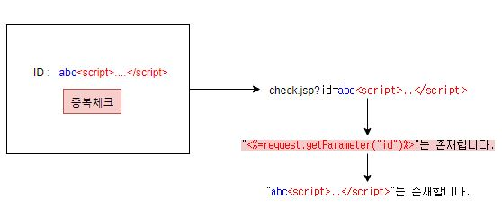
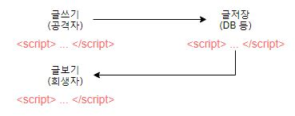
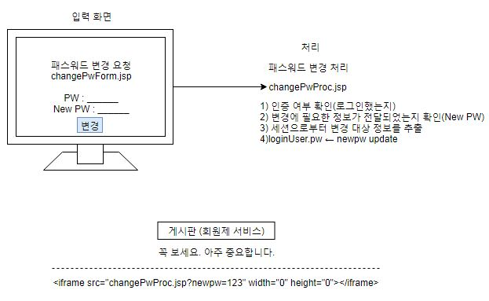
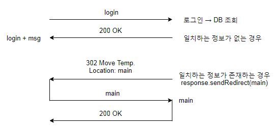
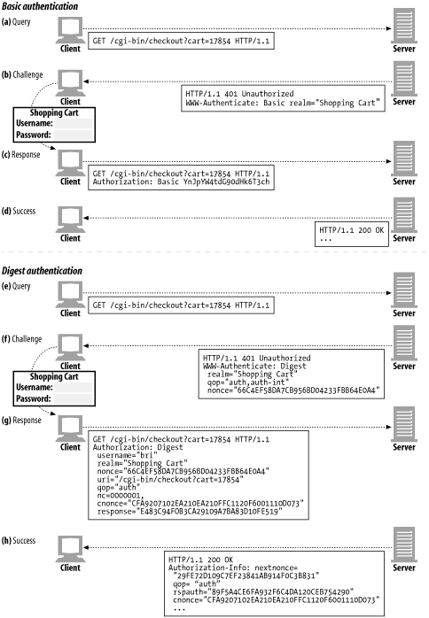

책 그대로

## 1. 안전한 소프트웨어 개발 방법론

> ### 1. 시큐어 코딩의 개요
>
> ### 2. 개발보안 방법론


## 2. 안전한 소프트웨어를 만드는 시큐어코딩 기법

> ### 3. 웹 애플리케이션 보안을 위한 기본 지식
>
> ### 4. 보안취약점 제거를 위한 코딩 기법
>
> ### 5. 안전하지 않은 코딩 스타일


## 3. 소프트웨어 보안 강화 기법

> ### 6. 오픈소스 보안 라이브러리 활용
>
> ### 7. 보안약점 진단 도구 활용

### 		　

### 1-1 시큐어코딩의 개요

- 소프트웨어 개발보안의 필요성
- 침해 사고 사례
- 보안취약점 정보 활용
- 행정자치부 소프트웨어 개발보안 가이드


#### 파일 업로드 취약점(개인정보 유출의 가장 큰 원인)

- 파일 업로드 기능을 제공하는 사이트에서업로드 파일의 크기와 개수를 제한하지 않음
  - 서버의 연결 및 디스크 자원을 고갈시킨다. ⇒ 정상적인 서비스를 방해 ⇒ DoS
- 업로드 파일의 종류를 제한하지 않음
  - 서버에서 실행 가능한 웹쉘(WebShell) 파일을 업로드 후 해당 파일을 실행해서 서버의 제어권을 탈취
  - 악성코드가 포함된 실행파일을 업로드 후 불특정 다수가 다운로드하도록 유도 ⇒ 악성코드 유포지로 악용
- 외부에서 접근 가능한 경로에 파일을 저장하는 경우에 발생하는 취약점

#### 방어기법

- 업로드 파일의 크기와 개수를 제한
- 업로드 파일의 종류를 제한
- 외부에서 접근할 수 없는 경로에 업로드 파일을 저장
- 업로드 파일의 저장 경로와 파일명을 외부에서 알 수 없도록 한다.
- 업로드 파일의 실행 속성을 제거한 후 저장한다.


#### SSL

취약점 : Heart Bleed https://blog.alyac.co.kr/76


#### SQL Injection

- SQL 명령에 사용된 특별한 엘리먼트를 무효화하지 않는 것 (SQL Injection)
- SQL문 예약어 또는 특수기호 ⇒ 메타문자(어떤 기능에서 의미를 가지고 있는 문자)
- 이스케이프 = 메타문자(의미문자)에서 의미를 제거하고 문자만 남기는 것
- 외부 입력값을 쿼리 조작 문자열 포함 여부를 확인하지 않고, 쿼리 생성 및 실행에 사용하는 경우 발생 → 원리 의미와 다른 형태로 쿼리가 변형되어서 실행되는 것 


#### 운영체제 명령어 삽입 (Command Injection)

- 운영체제 명령어 실행 부분이 존재하는 경우, 외부 입력값을 검증, 제한하지 않고, 명령어 또는 명령어의 일부로 사용하는 경우 발생

  ```java
  // 외부 입력값을 검증, 제한하지 않고, 명령어로 사용하는 경우
  String cmd = request.getParameter("cmd");
  Runtime.getRuntime().exec(cmd); 
  
  // 외부 입력값을 검증, 제한하지 않고, 명령어의 일부(명령어의 파라미터)로 사용하는 경우 ⇒ 의도하지 않은 추가 명령어 실행이 가능
  String file = request.getParameter("file");
  Runtime.getRuntime().exec("type c:\\data\" + file); 
  // c:\\data\ 아래에 존재하는 파일의 내용을 콘솔에 출력
  ```


#### 크로스 사이트 스크립팅(XSS = Cross-site Scripting)

- <u>웹 페이지 생성</u>에 사용된 <u>입력값 검증이 이뤄지지 않은 것</u>
  - 동적 페이지
  - 입력값이 페이지 생성에 사용되었음
  - 입력값에 실행 가능한 코드가 포함되었음

- <u>공격자가 전달한 스크립트 코드</u>가 사용자 브라우저를 통해서 실행되는 것
  
  1. 반사 XSS (Reflective)
  
     사용자 입력이 다음 화면 출력으로 실행 가능한 스크립트 코드 검증 없이 사용되는 경우 발생
  
     ⇒ 취약점을 가지고 있는 서버는 공격자의 스크립트 코드를 전달해주는 역활 = 경유지
  
     - 아이디 중복 체크  \-\-\-\-\-\-\-\-\-\-\-\-\-\-\-\-\-\-\-\-\-\-\-\-\-\-> check.jsp?**id=abc\<script>....\</script>**
  
       ID : **abc\<script>....\</script>** [check]
  
       
  
       "**abc\<script>....\</script>**"는 사용......  <\-\-\-\-\-\-\-\-\-\-\- "<%=request.getParameter("id")%>"는 사용......
  
       
  
       ⇒ 작동을 확인한 공격자는 공격 문자열을 제작
  
       ​	\<a href="check.jsp?**id=abc\<script>....\</script>**"> \~\~\~\~\~ \</a>
  
  2. 저장 XSS (Stored)
  
     게시판
  
     공격자가 전달한 스크립트 코드가 취약점을 가지고 있는 서버에 저장되고, 저장된 스크립트 코드가 지속적으로 사용자에게 전달되어서 실행
  
     
  
     **\## DOM-Based XSS**
  
     개발자가 만들어 놓은 스크립트 코드의 문제점을 이용
  
     \<script>
  
     ​            :
  
     ​    document.write(_______);
  
     \</script>
  
     
  
- **방어**

  1. 입력값 검증과 출력값 검증을 병행
  2. 입출력값에 포함된 실행 가능한 코드를 안전한 형태로 변형해서 전달 = HTML 인코딩
  3. 검증된 프레임워크 또는 라이브러리를 이용해서 검증 로직을 구현

```jsp
<%
	// 입력값에 포함된 태그 요소(< >)를 HTML 인코딩 처리해서 출력한다.
	// <script>..</script> ⇒ &lt;script&gt;..&lt;/script&gt;
	String input = request.getParameter("id");
	if (input != null) {
		input = input.replaceAll("<", "&lt;");
		input = input.replaceAll(">", "&gt;");
	}
%>
"<%=input>"는 존재합니다.
```


#### 사이트간 요청위조 = 크로스 사이트 요청위조 = CSRF(Cross-Site Request Forgery)

- 요청을 받은 서버측 프로그램이 요청 주체와 요청 절차를 검증하지 않고 요청을 처리했을 때 발생 = 자동화된 요청 여부를 확인하지 않고 처리



- **방어기법**

  1. 요청 주체를 검증

     ⇒ **주요 기능**에 대해서 재인증, 재인가

     - 트랜젝션이 발생하는 기능 = 데이터가 생성, 수정, 삭제

     - 중요한 정보를 다루는 기능 (개인정보, 금융정보, 인증정보, …)

     - 과금이 부과(처리)되는 기능

     ⇒ 추가 인증 수단을 고려

     패스워드 변경 시 현재 패스워드를 제시 → 패스워드 변경 요청자가 본인임을 증명

  2. 요청 절차를 검증

     ⇒ Referer 요청 헤더를 검증

     ⇒ 토큰(token)을 검증

     - 텍스트 기반의 토큰은 운영과정에서 사용자의 관여(참여)가 없이 진행 → 자동화된 스크립트를 통해서 검증 로직 우회가 가능
     - CAPTCHA = 자동화된 요청을 방지 기법 = 사용자와의 상호작용을 통한 요청


#### Open Redirect 

- 신뢰되지 않은 URL 주소로 자동 접속 연결외부 입력값을 검증, 제한 없이 리다이렉트 주소로 사용하는 경우 발생
-  의도하지 않은(계획되지 않은) 외부 사이트로 리다이렉션이 발생할 수 있음



mypage.jsp
요청 : mypage.jsp?url=main.jsp ⇒ 응답 : main.jsp 

```jsp
<%@ page language="java" contentType="text/html; charset=EUC-KR"
    pageEncoding="EUC-KR"%>
<!DOCTYPE html PUBLIC "-//W3C//DTD HTML 4.01 Transitional//EN" "http://www.w3.org/TR/html4/loose.dtd">
<html>
<head>
<meta http-equiv="Content-Type" content="text/html; charset=EUC-KR">
<title>Insert title here</title>
</head>
<body>
여기는 redirect.jsp 입니다.
<%
	String url = request.getParameter("url");
	if(url != null) {
		response.sendRedirect(url);
	}
%>
</body>
</html>
```

http://localhost:8080/openeg/Redirect.jsp?url=cors.html

- url을 직접 입력해주면 그쪽으로 redirect됨


#### 경로추적외부

- 입력값을 경로조작 문자열 포함 여부를 확인하지 않고, 내부 파일 참조에 사용하는 경우 발생
  - 정상 요청 : download.jsp?file_name=abc.gif ⇒ /upload/data/2019/08/abc.gif 파일을 다운로드 처리
  - 비정상 요청 : download.jsp?file_name=../../../../../../../../../etc/passwd ⇒ /ect/passwd 파일을 다운로드 처리
- 권한 밖의 파일에 접근이 가능
- 지정된 경로 밖의 파일에 접근이 가능


### 위협 모델링

1. 팀소집 - 팀원, 팀리더
2. 어플리케이션 **분해** → 위협목표 식별
3. ★★★**위협결정(위협트리)** ← **분류(STRIDE)** ← 식별
4. ★★★**위험도 산정(DREAD)** → 우선순위 결정
5. 대응방법 결정 : 무시, 알림, 고침(기능을 수정해서 사용가능), 제거(기능자체를 삭제)
6. 적용 기법·기술 선택


cgi → servlet → mvc 프레임워크


### 웹 인증 방식

쿠키(Cookie)

1. **쿠키에 중요정보를 포함하지 않는다. ☞ 쉽게 노출, 유출되고, 위변조가 가능하므로**

2. **중요정보를 포함하는 경우, 반드시 암호화한다.**

3. **유효기간(Expires), 지속시간(MaxAge)**
   - 길게 설정된 경우 → 사용자 하드디스크(의 브라우저 영역)에 파일로 저장 = 디스크 쿠키, Persistence(영구적) Cookie
   - 설정되지 않거나 짧게 설정된 경우 → **메모리에 저장 = Memory, Session Cookie** (이 방식이 더 안전)
4. **보안(Secure)**
   - 설정된 경우 → 보안 쿠키 = HTTPS 통신인 경우에만 서버로 전달(중요한 정보는 필요할 때만 왔으면 좋겠다.)
   - 설정되지 않은 경우 → 비보안 쿠키
5. **HttpOnly**
   - 클라이언트(브라우저)에서 쿠키에 접근을 차단**(쿠키가 털리는 경우 - 1. 네트워크 부분: 통신중의 쿠키가 노출→보안 쿠키를 이용해서 예방(https - SID도 암호화되므로 털려도 읽기 힘들다), 2. 브라우저: 브라우저의 메모리, 하드디스크가 털리는 경우 → HttpOnly옵션을 활성화)**
   - 모든 브라우저에서 지원하지 않음

- HTTP는 다른 프로토콜들처럼 연결을 유지하지 않기 때문에 app에서 직접 연결을 유지하기 위한 프로그래밍을 해준다.
- 도착한 요청이 전에온 놈인지 구분하기 위해(요청과 요청에 연관성을 나타내기 위한 첫번째 수단) 요청에 붙어온 쿠키를 확인해서 자신이 부여해준 쿠키(Set-Cookie 헤더를 통해 생성)인지 확인한다.
- 쿠키에 관련된 일들은 브라우저가 해주고 사용자의 관여를 없애준다. 연결이 유지되는 것처럼 착각하게 만들어준다. 사용자는 요청 파라미터를 사용해서 관계를 알려준다.

- 한번 저장된 쿠키는  유효기간이 경과하지 않았다면 해당 도메인에 접속하면 브라우저가 자동으로 탑재하여 전송

**세션이란? 요청과 요청이 연관이 있다는 것을 알려주는 역할을 한다.**

#### 세션을 사용하지 않는 HTTP 인증

- Basic Authentication - **Basic 64로 인코딩해서 안전하지 않다. 연결을 유지하지 않기 때문에 연결할때마다 인증정보를 계속 가져가야 한다.(세션을 유지하지 않기 때문에☞인증 정보를 계속 달고가기 때문에 유출가능성이 높아진다.)**

- HTTP Digest Authentication - 서버가 임의의 값(nonce)을 준 후 해쉬를 돌리고 클라이언트가 해쉬를 돌려서 res에 같이 보내준 값과 비교하여 인증을 한다.

  

- HTTP NTLM Authentication - 인터넷 익스플로러

- Anonymous Authentication

#### 세션을 사용하는 인증

- Form Based Authentication - **인증에 성공하면 세션을 생성한다. 그 후 요청엔 쿠키를 통해 전달되는 SID(세션 ID)만 가지고 인증을 해준다.**

- **안전한 세션 ID(SID) 생성 및 관리 규칙**
  1. 세션 ID 생성 규칙을 유추할 수 있으면 안됨 → 세션 ID 추측 공격이 가능 = 이전에 생성된 세션 ID 또는 이후에 생성될 세션 ID를 예측하여 공격자가 설정하고 대기
  2. 세션 ID가 인증전과 인증후 다르게 생성되어야 한다. → 세션 ID 고정 공격이 가능 = 공격자(사이트에 접속 권한 없음)가 발급 받은 세션 ID를 희생자(사이트에 접속 권한이 있음)에게 설정 후 희생자가 로그인하면 공격자도 로그인된 상태를 가지게 됨
  3. 서버로부터 발급받은 세션 ID를 훔쳐가는 것을 방지 → 세션 ID 훔치기 공격이 가능 = XSS 공격 또는 스니핑 등의 공격을 통해서 세션ID를 훔쳐감


### 인코딩

데이터를 일정한 규칙에 따라 바꾸는 것. 시스템간의 데이터가 안전하게 이동할 수 있도록 사용

- ASCII
- URL Encoding(클라이언트가 서버에게 데이터를 그대로 보내기위해 사용)
- HTML Encoding(서버가 클라이언트에게 데이터를 그대로 보내기위해 사용)
- BASE64 Encoding - 텍스트만 전송되던 메일 프로토콜에서 파일을 전송하기 위해 binary 데이터를 텍스트화해서 전송, 저장할 수 있도록 해준다.(8비트 2진 데이터를 문자코드에 영향을 받지 않는 ASCII 문자열로 바꾸는 인코딩 방식-SMTP 이메일 첨부 파일 전송, HTTP 기본 인증에 사용)


### 정규식

https://regexr.com/

문자열의 검색, 치환, 추출을 위해 사용되는 패턴


### 인젝션(Injection)

입력값을 검증 없이 **처리**에 사용하는 경우, 처리의 원래 의미와 형태가 변형되어서 실행되는 것

- 쿼리문을 만들고, 실행하는 처리 → SQL Injection
- XML 문서를 조회하는 쿼리를 만들고, 실행하는 처리 → XPath Injection, XQuery Injection
- 운영체제 명령어를 실행하는 처리 → Command Injection

- etc..

#### 인젝션을 방어하기 위한 방법

1. 입력값을 검증
2. 구조화된 처리, 파라미터화된 처리, … ⇐ 어떠한 입력을 받더라도 동일한 형태가 유지되는 것

입력값 검증은 공격자가 다양한 형태로 입력값을 변형해서 전달하므로 쉽지 않다.

정규화 또는 규범화, 새니타이즈 과정을 거친 후 검증을 수행해야 한다.

예) 입력값에서 \<script> 라는 단어가 들어간 경우 ··· 별도의 처리를 한다.

```java
String input = request.getParameter("data");
if (input != null && input.equals("<script>")) { … }
```

../check.jsp?data=\<script>         ⇐ 위 검증을 수행

../check.jsp?data=     \<ScRiPt>    ⇐ 위 검증 로직을 우회하는 입력


**정규화, 규범화 = 데이터를 가장 함축적이고 일반화된 형태로 변형하는 과정**

백달러(정규화)

100 dollars  ⇒  $100


규범화

\<a>123\</a>\<b>456\</b>

\<a>123\</a>  \<b>456\</b>

\<a>123\</a>		\<b>456\</b>  ⇒  \<a>123\</a>\<b>456\</b>


새니타이즈 = 대상 시스템에 요구사항에 맞춰 데이터를 변형하는 과정

입력값 [     \<ScRiPt>    ]

⇒ 불필요한 공백을 제거 → [\<ScRiPt>]

⇒ 데이터를 소문자로 비교 → [\<script>]


### SQL Injection

외부 입력값을 쿼리 조작 문자열 포함 여부를 확인하지 않고 쿼리문 작성 및 실행에 사용하는 경우 발생

→ 의도하지 않은 형태로 쿼리가 변형되어서 실행 = 쿼리문의 의미와 구조가 변형되어 실행

→ 권한밖의 데이터 조회 및 생성, 수정, 삭제가 가능

→ 서버의 제어권을 탈취

→ 쿼리문의 용도에 따라서 기능을 우회


```java
String id = request.getParameter("id");
String query = "select * from users where id = '" + id + "'";
/* 이대로 사용하면 조작이 가능하다. */
Statement stmt = connection.createStatement();
stmt.executeQuery(query);
```

이를 방지하기 위해 쿼리문의 구조를 미리 정의해주는 방식을 사용해보자.

```java
String id = request.getParameter("id");
String query = "select * from users where id = ? "; // 쿼리문의 구조를 정의
PreparedStatement stmt = connection.prepareStatement(query);
stmt.setString(1, id); // setString이 자체적으로 인젝션을 방어해준다. 조작문 안의 '나 "등을 escape시켜줘서 문자열로 입력되게 해준다.
// ex) 123' or 'a' = 'a 를 입력하면
// 123' or 'a' = 'a 를 id로 가진 유저를 찾는다.
stmt.executeQuery();
```

**SQL Injection의 유형**

1. **항상 참**이 되는 입력 ⇒ 권한 밖의 데이터 조회가 가능

   예) ../dosomething.jsp?id=**a' or 'a' = 'a**

   ⇒ … **where id = 'a' or 'a' = 'a'**

   이제 WebGoat에서 해당 코드를 살펴보자.

   ```java
   public boolean login(WebSession s, String userId, String password)
   	{
   		// System.out.println("Logging in to lesson");
   		boolean authenticated = false;
   
   		try
   		{
               // 진단결과:
                   // 외부에서 전달된 userId와 password를 검증하지 않고
                   // SQL문 생성 및 실행에 사용하고 있음
                   // 즉, SQL Injection 취약점이 발생할 수 있다.
                   
                   // 조치방안:
                   // 정적쿼리가 실행될 수 있도록 한다.
                   // = 항상 동일한 형태의 쿼리가 실행되는 것을 보장
                   // = 구조화된 쿼리 실행
                   // = 파라미터화된 쿼리 실행
                   // = PreparedStatement 객체를 이용한 쿼리 실행
                   
                   // #1 쿼리문의 구조를 정의
                   //	- 변수 부분을 물음표(?)로 마킹
                   //	- 해당 컬럼의 데이터 타입을 고려하지 않음
   				// String query = "SELECT * FROM employee WHERE userid = " + userId + " and password = '" + password + "'";
               String query = "SELECT * FROM employee WHERE userid = ? and password = ? ";
   			try
   			{	
                   // #2 PreparedStatement 객체를 생성
                   // 	- prepareStatement(쿼리문의 구조) 메소드를 이용해서 생성
   				// Statement answer_statement = WebSession.getConnection(s)
   					//  	.createStatement(ResultSet.TYPE_SCROLL_INSENSITIVE, ResultSet.CONCUR_READ_ONLY);
                   java.sql.PreparedStatement answer_statement = WebSession.getConnection(s)
   						.prepareStatement(query, ResultSet.TYPE_SCROLL_INSENSITIVE, ResultSet.CONCUR_READ_ONLY);
                   // #3 변수 영역에 값을 바인딩 후 쿼리를 실행
                   // 	- 해당 컬럼의 데이터 타입을 고려해서 바인딩 함수를 사용
                   answer_statement.setInt(1,  Integer.parseInt(userId)); // 추가
   				answer_statement.setString(2, password); // 추가
   				ResultSet answer_results = answer_statement.executeQuery(query);
   				if (answer_results.first())
   				{
   					setSessionAttribute(s, getLessonName() + ".isAuthenticated", Boolean.TRUE);
   					setSessionAttribute(s, getLessonName() + "." + SQLInjection.USER_ID, userId);
   					authenticated = true;
   				}
   			} catch (SQLException sqle)
   			{
   				s.setMessage("Error logging in");
   				sqle.printStackTrace();
   			}
   		} catch (Exception e)
   		{
   			s.setMessage("Error logging in");
   			e.printStackTrace();
   		}
   
   		// System.out.println("Lesson login result: " + authenticated);
   		return authenticated;
   	}
   ```

2. **오류를 유발**하는 입력 ⇒ 정보수집을 통해 추가 공격을 기획

   예) ../dosomething.jsp?**id=a'**

   ⇒ … **where id = 'a''** 

3. SP(Stored Procedure)를 호출하는 입력(exec 등)

   ⇒ 시스템 SP(시스템에서 제공하는 범용적, 관리적 기능, 사용자들이 만들어서 사용하는 유저 SP도 있으나 이것은 공격자가 확인할 수 없다.) 호출

   예) ../dosomething.jsp?id=**a' ; exec xp_cmdshell 'cmd.exe /c dir' ; --**

   ⇒ … **where id = 'a' ; exec xp_cmdshell 'cmd.exe /c dir' ; --'**

4. UNION 구문을 입력 ⇒ 공격자가 원하는 정보를 조회

   >@Kali#2 브라우저로 bWAPP로 접속 (bee / bug)Choose your bug: SQL Injection (GET/Search) 선택 후 Hack 버튼 클릭 > 영화 정보 조회 서비스
   >
   >1. a' 입력해서 인젝션 여부를 확인 a'
   >
   >⇒ select * from movies where like '%a'%'
   >
   >Error: You have an error in your SQL syntax; check the manual that corresponds to your MySQL server version for the right syntax to use near '%'' at line 1
   >
   >2. 정상적인 입력을 통해서 쿼리 실행 결과를 확인man으로 검색
   >
   >⇒ select * from movies where like '%man%'
   >
   >select * from xxxxxx → 공격자가 알고자 하는 정보를 조회하는 쿼리
   >
   >3. 
   >
   >```sql
   >select * from movies where like '%man' **union** select * from xxxxxx -- %'
   >```
   >
   >​	→ 각 쿼리의 결과 컬럼의 개수가 동일해야 한다.
   >
   >​	select * from movies where like '%man' order by 1 -- %'
   >
   >​			:
   >
   >​	select * from movies where like '%man' order by 8 -- %'
   >
   >​	⇒ Error: Unknown column '8' in 'order clause' ⇐ 7 컬럼이 존재
   >
   >​	→ 각 컬럼의 데이터 타입이 호환 가능해야 한다.
   >
   >4. UNION 구문을 이용해서 DB정보를 출력
   >
   >   select * from movies where like '%**man' and 1=2 union select @@version,2,3,4,5,6,7 --** %' 
   >
   >   ⇒ 2, 3, 5, 4 가 출력
   >
   >   select * from movies where like '%**man' and 1=2 union select 1,@@version,3,4,5,6,7 --** %' 
   >
   >5. 테이블 정보를 조회
   >
   >   select * from movies where like '%**man' and 1=2 union select 1,table_catalog,table_schema,table_name,table_type,6,7 --** %'
   >
   >6. users 테이블에 컬럼 정보를 조회
   >
   >   select * from movies where like '%**man' and 1=2 union select 1,column_name,3,4,5,6,7 from information_schema.columns where table_name='users' --** %'
   >
   >7. users 테이블에 id, login, password, email, secret 정보를 조회
   >
   >   select * from movies where like '%**man' and 1=2 union select 1,id,login,password,concat(email, ' : ', secret),6,7 from users --** %' 

5. Blind SQL Injection ⇒ 참인 조건과 거짓인 조건에 따른 서버의 반응을 보고 원한 값을 찾아가는 과정

   예) ../dosomething.jsp?id=123

   ⇒ … where id = '123' → ID가 123인 사용자의 정보가 조회되어서 출력

   ../dosomething.jsp?id=123' and 1 = 1 --

   ⇒ … where id = '123' and 1 = 1 -- ' → ID가 123인 사용자의 정보가 조회되어서 출력

   ../dosomething.jsp?id=123' and 1 = 2 --

   ⇒ … where id = '123' and 1 = 2 -- ' → 결과 없음

   ../dosomething.jsp?id=123' and (select …) --

   ⇒ … where id = '123' and (select …) -- ' 

   → 결과 없음 ⇒ (select …) 구문은 거짓

   → 사용자 정보 ⇒ (select …) 구문은 참

   **※ WebGoat에서 실습을 해보자.**

   ```sql
   WebGoat > Injection Flaws > Blind Numeric SQL Injection > 계좌의 유효성 체크 서비스
   문제: pins 테이블에서 cc_number의 값이 1111222233334444인 pin 값을 찾으시오.
   ⇒ select pin from pins where cc_number = '1111222233334444'
   
   [화면] 
   Account Number : 101 and (select pin from pins where cc_number = '1111222233334444')
   
   [전달]
   ../check.jsp?account_number=101 and (select pin from pins where cc_number = '1111222233334444')
   
   입력순서
   101 ⇒ 유효한 계좌번호이므로 Account number is valid 메시지 출력
   999 ⇒ 유효하지 않은 계좌번호이므로 Invalid account number 메시지 출력
   101 and 1=1 ⇒ 항상 참(1=2)인 조건이므로 101을 입력했을 때와 동일한 결과
   101 and 1=2 ⇒ 항상 거짓(1=2)인 조건이므로 Invalid account number 메시지가 출력
   101 and (select pin from pins where cc_number = '1111222233334444') < 3000 ⇒ Invalid account number 메시지 출력 → 찾고자 하는 pin 값이 3000 보다 작음
   101 and (select pin from pins where cc_number = '1111222233334444') < 2000 ⇒ Account number is valid 메시지 출력 → 찾고자 하는 pin 값이 2000 보다 큼
   101 and (select pin from pins where cc_number = '1111222233334444') = 2364 ⇒ Account number is valid 메시지 출력 → 찾고자 하는 pin 값이 2364 임
   
   [사용]
   select * from accounts where account_number = 101 and (select pin from pins where cc_number = '1111222233334444') = 2364
   → 결과가 있으면 → Account number is valid.
   → 결과가 없으면 → Invalid account number.
   ```

   **[방어기법]**

   1. 정적쿼리를 사용한다.

      = 구조화된 쿼리 실행 = 파라미터화된 쿼리 실행 = PreparedStatement 객체를 이용

   2. 동적쿼리를 사용해야 하는 경우, 입력값에 반드시 쿼리 조작 문자열 포함 여부를 확인 후 사용한다.

      - 포함되어있으면?
        1. 오류 처리
        2. 그 문자만 제외하고 사용하도록 함
        3. 문자를 escape시켜서 사용

   3. 오류 메시지에 시스템 정보가 포함되지 않도록 통제한다. 

      ⇒ Error-based SQL Injection 공격을 완화

   4. 어플리케이션에서 사용하는 DB 사용자 계정에 대해 최소 권한을 부여한다.

      = 해당 어플리케이션에서 사용하는 DB 객체에 대해서만 사용 권한을 부여한다.

      ⇒ SP 또는 UNION-Based SQL Injection 공격을 완화

   5. ORM을 이용해서 개발하는 경우, 외부 입력값을 쿼리맵에 바이딩할 때는 반드시 # 기호를 이용한다.


### 운영체제 명령어 삽입 (Command Injection)

어플리케이션에서 운영제체 명령어 실행 부분이 존재하는 경우, 외부 입력값을 검증, 제한하지 않고, 운영체제 명령어 또는 명령어의 일부로 사용하는 경우 발생

```java
Runtime.getRuntime().exec(______); // ← ______ 명령어를 해당 시스템의 쉘에서 실행

//	외부 입력값을 검증, 제한 없이 운영체제 명령어로 사용하는 경우
//	⇒ 공격자가 파라미터를 조작, 변경해서 의도하지 않은 명령어가 실행
//	⇒ 해당 시스템의 제어권을 탈취

String pcmd = request.getParameter("cmd");

Runtime.getRuntime().exec(pcmd);
```

- 정상요청 : ../doSomething.jsp?cmd=dir 

- 비정상요청 : ../doSomething.jsp?cmd=ipconfig 

```java
// 외부 입력값을 검증, 제한 없이 운영체제 명령어의 일부로 사용하는 경우
String fname = request.getParameter("file_name");
Runtime.getRuntime().exec("type c:\data\ " + fname); // ⇐ c:\data\ 아래에 있는 특정 파일의 내용을 출력
```

- 개발자가 의도했던 정상 요청 : ../doSomething.jsp?file_name=abc.txt
- 공격자가 조작한 비정상 요청 : ../doSomething.jsp?file_name=abc.txt & ipconfig

#### 방어기법

1. 운영체제 명령어 실행을 통한 서비스 제공의 필요성을 검토

   → 불필요한 운영체제 명령어 실행을 제거하거나 또는 다른 기능으로 대체한다.

2. 해당 시스템에서 **사용할 명령어를 미리 정의**하고, 정의된 범위 내에서만 사용될 수 있도록 제한한다. 

   = 화이트 리스트(허용 목록) 방식으로 입력값을 제한

3. 추가 명령어 실행에 사용되는 &, |, ; 과 같은 문자가 입력값에 포함되어 있는 검증한다.

#### **입력값 검증 제한 방식**

1. 화이트 리스트 : 허용 목록

2. 블랙 리스트 : 제한 목록

- 입력값 유형 a, b, c가 존재하는 경우, 검증 결과 a는 안전하고, b, c는 안전하지 않을 경우, 허용 목록에 a를, 제한 목록에 b, c를 등록허용 목록이나 제한 목록이나 a, b, c가 입력되었을 때 a만 사용하게 된다.
- 아직 검증되지 않은 새로운 유형 x, y, z이 입력되었을 때, 허용 목록을 적용하면 여전히 a만 사용하게 되나, 제한 목록을 적용하면 a 뿐만 아니라, x, y, z도 사용하게 된다.
- 만약에 x, y, z가 안전하지 않은 유형이라면, 허용 목록을 적용하면 동일한 보안성이 보증되는 것이나, 제한 목록을 적용하면 시스템이 취약해 질 수 있다.

#### 216페이지운영체제 명령어 삽입 취약점 점검 및 대응

Eclipse > Ctrl+Shift+R > TestController.java

request.getSession().getServletContext().getRealPath("/")

⇒ 웹 루트의 실제 디렉터리 경로를 가져오는 것

⇒C:\FullstackLAB\workspace\.metadata\.plugins\org.eclipse.wst.server.core\tmp0\wtpwebapps\openeg (Apache Tomcat의 서버위치)

```java
public String testCommandInjection(HttpServletRequest request, HttpSession session) {
		StringBuffer buffer = new StringBuffer();
    
    	/* 
    		진단결과
    	외부에서 전달된 data 파라미터 값을 검증, 제한하지 않고,
    	운영체제 명령어 실행에 사용하고 있다.
    	→ 운영체제 명령어 삽입 취약점을 가지고 있다.
    	
    		대응방법
    	사용 가능한 명령어를 미리 정의하고,
    	정의된 범위 내에서 명령어가 실행될 수 있도록 한다.
    	※ 내부 처리에 사용되는 명령어가 외부에서 직접 전달되지 않도록 한다.
    	   = 외부에서 전달된 값이 내부 처리에 직접 사용되지 않도록 한다.
    	   = 외부에서는 코드화된 정보가 전달되고,
    	     내부에서는 코드에 해당하는 명령어 대체해서 사용하도록 코딩
    	   => 허용 목록 기반의 입력값 제한(화이트 리스트)과 내부 처리를 감추는 캡슐화를 동
    	   시에 구현할 수 있다.
    	*/
    
    	// #1. 사용 가능한 명령어를 정의
    	String[] allowedCommands = { "type", "dir" };
    
    	// #2. 화면에서 전다로딘 0, 1을 사용할 명령어로 대체
    	// AS-IS : 처리에 사용되는 명령어가 전달
    	// TO-BE : 화면에서는 코드가 전달되고, 처리에서는 명령어로 대체해서 처리    
		String data = request.getParameter("data");
    	try {
			data = allowedCommands[Integer.parseInt(data)];
		} catch (Exception e) {
			// 숫자가 아닌 문자가 전달되는 경우 → 예) data=ipconfig → 파싱 오류가 발생
            // 0 또는 1이 아닌 숫자가 전달되는 경우 → 예) data=100 → 인덱스 오류가 발생
            // (배열 바운더리 초과)
            return  "잘못된 접근입니다.";
		}
    
		if (data != null && data.equals("type")) {
			data = data + " " + request.getSession().getServletContext().getRealPath("/") + "files\\file1.txt";
		}

		Process process;
		String osName = System.getProperty("os.name");
		String[] cmd;

		if (osName.toLowerCase().startsWith("window")) {
            // window면 cmd 명령어를 cmd에 넣어준다.
			cmd = new String[] { "cmd.exe", "/c", data };
		} else {
            // 리눅스면 배쉬 명령어를 cmd에 넣어준다.
			cmd = new String[] { "/bin/sh", data };
		}
		try {
			process = Runtime.getRuntime().exec(cmd);
			InputStream in = process.getInputStream();
			Scanner s = new Scanner(in);
			buffer.append("실행결과: <br/>");
			while (s.hasNextLine() == true) {
				buffer.append(s.nextLine() + "<br/>");
			}
		} catch (IOException e) {
			buffer.append("실행오류발생");
			e.printStackTrace();
		}
		return buffer.toString();
	}
```

test.jsp

```jsp
<form action="command_test.do" id="form5">
	<pre>
        (4) Command 인젝션  <br />
        <select name="data" id="data5">
        	<option value="type">--- show File1.txt ---</option>
            <option value="dir">--- show Dir ---</option>
        </select> <input type="button" id="button5" value="실행">
    </pre>
</form>
```


### XPath 삽입

|        |      |                                      |
| ------ | ---- | ------------------------------------ |
| SQL    | DB   | SELECT phone FROM user WHERE id = ?? |
| XPath  | XML  | //user [ id = ??? ]/phone            |
| XQuery |      |                                      |

​	1) 입력값 검증

​	2) 구조화된 쿼리 실행을 지원하는 XQuery 구문으로 대체

```XML
XML 예

<addressBook>
	<address>
    	<name>홍길동</name>
        <password>1234</password>
        <email>hong@korea.com</email>
        <ccard>1234-5678-9000</ccard>
    </address>
    <address>
    	<name>임꺽정</name>
        <password>5678</password>
        <email>lim@korea.com</email>
        <ccard>9876-5432-1000</ccard>
    </address>
</addressBook>
```

XPath 사용 예

- Email 주소를 추출하기 위한 XPath 쿼리
  - //address/email/text()
- 홍길동의 사용자 정보를 조회
  - address[name/text()='홍길동']
- 홍길동의 신용카드 번호를 조회
  - //address[name/text()='홍길동' and password/text()='1234']/ccard/text()
- **애플리케이션 로직 파괴**
  - //address[name/text()='홍길동' and password/text() = ' **' or 'a'='a** ']/ccard/text()


### LDAP 삽입

- 정상적인 입력값: 홍길동

  ```ldap
  <LDAP://ldapserver>;(name=홍길동);cn,phone,department
  ```

- 공격을 위한 입력값: 홍길동);mail,cn;

  ```ldap
  <LDAP://ldapserver>;(name=**홍길동);mail,cn;**);cn,phone,department
  ```

- 공격을 위한 입력값: *);cn,location,nation,mail;

  ```ldap
  <LDAP://ldapserver>;(name=***);cn,location,nation,mail;**);cn,phone,department
  ```


## 인증 및 세션 관리 취약

### 인증

1. 인증 과정(처리)

   - 세션을 이용하는 인증 - 인증정보를 계속 반복해서 전달하지 않기위해. 
   - → 세션 생성·관리(로그인 전후 다르게, 유추 불가, 도용 방지)
   - 인증시도 회수 제한

2. 인증 정보 생성·저장

   - 패스워드 생성·관리 규칙

     생성규칙

     - 영·숫·특 : 8자리
     - 영·숫·특 중 2가지 : 10자리
     - 사전에 있는 것 사용 금지
     - 규칙성 있는 것 사용 금지
     - 본인신상정보관련 사용 금지

     관리규칙

     - 변경주기
     - 히스토리(사용했던 것 금지)
     - 최소 사용 기간

   - 패스워드 저장 → 암호화

     - 해쉬 : SHA2 이상
     - salt를 적용
     - 분리된 공간에 salt 보관


## 인증 시도 회수 제한

회원가입

- SQL Injection
- CSRF
- XSS
- 파일 업로드
- 패스워드(생성규칙) 암호화처리(SHA2이상), 저장(salt사용)

로그인

- sql injection
- 로그인 횟수
- 로그인 세션id 고정값
- 유지되는 세션에서 진행
- 암호화 통신(https)
- 정보 암호화

게시판

- SQL Injection
- CSRF
- XSS
- 권한 여부
- 파일 업로드
- 파일 다운로드


## 데이터 암호화 취약점


---

관리자 페이지는 관리하는 데이터의 범위가 넓기때문에 다른 도메인에서 관리하는게 옳다.

ex) http://70.12.50.164:1234/


# HTTP 응답 분할

 외부 입력값을 개행 문자열 포함 여부를 확인하지 않고 응답 헤더의 값으로 사용하는 경우 응답이 여러개로 분리되어서 전달되는 현상

- 분할된 헤더 중 본문 영역에 실행 가능한 코드를 추가해서 전달이 가능

  HTTP/1.1 200 OK↳

  Set-Cookie: user-role=user;↳

  Location: main.jsp↳ .... ↳↳ ..\<script> … \</script>.. ↳HTTP/1.1 200 OK↳ .... ↳

  Server: Apache↳

  ↳

  \<html>...\</html>

- **대응방법**

  외부 입력값을 응답헤더의 값으로 사용하는 경우, 개행문자 포함 여부를 확인 후 사용

  ```JAVA
  Cookie c = new Cookie();
  c.add("role", "user");
  response.addCookie(c);
  ⇒ Set-Cookie : role=user;
  
  response.setHeader("Content-Disposition", "inline; filename=abc.txt");
  ⇒ Content-Disposition: inline; filename=abc.txt;
  
  response.sendRedirect("list.do");
  ⇒ Location: list.do;
  ```


  개행문자 : CR(Carrige Return), LF(Line Feed) ⇒ \r, \n


# 시큐어 코딩

안전한 소프트웨어를 만드는것

→ 구현단계 - 소스코드를 안전하게 ← Secure Coding(이런 체계를 이용해 소스코드를 만들면 안전하다)

분석→설계→구현→테스트→이  ← 개발보안 방법론( - MS-SDL	- 7 Touch Point)