# 칼리 리눅스

- 포트 스캐닝

  특정 포트가 동작하고 있는지 확인하는 것 (ex. 80번 포트가 돌고있는지 확인하면 웹 서버가 돌고있다라는걸 알 수 있다.)

  - 가장 기본적인 것

    TCP Open Scan - TCP 연결과정(3-way handshaking)을 통해서 해당 포트의 실행(사용) 여부를 확인

    - 해당 포트가 유효하면  SYN →,  SYN/ACK ←,  ACK →   = 연결(세션)이 수립 = 접속(연결) 로그가 남음

      로그가 남으면 추적이 가능하기 때문에 공격자에게 안좋다.

    - 해당 포트가 무효하면  SYN →,  RST/ACK ←

    Stealth Scan - 기록을 남기지 않는 포트 스캔 방법

    - TCP half open scan = TCP SYN open scan

      해당 포트가 유효하면 : SYN →,  SYNC/ACK ←,  (RST →)	= ACK가 와도 그냥 가만히 대기하거나 리셋(나는 동작사실을 확인할 수 있음) = 연결이 수립되지 않음 = 로그가 남지 않는다.

      해당 포트가 무효하면 : SYN →,  RST/ACK ←

    - FIN scan

      해당 포트가 유효하면 : FIN →,  ??? (무응답)

      해당 포트가 무효하면 : FIN →,  RST/ACK ←

    - XMAS scan

      해당 포트가 유효하면 : FIN+PSH+URG(흔치 않은 플래그를 보냄) →,  ??? (무응답)

      해당 포트가 무효하면 : FIN+PSH+URG →,  RST/ACK ←

    - NULL scan

      해당 포트가 유효하면 : NULL(플래그를 비움) →,  ??? (무응답)

      해당 포트가 무효하면 : NULL →,  RST/ACK ←

## **ARP(Address Resolution Protocol)**

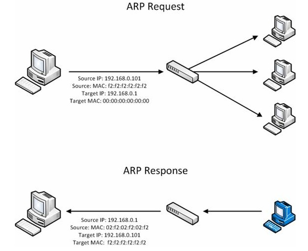

### **ARP Spoofing**

승인받은 사용자인 것처럼 시스템에 접근하거나 네트워크상에서 허가된 주소로 가장하여 접근 제어를 우회하는 공격 행위

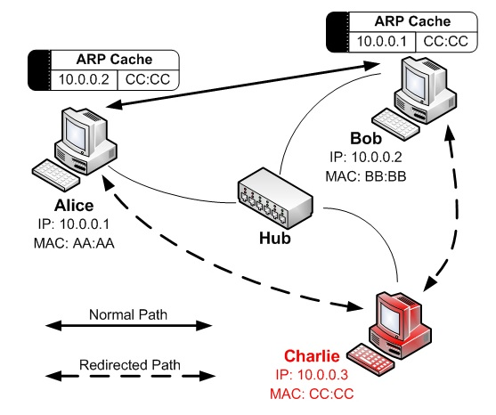

### ARP Spoofing 방어

ARP cache table에 Gateway MAC 주소를 정적으로 설정

## MTM(Man in The Middle) attack

두 호스트 간에 통신을 하고 있을 때, 중간자가 사이에 끼어들어 통신 내용을 도청, 조작하는 공격

# 실습

nmap (network map)

- 네트워크에 연결되어 있는 호스트의 정보를 파악하는 도구
- nmap을 이용해서 네트워크에 연결되어 있는 호스트의 IP, OS, Service Port, SW 등을 확인할 수 있음

nmap --help

SCAN TECHNIQUES:

  -**sS/sT**/sA/sW/sM: **TCP SYN/Connect()**/ACK/Window/Maimon scans

  -sU: UDP Scan

  -**sN/sF/sX: TCP Null, FIN, and Xmas scans**

  --scanflags <flags>: Customize TCP scan flags

  -sI <zombie host[:probeport]>: Idle scan

  -sY/sZ: SCTP INIT/COOKIE-ECHO scans

  -sO: IP protocol scan

  -b <FTP relay host>: FTP bounce scan

**Kali #1에 apache2, vsftp 서비스를 실행**

\# service apache2 start

\# service vsftpd start

**Kali#2에서 Kali#1으로 웹 서비스 요청과 FTP 서비스 요청을 할 수 있음**

- 아파치 서버가 작동중인지 파이어폭스로 확인해본다.

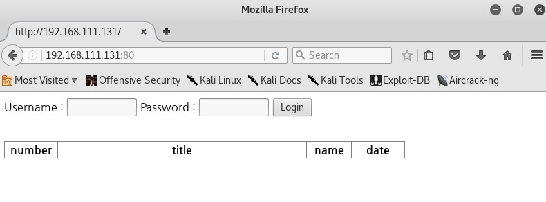

- ftp 가 작동중인지 ftp 명령어로 확인해본다.
- Victom쪽에서 와이어 샤크를 실행시킨 뒤 Attacker 쪽에서 포트 스캔을 해본다.

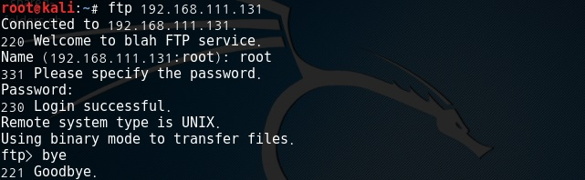

- 포트 스캔 방식과 포트를 지정해줘서 스캔을 해본다.

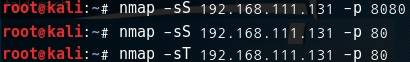

- 그 결과를 와이어샤크를 이용해 캡쳐한다. (TCP half open scan)

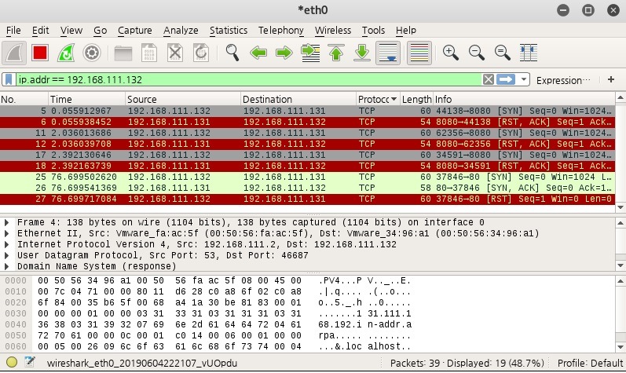

- 그 결과를 와이어샤크를 이용해 캡쳐한다. (TCP open scan)

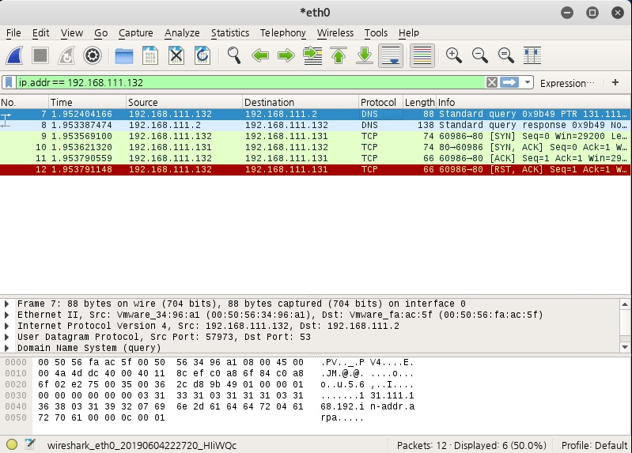

- NULL, FIN, XMAS scan을 해보고 캡쳐해본다.

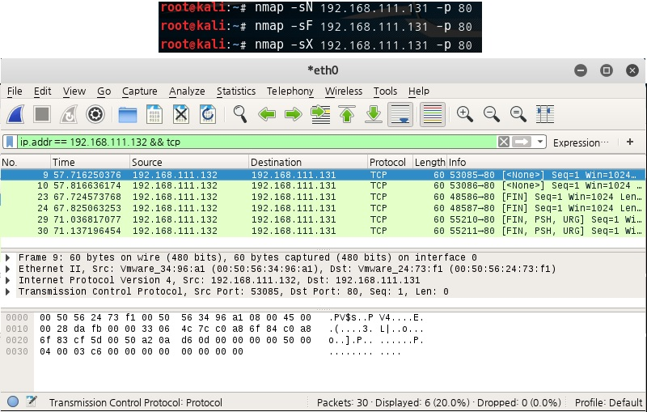

### ARP Spoofing

- **Kali2 (Attacker)가 arpspoofing을 한다.**

kali1(Victom) : 192.168.111.131

kali2(Attacker) : 192.168.111.132

WindowsXP : 192.168.111.133

- **root@kali2:~\# arpspoof -i eth0 -t VICTIM_IP(WINXP) GATEWAY_IP**

⇒ # arpspoof -i eth0 -t 192.168.111.131(133) 192.168.111.2

**공격 대상자의 arp 테이블의 게이트웨이 맥주소가 변경되는것을 확인할 수 있다.**

이제 게이트웨이로의 요청이 공격자에게 가고 공격자는 dns를 수행해주지 않기때문에 naver 접속이 되지 않는다.

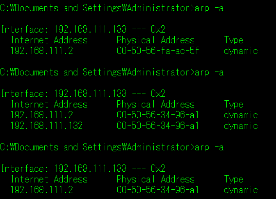

가로챈 패킷을 원하는 방향으로 돌리고 싶을 때

- **root@kali2:~\# fragrouter -B1** ← 원래 방향으로 라우팅 해준다.

이제 공격자가 원래 경로로 라우팅해준다. dns 서버 사용이 가능해지기 때문에 naver 접속이 다시 가능해진다.

### ARP Spoofing 방어

Windows 두가지 방법

1. \> arp -s GATEWAY_IP GATEWAY_MAC

2. \> netst interface ip delete neighbors "NETWORK_CARD_NAME" "GATEWAY_IP"

   \> netst interface ip add neighbors "NETWORK_CARD_NAME" "GATEWAY_IP" "GATEWAY_MAC"

### MTM(Man in The Middle) attack

DNS Spoofing

etter.dns 파일 수정 ← DNS Spoofing에서 사용할 정보를 담고있는 파일 (Victom이 naver.com에 dns 요청을 할 때 naver.com의 응답 ip를 주지않고 공격자 자신의 ip를 주는 방식인데 그 정보를 담고있음)

**root@kali2:~\# gedit /etc/ettercap/etter.dns**

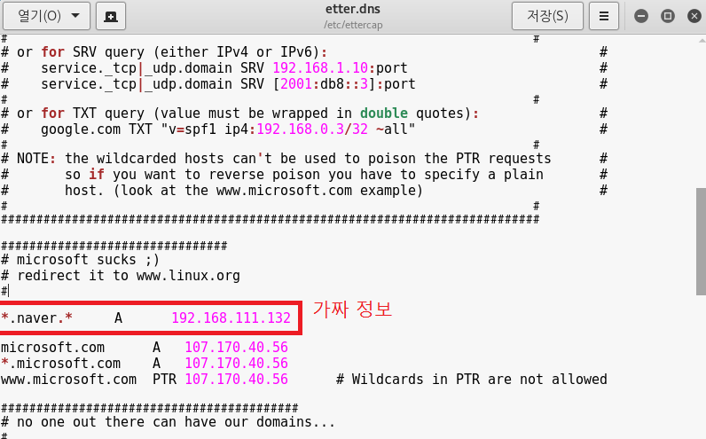

ettercap 실행

**root@kali2:~\# ettercap -G**

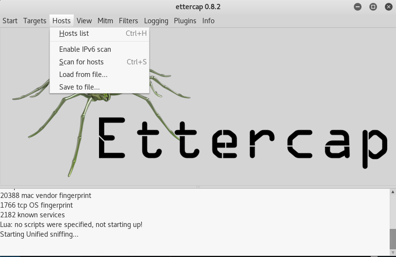

**Sniff > Unified sniffing > eth 0 ⇐ 스니핑할 NIC를 지정**

**Hosts > Scan for hosts ⇐ 해당 LAN에 존재하는 호스트를 검색**

**Hosts > Hosts list ⇐ 검색 결과를 확인**

공격 대상을 지정

**target1 => Gateway (192.168.111.2)**

**target2 => WinXP (192.168.111.140)**

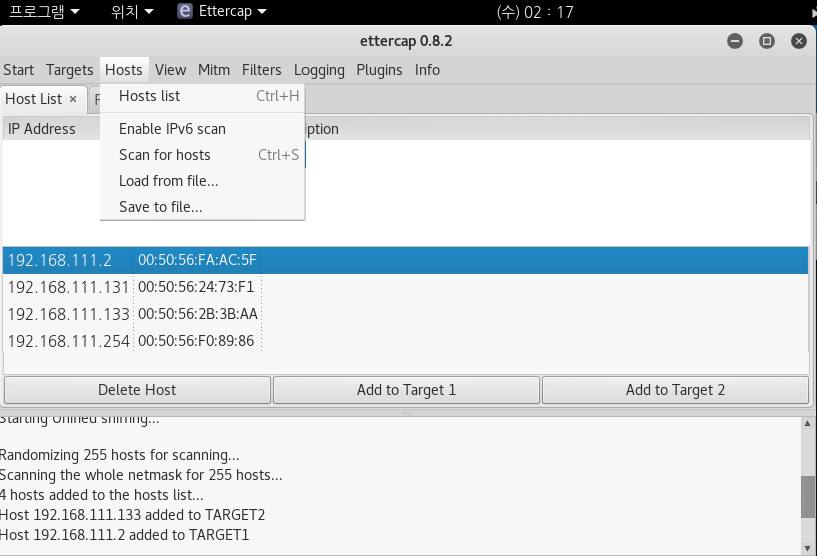

Apr spoofing ⇒ 공격자를 공격 대상 사이에 위치 ⇒ WinXP <---> Kali#2 <---> Gateway

**Mitm > ARP Spoofing > Sniff remote connections **

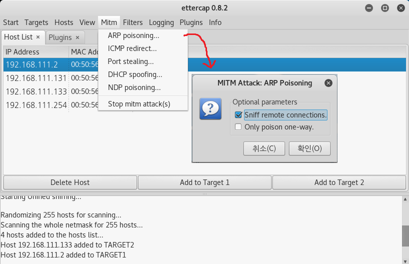

DNS Spoofing 공격

**Plugins > Manage the plugins > dns_spoof **

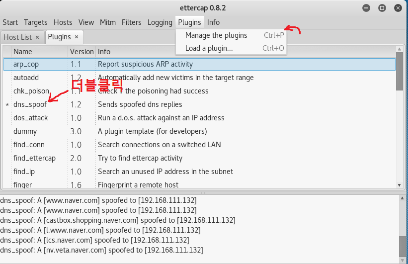

**WinXP에서 http://www.naver.com으로 접속을 시도 → Kali#2에서 제공하는 웹 페이지가 보이면 공격 성공**

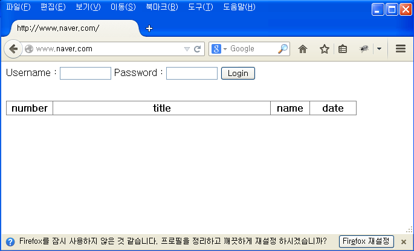